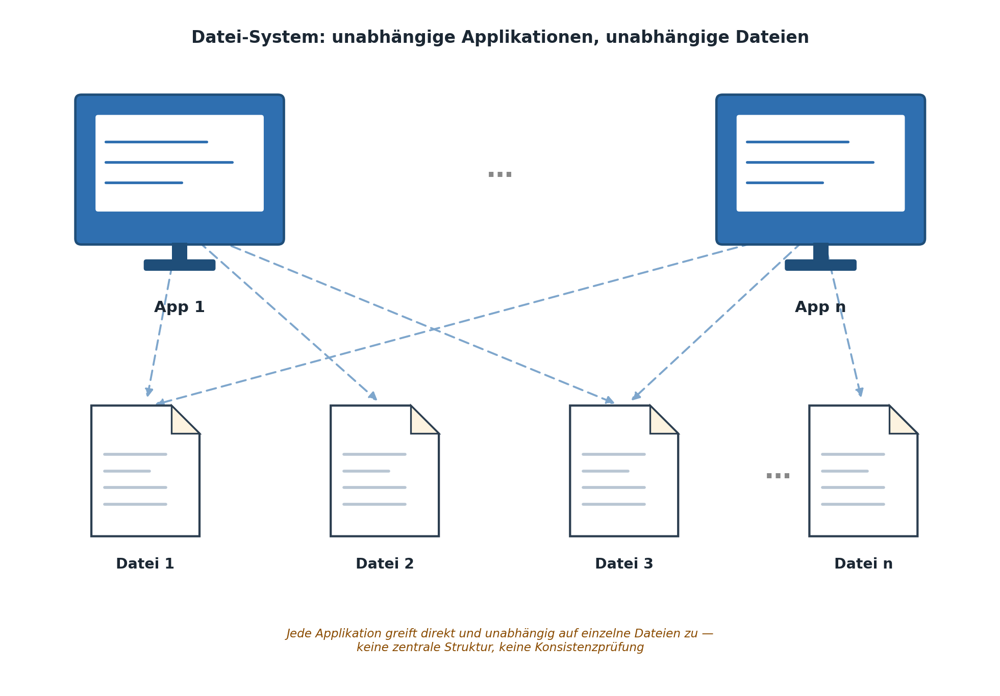
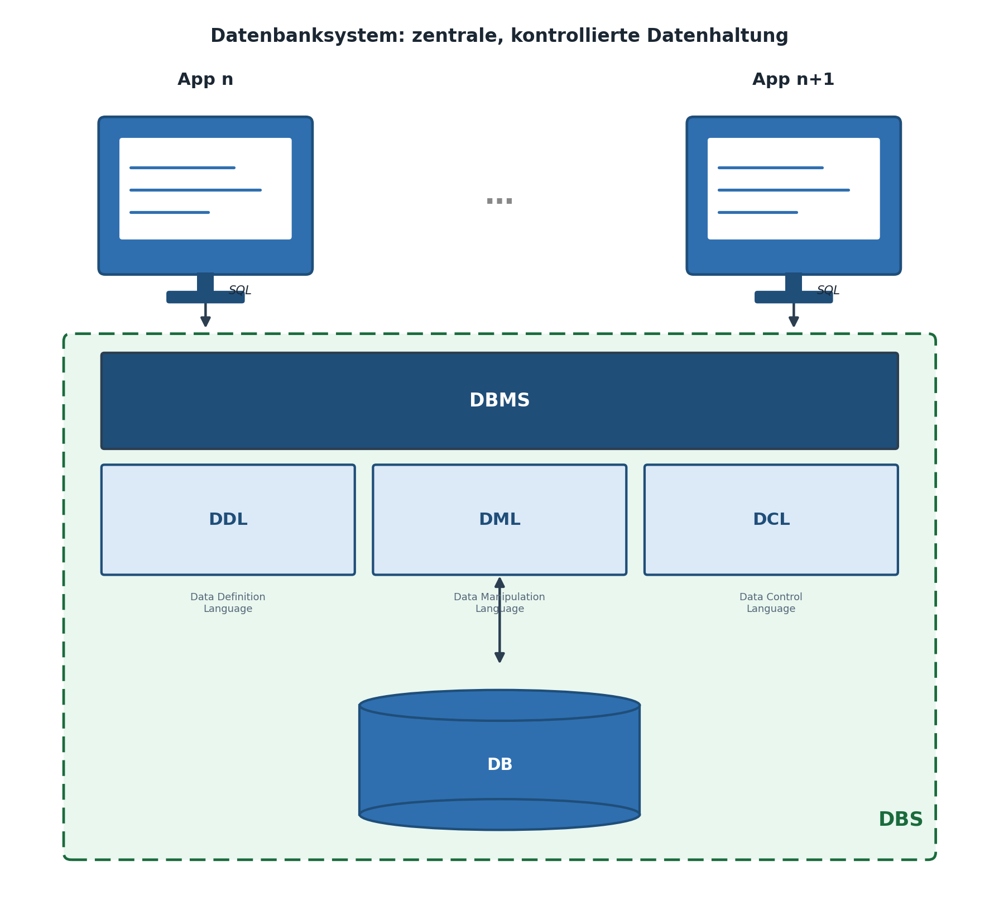
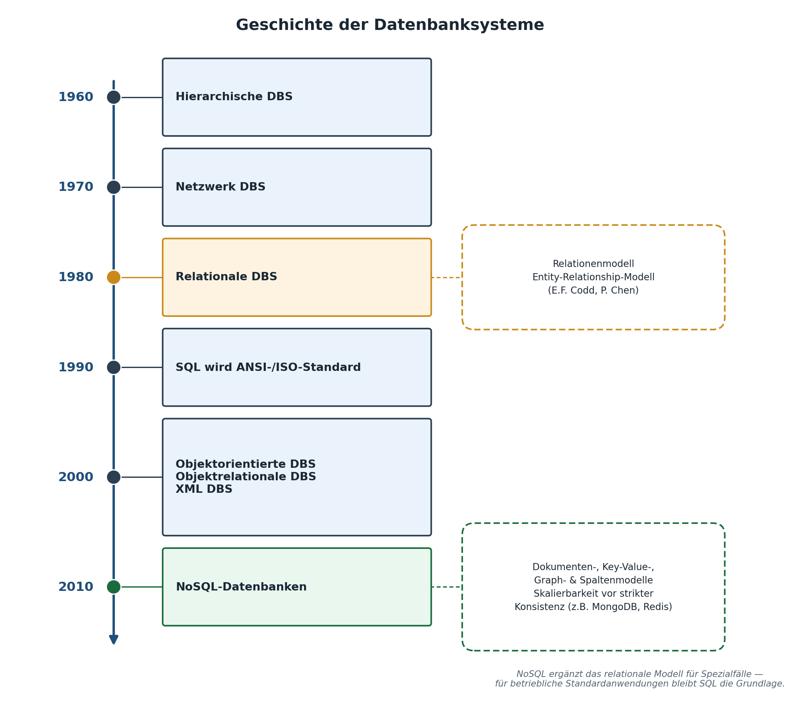
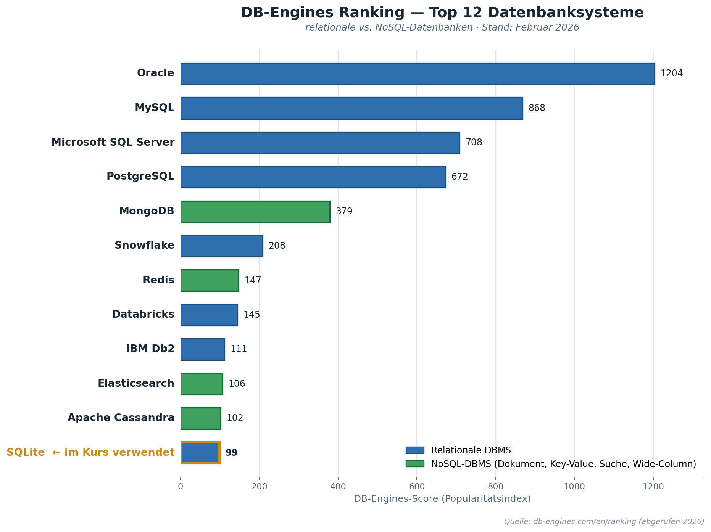

|                                             |                          |                               |
| ------------------------------------------- | ------------------------ | ----------------------------- |
| **Informatik\*in / Systemtechniker\*in HF** | **Datenbankentwicklung** |  |

- [1. Einführung](#1-einführung)
  - [1.1. Lernziele](#11-lernziele)
  - [1.2. Wozu Datenbanken?](#12-wozu-datenbanken)
  - [1.3. Dateisystem](#13-dateisystem)
    - [1.3.1. Probleme](#131-probleme)
    - [1.3.2. Vorteile](#132-vorteile)
  - [1.4. Datenbanksystem](#14-datenbanksystem)
    - [1.4.1. Eigenschaften von DBMS](#141-eigenschaften-von-dbms)
    - [1.4.2. Die Rolle der Daten im Unternehmen](#142-die-rolle-der-daten-im-unternehmen)
  - [1.5. Begriffsklärung: DB, DBMS, DBS](#15-begriffsklärung-db-dbms-dbs)
    - [1.5.1. Die drei Sprachkomponenten eines DBMS](#151-die-drei-sprachkomponenten-eines-dbms)
    - [1.5.2. Grundfunktionen, die man von jedem DBS erwartet](#152-grundfunktionen-die-man-von-jedem-dbs-erwartet)
  - [1.6. Dateisystem vs. Datenbanksystem](#16-dateisystem-vs-datenbanksystem)
  - [1.7. Datenbankmodelle im Überblick](#17-datenbankmodelle-im-überblick)
    - [1.7.1. Historische Entwicklung im Kurzüberblick](#171-historische-entwicklung-im-kurzüberblick)
    - [1.7.2. Wo steht SQLite?](#172-wo-steht-sqlite)
  - [1.8. DB-Engines Ranking: Marktüberblick relationaler und NoSQL-Datenbanken](#18-db-engines-ranking-marktüberblick-relationaler-und-nosql-datenbanken)
    - [1.8.1. Aktuelle Rangliste (Stand Februar 2026)](#181-aktuelle-rangliste-stand-februar-2026)
    - [1.8.2. Einordnung für den Kurs](#182-einordnung-für-den-kurs)
- [2. Aufgaben](#2-aufgaben)
  - [2.1. Datenbank vs. Dateisystem](#21-datenbank-vs-dateisystem)
  - [2.2. Daten speichern und analysieren](#22-daten-speichern-und-analysieren)

---

 

# 1. Einführung

## 1.1. Lernziele

Nach diesem Kapitel können Sie:

- [ ] erklären, weshalb Datenbanken gegenüber einfachen Dateisystemen eingesetzt werden
- [ ] die Begriffe **Datenbank (DB)**, **Datenbank-Managementsystem (DBMS)** und **Datenbank-System (DBS)** unterscheiden
- [ ] die drei Sprachkomponenten eines DBMS (DDL, DML, DCL) benennen und Beispiele zuordnen
- [ ] den Unterschied zwischen hierarchischen, relationalen und objektrelationalen Datenbankmodellen skizzieren
- [ ] die sieben Grundfunktionen eines DBMS benennen und an einem eigenen Beispiel erläutern
- [ ] einordnen, wo sich SQLite im Vergleich zu anderen Datenbanksystemen positioniert

---

## 1.2. Wozu Datenbanken?

Stellen Sie sich einen Automatisierungsbetrieb vor, der seine Maschinenparks, Wartungsaufträge und Ersatzteile in mehreren Excel-Dateien verwaltet: eine Liste der Maschinen, eine Liste der Techniker, eine Liste der Wartungstermine. Sobald ein Techniker seinen Namen ändert oder eine Maschine den Standort wechselt, muss dies in mehreren Dateien nachgeführt werden – Fehler und Widersprüche sind vorprogrammiert.

---

## 1.3. Dateisystem

Systeme, bei denen die Daten in verschiedenen Dateien gespeichert und nicht miteinander verknüpft werden können, sind Datei-Systeme und gelten in unserem Sinne nicht als  Datenbanksysteme.

Ein typisches Szenario gibt die folgende Auflistung wieder:

- Ein Textverarbeitung verwaltet Texte, Artikel und Adressen.
- Die Buchhaltung speichert ebenso Artikel- und Adress-Informationen.
- In der Lagerverwaltung werden Artikel und Aufträge benötigt und verwendet.

### 1.3.1. Probleme

- In diesem Szenario sind die Daten redundant, also mehrfach gespeichert. Etwa werden Artikel und Adressen von mehreren Anwendungen verwaltet. Die entstehenden Probleme sind die Verschwendung von Speicherplatz aber noch viel mehr das Vergessen von lokalen Änderungen.
- Ein Datei-System erlaubt es nicht, dass mehrere Benutzer oder Anwendungen parallel auf den gleichen Daten arbeiten können, ohne einander zu stören. Datenverlust durch unkontrolliertes Überschreiben kann entstehen.
- Datei-Systeme können grosse Mengen von Daten nicht effizient verarbeiten, da nur ein sequentieller und kein indizierter Zugriff auf Daten besteht.
- Dateien haben kein Zugriffskontrollsystem mit dem Benutzer klassifiziert werden können.
- Der grösste Nachteil von Datei-Systemen besteht darin, dass die Datenstruktur in den Applikationen eincodiert ist. D.h. sobald etwas an der Datenstruktur geändert wird, laufen sämtliche “alte“ Applikationen nicht mehr.

### 1.3.2. Vorteile

Ein Dateisystem hat seine Berechtigung, nicht in jedem Fall empfiehlt sich der Einsatz eines Datenbanksystems. Ein Filesystem hat gegenüber einem DBS einige Vorteile:

- ist einfach zu verstehen, braucht wenig Know-how
- ist schnell programmiert, oft werden gar keine Programmierkenntnisse gebraucht
- braucht keine Tools

Der Einsatz eines Dateisystems empfiehlt sich umso eher, ...

- je kleiner die Datenmenge
- je einfacher die Datenstruktur
- je weniger Änderungen in der Struktur zu erwarten sind
- je weniger Benutzer gleichzeitig auf Daten zugreifen
- je unwichtiger der Sicherheitsaspekt ist

Genau dieses Problem lösen Datenbanksysteme: Sie halten Daten **zentral, konsistent und mehrfach nutzbar** vor.

---

## 1.4. Datenbanksystem

Die Probleme der Datei-Systeme können mit Hilfe der Datenbanktechnologie gelöst werden.

Alle Anwendungssoftware arbeitet mit denselben Daten, die in einer zentralen Datenhaltungskomponente verwaltet werden. Der Gesamtbestand der Daten wird nun als Datenbank bezeichnet. Anwendungssoftware kann nur über eine zusätzliche Layer – hier **DBMS** genannt -  auf die Daten zugreifen.

Dieses Phänomen ist keineswegs auf Kleinbetriebe beschränkt. Auch in grossen Unternehmen entstehen historisch gewachsene „Datenfriedhöfe": Insellösungen, die über Jahre parallel zueinander gepflegt wurden, ohne dass jemand mehr den vollständigen Überblick hat, welche Datei die „Wahrheit" enthält. Die Datenmodellierung, die wir in Kapitel 2 einführen, ist der methodische Gegenentwurf zu diesem Wildwuchs: Sie zwingt uns, vor der technischen Umsetzung bewusst zu entscheiden, welche Daten es gibt, wie sie zusammenhängen und wo sie **einmalig** und **verbindlich** gespeichert werden.

### 1.4.1. Eigenschaften von DBMS

- DBMS können grosse Datenmengen effizient verwalten.
- Sie bieten benutzergerechte Abfragesprachen an.
- Viele Benutzer können parallel auf Datenbanken arbeiten.
- Die Datenunabhängigkeit der Applikationssoftware wird durch ein Drei-Ebenen-Konzept gewährleistet ( siehe 3 Schema Architektur ).
- Zugriffskontrolle ( kein unbefugter Zugriff ) und Datensicherheit ( kein ungewollter Datenverlust ) werden vom System gewährleistet.

### 1.4.2. Die Rolle der Daten im Unternehmen

Daten sind längst nicht mehr nur ein technisches „Abfallprodukt" der täglichen Arbeit, sondern ein eigenständiger Wertfaktor. In der Automatisierungstechnik zeigt sich das besonders deutlich: Wartungshistorien erlauben vorausschauende Instandhaltung (Predictive Maintenance), Maschinendaten liefern die Grundlage für Optimierungsentscheidungen, und Ersatzteilverbrauch über Jahre hinweg erlaubt eine bessere Lagerplanung. All diese Auswertungen setzen voraus, dass die zugrundeliegenden Daten sauber, konsistent und über die Zeit hinweg verlässlich strukturiert vorliegen – genau das ist die Aufgabe eines Datenbanksystems.

---

## 1.5. Begriffsklärung: DB, DBMS, DBS

| **Begriff**                           | **Bedeutung**                                                                             |
| ------------------------------------- | ----------------------------------------------------------------------------------------- |
| **DB** (Datenbank)                    | Der strukturierte, tatsächliche Datenbestand (die Daten selbst)                           |
| **DBMS** (Datenbank-Managementsystem) | Die Software, welche die Datenbank verwaltet (z.B. SQLite-Engine, SQL Server, PostgreSQL) |
| **DBS** (Datenbank-System)            | DB + DBMS zusammen – das Gesamtsystem aus Daten und verwaltender Software                 |

**Praxisbeispiel SQLite:** Die Datei `werkstatt.db` ist die *Datenbank*. Die SQLite-Engine (eine Programmbibliothek), die diese Datei liest und schreibt, ist das *DBMS*. Beides zusammen ergibt das *Datenbank-System*.

Diese begriffliche Präzision mag auf den ersten Blick spitzfindig wirken, ist in der Praxis aber wichtig: Wenn eine Applikation „die Datenbank ist langsam" meldet, kann damit ganz Unterschiedliches gemeint sein – ein Problem der Datenstruktur (DB), ein Problem der verwaltenden Software (DBMS, z.B. fehlender Index) oder ein Problem des Zusammenspiels beider (DBS, z.B. zu viele gleichzeitige Zugriffe). Eine präzise Begriffsverwendung erleichtert die Fehlersuche erheblich.

### 1.5.1. Die drei Sprachkomponenten eines DBMS

Jedes DBMS gliedert sich funktional in drei Komponenten, denen jeweils eine Teilsprache von SQL zugeordnet ist:

1. **DDL – Data Definition Language** (Strukturierungskomponente): definiert die Struktur der Daten.
   Beispiele: `CREATE TABLE`, `ALTER TABLE`, `DROP TABLE`
2. **DML – Data Manipulation Language** (Manipulationskomponente): verarbeitet die eigentlichen Daten.
   Beispiele: `SELECT`, `INSERT`, `UPDATE`, `DELETE`
3. **DCL – Data Control Language** (Integritäts-/Zugriffskomponente): steuert Zugriffsrechte und Transaktionen.
   Beispiele: `GRANT`, `REVOKE`, `COMMIT`, `ROLLBACK`

> Diese Dreiteilung begegnet uns während des ganzen Kurses wieder – Kapitel 6 widmet sich der DDL, Kapitel 7–9 der DML, und Transaktionen/Rechte werden punktuell gestreift.

Diese Einteilung ist nicht nur akademisch: Sie hilft, SQL-Befehle im Alltag rasch richtig einzuordnen. Wer sich fragt „verändere ich hier die Struktur der Datenbank oder nur ihre Inhalte?" kann fast immer sofort erkennen, ob ein Befehl der DDL oder der DML zuzuordnen ist. Ein `CREATE TABLE` verändert das Data Dictionary (die Struktur), ein `INSERT` verändert nur den Dateninhalt einer bereits bestehenden Tabelle.

### 1.5.2. Grundfunktionen, die man von jedem DBS erwartet

- **Keine unnötige Datenredundanz** – jedes Datum wird möglichst nur einmal gespeichert
- **Operationen** – Speichern, Suchen, Ändern, Löschen von Daten
- **Data Dictionary** – Metadaten über die Struktur aller Tabellen und Objekte
- **Benutzersichten (Views)** – unterschiedliche Sichten auf denselben Datenbestand
- **Konsistenzüberwachung** – Integritätsregeln stellen die Korrektheit der Daten sicher
- **Zugriffskontrolle** – nur autorisierte Zugriffe sind möglich
- **Transaktionen** – zusammengehörige Änderungen werden entweder vollständig oder gar nicht ausgeführt

Diese sieben Punkte lassen sich gut anhand unseres Werkstatt-Beispiels durchgehen: Das Data Dictionary entspricht der Struktur unserer Tabellen `Techniker`, `Maschine`, `Wartung` usw.; eine Transaktion wäre z.B. das gleichzeitige Erfassen einer Wartung **und** das Verringern des Ersatzteil-Lagerbestands – beide Änderungen sollen entweder gemeinsam gelingen oder gemeinsam scheitern, damit nie ein inkonsistenter Zwischenzustand entsteht (z.B. eine Wartung ohne entsprechende Lagerbuchung).

---

## 1.6. Dateisystem vs. Datenbanksystem

| **Dateisystem**                                   | **Datenbanksystem**                                                                         |
| ------------------------------------------------- | ------------------------------------------------------------------------------------------- |
| Daten liegen in getrennten, unverknüpften Dateien | Daten sind strukturiert und über Beziehungen verknüpft                                      |
| Redundanz (gleiche Daten mehrfach gespeichert)    | Zentrale Datenhaltung, Redundanz wird minimiert                                             |
| Kein Mehrbenutzerzugriff ohne Konflikte           | Kontrollierter, gleichzeitiger Mehrbenutzerzugriff                                          |
| Datenstruktur ist im Programmcode „eincodiert"    | Datenunabhängigkeit: Struktur ändert sich, ohne dass jede Applikation angepasst werden muss |
| Kein systematisches Zugriffskontrollsystem        | Benutzer- und Rechteverwaltung möglich                                                      |
| Einfach, schnell, kein Tool nötig                 | Erfordert Modellierung, Tools und Sprachkenntnisse (SQL)                                    |
| Zugriff meist nur sequentiell möglich             | Effizienter, indizierter Zugriff auch auf grosse Datenmengen                                |
| Keine standardisierte Abfragesprache              | SQL als etablierter, herstellerübergreifender Standard                                      |

Ein Dateisystem hat durchaus seine Berechtigung – bei kleinen, einfachen, selten geänderten Datenmengen mit wenigen gleichzeitigen Nutzern ist es oft die pragmatischere Lösung. Je grösser und kritischer die Daten werden, desto klarer sprechen die Vorteile für ein Datenbanksystem. Als Faustregel gilt: Je grösser die Datenmenge, je komplexer die Struktur, je häufiger sich diese ändert und je mehr Personen gleichzeitig darauf zugreifen, desto eher lohnt sich ein Datenbanksystem.

---

## 1.7. Datenbankmodelle im Überblick

Im Lauf der Zeit haben sich verschiedene Modelle etabliert, wie Daten strukturiert werden:

| **Modell**                    | **Grundidee**                                                                                 | **Beispiel / Status heute**                                                       |
| ----------------------------- | --------------------------------------------------------------------------------------------- | --------------------------------------------------------------------------------- |
| **Hierarchisches Modell**     | Baumstruktur, jedes Kind hat genau einen Elternknoten                                         | Historisch (z.B. IMS), heute noch in Dateisystemen/XML sichtbar                   |
| **Netzwerkmodell**            | Erweiterung des hierarchischen Modells, mehrere Elternknoten möglich                          | Historisch, kaum noch im Einsatz                                                  |
| **Relationales Modell**       | Daten in Tabellen (Relationen) mit Zeilen und Spalten, verknüpft über Schlüssel               | Dominierendes Modell: SQL Server, PostgreSQL, MySQL, **SQLite**, Oracle           |
| **Objektrelationales Modell** | Relationales Modell, erweitert um objektorientierte Konzepte (z.B. Vererbung, komplexe Typen) | z.B. PostgreSQL mit erweiterten Typen                                             |
| **NoSQL / Dokumentenmodell**  | Schemafreie, dokumenten- oder schlüsselwertbasierte Speicherung                               | MongoDB, Redis – für Spezialfälle (z.B. sehr grosse, unstrukturierte Datenmengen) |
| **XML-Datenbanken**           | Speicherung hierarchisch strukturierter XML-Dokumente                                         | Nischenanwendungen, Austauschformate                                              |

### 1.7.1. Historische Entwicklung im Kurzüberblick

Die ersten Datenbanksysteme der 1960er-Jahre basierten auf hierarchischen und Netzwerkmodellen – sie waren eng an die physische Speicherstruktur gekoppelt und dadurch schwer zu warten, sobald sich Anforderungen änderten. Der entscheidende konzeptionelle Durchbruch gelang 1970 mit dem relationalen Modell (Edgar F. Codd), das Daten und ihre Struktur strikt von der physischen Speicherung trennte. Diese sogenannte **Datenunabhängigkeit** ist bis heute einer der zentralen Vorteile relationaler Systeme und wird in Kapitel 2.11 (3-Schema-Architektur, sofern im Kurs vertieft) nochmals aufgegriffen.

In den letzten 15 Jahren hat sich daneben die NoSQL-Bewegung etabliert – meist getrieben durch Anforderungen extrem grosser, verteilter Webanwendungen (z.B. soziale Netzwerke), bei denen strikte Konsistenz teilweise zugunsten von Skalierbarkeit und Verfügbarkeit aufgegeben wird. Für die allermeisten betrieblichen Anwendungen – auch in der Automatisierungstechnik – bleibt das relationale Modell jedoch die richtige Wahl, da hier Datenkonsistenz (z.B. „jede Wartung muss einer existierenden Maschine zugeordnet sein") in aller Regel wichtiger ist als extreme horizontale Skalierbarkeit.

Dieser Kurs konzentriert sich vollständig auf das **relationale Modell**, da es nach wie vor die Grundlage der allermeisten produktiv eingesetzten Datenbanksysteme bildet – auch in der Automatisierungstechnik, z.B. bei Leitsystemen, MES- oder ERP-Anbindungen.

### 1.7.2. Wo steht SQLite?

SQLite ist eine **relationale, dateibasierte Datenbank-Engine**, die direkt in eine Anwendung eingebettet wird (kein separater Serverprozess). Sie ist die weltweit am häufigsten eingesetzte Datenbank-Engine überhaupt – sie steckt u.a. in jedem Smartphone (Android, iOS), in Browsern und in unzähligen Embedded-Systemen. Für die Automatisierungstechnik ist das besonders relevant: SQLite eignet sich hervorragend für lokale Datenspeicherung auf Steuerungen, HMI-Panels oder IoT-Geräten mit begrenzten Ressourcen.

Man spricht bei SQLite von einer **„serverless"** Architektur: Es gibt keinen eigenständigen Datenbankserver-Prozess, mit dem eine Applikation über das Netzwerk kommuniziert (wie bei SQL Server oder PostgreSQL), sondern die SQLite-Bibliothek wird direkt in den Prozess der Anwendung eingebunden und liest/schreibt die Datenbankdatei unmittelbar über das Dateisystem. Das erklärt sowohl die minimalen Hardwareanforderungen als auch die zentrale Einschränkung: SQLite ist nicht dafür konzipiert, dass sehr viele Clients gleichzeitig über ein Netzwerk auf dieselbe Datenbank schreibend zugreifen – für die Zwecke dieses Kurses (Einzelarbeitsplatz, Lernumgebung, kleine bis mittlere Anwendungen) ist dies jedoch keine relevante Einschränkung.

---

## 1.8. DB-Engines Ranking: Marktüberblick relationaler und NoSQL-Datenbanken

Wie „beliebt" oder verbreitet ein bestimmtes Datenbanksystem tatsächlich ist, lässt sich nicht aus einer einzelnen Quelle ablesen. Als etablierter Massstab dafür hat sich das **DB-Engines Ranking** (db-engines.com) etabliert: eine monatlich aktualisierte Rangliste von über 420 Datenbank-Systemen, die deren Popularität anhand mehrerer unabhängiger Indikatoren misst – u.a. Anzahl Suchmaschinen-Treffer, Google-Trends-Verlauf, Diskussionen auf Stack Overflow, Stellenanzeigen mit Nennung des Systems sowie Erwähnungen in beruflichen Netzwerken. Der daraus berechnete **Score** ist kein Marktanteil in Prozent, sondern ein relativer Popularitätsindex, der vor allem für Verlaufsvergleiche und Rangfolgen geeignet ist.

### 1.8.1. Aktuelle Rangliste (Stand Februar 2026)

Einige Beobachtungen, die sich direkt aus dieser Grafik ableiten lassen:

- **Relationale Systeme dominieren nach wie vor klar die Spitze.** Die vier meistgenutzten Systeme überhaupt – Oracle, MySQL, Microsoft SQL Server und PostgreSQL – sind alle primär relational. Zusammengenommen liegen sie weit vor dem stärksten NoSQL-System.
- **MongoDB ist die mit Abstand populärste NoSQL-Datenbank** und belegt Rang 5 der Gesamtliste – ein Beleg dafür, dass dokumentenorientierte Datenbanken für bestimmte Anwendungsfälle (flexible, sich häufig ändernde Datenstrukturen, z.B. in agilen Webprojekten) einen festen Platz im Markt haben.
- **Redis, Elasticsearch und Apache Cassandra** zeigen die Bandbreite von NoSQL: Key-Value-Speicher (Caching, Sessions), Suchmaschinen-Engines (Volltextsuche) und Wide-Column-Stores (verteilte, hochskalierbare Schreiblast) lösen jeweils sehr spezifische technische Probleme, für die ein relationales System weniger geeignet wäre.
- **SQLite** belegt Rang 12 – bemerkenswert für ein System ganz ohne eigenen Server-Prozess und Marketingbudget. Dies unterstreicht, weshalb SQLite eine sinnvolle Wahl für diesen Kurs ist: Es ist kein Nischenprodukt, sondern eines der am breitesten eingesetzten Datenbanksysteme weltweit (siehe Kapitel 1.3).
- **Multi-Model-Systeme nehmen zu.** Viele der klassisch relationalen Systeme (Oracle, PostgreSQL, SQL Server) unterstützen inzwischen zusätzlich Dokument-, Graph- oder Vektordaten innerhalb derselben Engine. Die früher klare Trennung „relational vs. NoSQL" verschwimmt damit zunehmend.

### 1.8.2. Einordnung für den Kurs

Für praktisch alle Anwendungen im betrieblichen Umfeld – auch für die in diesem Kurs behandelte Werkstatt-Datenbank – bleibt das relationale Modell die richtige und am weitesten verbreitete Wahl: Es bietet garantierte Datenkonsistenz, eine standardisierte Abfragesprache (SQL) und jahrzehntelang erprobte Werkzeuge. NoSQL-Systeme ergänzen dieses Spektrum dort, wo einzelne ihrer Stärken (horizontale Skalierbarkeit, flexible Schemata, extrem hoher Schreibdurchsatz) im Vordergrund stehen – sie ersetzen das relationale Modell in den seltensten Fällen vollständig, sondern kommen meist gezielt neben einer relationalen Kerndatenbank zum Einsatz (sogenannte **Polyglot Persistence**).

> **Hinweis:** Da das DB-Engines Ranking monatlich aktualisiert wird, können sich einzelne Platzierungen im Lauf der Zeit verschieben. Für eine tagesaktuelle Ansicht lohnt sich ein Blick auf db-engines.com/en/ranking – die grundsätzliche Dominanz der relationalen Systeme an der Spitze ist jedoch seit Jahren stabil.

---

 

# 2. Aufgaben

## 2.1. Datenbank vs. Dateisystem

| **Vorgabe**             | **Beschreibung**                                                 |
| :---------------------- | :--------------------------------------------------------------- |
| **Lernziele**           | Probleme von dateibasierten Insellösungen erkennen               |
|                         | Die Begriffe DB, DBMS und DBS korrekt unterscheiden und anwenden |
|                         | DDL, DML und DCL konkreten Aufgaben zuordnen                     |
| **Sozialform**          | Einzelarbeit, anschliessend Besprechung im Plenum                |
| **Auftrag**             | siehe unten                                                      |
| **Hilfsmittel**         | Kapitel 1 des Kursskripts                                        |
| **Erwartete Resultate** | Schriftliche Kurzantworten zu den 4 Teilaufgaben                 |
| **Zeitbedarf**          | 30 min                                                           |
| **Lösungselemente**     | Musterantworten zu allen Teilaufgaben                            |

Ein Automatisierungsbetrieb verwaltet aktuell folgende Informationen in separaten Excel-Dateien:

- `Maschinen.xlsx`: Maschinennummer, Bezeichnung, Standort, Baujahr
- `Techniker.xlsx`: Personalnummer, Name, Telefonnummer, Fachgebiet
- `Wartungen.xlsx`: Datum, Maschinennummer, Personalnummer, durchgeführte Arbeiten

1. Nennen Sie drei konkrete Probleme, die bei dieser Excel-basierten Lösung auftreten können, sobald mehrere Personen gleichzeitig damit arbeiten.
2. Ordnen Sie folgende Aussagen den Begriffen DB, DBMS oder DBS zu:
   a) „Die Datei `werkstatt.db`, in der alle Tabellen gespeichert sind"
   b) „Die SQLite-Engine, welche die Datei liest und schreibt"
   c) „Das Gesamtsystem, mit dem der Betrieb seine Wartungsdaten verwaltet"
3. Welche der drei Sprachkomponenten (DDL, DML, DCL) würden Sie verwenden, um …
   a) … eine neue Tabelle `Ersatzteile` anzulegen?
   b) … eine neue Wartung einzutragen?
   c) … einem neuen Mitarbeiter Leserechte auf die Datenbank zu geben?
4. Begründen Sie in 3–4 Sätzen, weshalb sich SQLite für diesen kleinen Betrieb (< 10 Mitarbeitende) eignen könnte – und nennen Sie einen Fall, in dem Sie stattdessen zu einem Server-DBMS raten würden.

---

## 2.2. Daten speichern und analysieren

| **Vorgabe**             | **Beschreibung**                                  |
| :---------------------- | :------------------------------------------------ |
| **Lernziele**           | Eine Datenbasis in Excel darstellen               |
|                         | Probleme (Anomalien) bei Datenmutationen erkennen |
| **Sozialform**          | Gruppenarbeit                                     |
| **Auftrag**             | siehe unten                                       |
| **Hilfsmittel**         |                                                   |
| **Erwartete Resultate** |                                                   |
| **Zeitbedarf**          | 30 min                                            |
| **Lösungselemente**     | Excel Datei mit Beispieldaten                     |

**Aufgabe 1 - Daten tabellarisch darstellen:**
Sie erhalten den Auftrag in einer relationalen Datenbank die Kunden mit deren Einkäufe bzw. die Rechnungsdaten zu speichern:

- Kunde mit:
  - Name, Anschrift
  - Wohnort mit Strasse, PLZ und Ortschaft
- Einkauf mit:
  - Rechnungsnummer mit Datum
  - Eingekaufte Artikel mit Preis
  - Rechnungsbetrag (Total)

Erstelle in Excel einen Vorschlag (Entwurf) wie diese Datenbasis gespeichert werden kann (min. 3 Beispiel Datensätze).

**Aufgabe 2 – Problemanalyse:**
Überlege welche Probleme bei der Verarbeitung (Einfüge-, Änderung- und Löschoperationen) der Daten entstehen können und fasse diese kurz zusammen.
