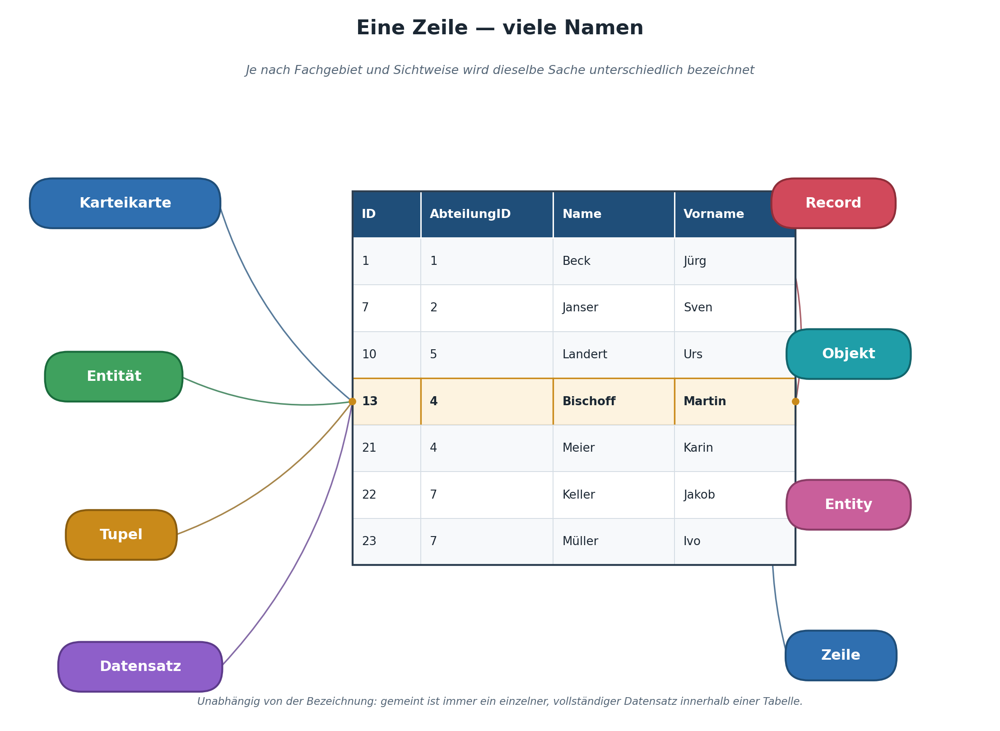
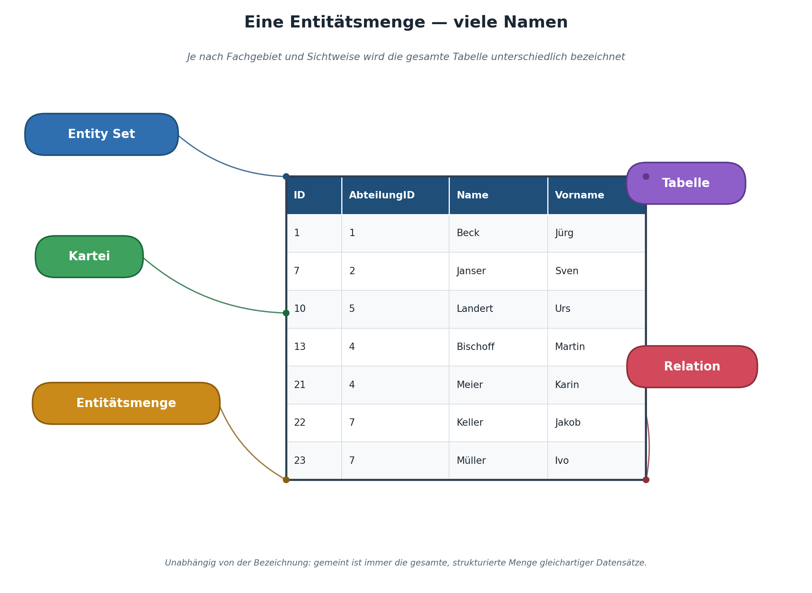

|                                             |                          |                               |
| ------------------------------------------- | ------------------------ | ----------------------------- |
| **Informatik\*in / Systemtechniker\*in HF** | **Datenbankentwicklung** |  |

- [1. Datenmodellierung](#1-datenmodellierung)
  - [1.1. Lernziele](#11-lernziele)
  - [1.2. Wozu Datenmodellierung?](#12-wozu-datenmodellierung)
  - [1.3. Charakteristiken von Modellen](#13-charakteristiken-von-modellen)
    - [1.3.1. Wer ist an der Datenmodellierung beteiligt?](#131-wer-ist-an-der-datenmodellierung-beteiligt)
  - [1.4. Der Weg vom Problem zur Datenbank](#14-der-weg-vom-problem-zur-datenbank)
    - [1.4.1. Warum diese Reihenfolge wichtig ist](#141-warum-diese-reihenfolge-wichtig-ist)
  - [1.5. Grundbegriffe](#15-grundbegriffe)
    - [1.5.1. Entität](#151-entität)
    - [1.5.2. Entitätsmenge](#152-entitätsmenge)
    - [1.5.3. Attribut](#153-attribut)
      - [1.5.3.1. Arten von Attributen](#1531-arten-von-attributen)
    - [1.5.4. Beziehung](#154-beziehung)
  - [1.6. Praxisbeispiel: Von der Anforderung zum ersten Modellansatz](#16-praxisbeispiel-von-der-anforderung-zum-ersten-modellansatz)
    - [1.6.1. Grenzen der Substantiv-Analyse](#161-grenzen-der-substantiv-analyse)
- [2. Aufgaben](#2-aufgaben)
  - [2.1. Substantiv-Analyse](#21-substantiv-analyse)

---

</br>

# 1. Datenmodellierung

## 1.1. Lernziele

Nach diesem Kapitel können Sie:

- [ ] den Zweck der Datenmodellierung im Gesamtprozess der Datenbankentwicklung erklären
- [ ] die Begriffe **Entität**, **Entitätsmenge** und **Attribut** definieren und an eigenen Beispielen anwenden
- [ ] die vier Schritte von der Anforderung bis zur fertigen Datenbank benennen und deren Zweck erklären
- [ ] mittels Substantiv-Analyse aus einer Anforderungsbeschreibung Kandidaten für Entitätsmengen ableiten
- [ ] entscheiden, ob ein Sachverhalt als eigene Entitätsmenge oder als Attribut modelliert werden sollte

---

## 1.2. Wozu Datenmodellierung?

Bevor eine einzige Zeile SQL geschrieben wird, muss geklärt sein: **Welche Daten sollen überhaupt gespeichert werden, und wie hängen sie zusammen?** Diesen Prozess nennt man Datenmodellierung.

Die Datenmodellierung legt fest, wie die Daten einer Anwendung konzeptionell strukturiert sind. In diesem Vorgang müssen verschiedene, zum Teil widersprüchliche Zielsetzungen und Bedürfnisse befriedigt werden, z.B.


- Das Datenmodell muss die notwendigen Informationen der Anwendung vollständig darstellen können, dabei ist die Bestimmung der Systemgrenze wichtig.
- Mit den gespeicherten Informationen im Datenmodell müssen sämtliche Geschäftsprozesse der Anwendung ausführbar sein. Eine Modellierung ohne jegliche Kenntnis der grundsätzlich gewünschten Funktionalität der Anwendung kann daher kein zweckmässiges Datenmodell liefern.
- Das Modell soll derart gebildet werden, dass auch zukünftige Bedürfnisse befriedigt werden können.

Ein gutes Datenmodell ist die Grundlage für:

- eine **redundanzfreie** Datenbank (jede Information nur einmal gespeichert)
- eine **konsistente** Datenbank (keine widersprüchlichen Daten möglich)
- eine Datenbank, die **erweiterbar** bleibt, wenn sich Anforderungen ändern
- eine Datenbank, die **verständlich** bleibt – auch für Personen, die nicht an der ursprünglichen Entwicklung beteiligt waren

Fehler in der Modellierungsphase sind in der Regel deutlich teurer zu korrigieren als Fehler im späteren SQL-Code – daher investiert man hier bewusst Zeit, bevor man Tabellen anlegt. Eine bereits produktiv befüllte Datenbank nachträglich umzustrukturieren (z.B. eine fehlende Beziehung nachzuziehen) bedeutet oft, bestehende Daten migrieren zu müssen – ein Aufwand, der sich durch sorgfältige Modellierung im Vorfeld meist vermeiden lässt.

---

## 1.3. Charakteristiken von Modellen

- Ein Modell ist eine zweckorientierte, vereinfachte und strukturgleiche Abbildung der Wirklichkeit.
- Die Beziehung zwischen Modell und Wirklichkeit ist die Analogie.
- Ein Modell konzentriert sich auf das Wesentliche und reduziert so die Komplexität der Wirklichkeit.
- Ein Modell grenzt Unwesentliches aus -> Informationsverlust
- Ein Modell hat eine Systemgrenze. Da diese praktische nie gegeben ist, muss sie festgelegt werden. Wie die Systemgrenze gesetzt wird, ist eine Frage der Zweckmässigkeit

### 1.3.1. Wer ist an der Datenmodellierung beteiligt?

In der Praxis ist Datenmodellierung selten eine reine Einzelarbeit der Entwicklung. Idealerweise werden Fachexpertinnen und -experten aus der Anwendungsdomäne (z.B. der Werkstattleiter, der Lagerverantwortliche) direkt einbezogen, da nur sie die tatsächlichen fachlichen Zusammenhänge und Sonderfälle kennen. Das ERM (Kapitel 3) ist dabei bewusst so gestaltet, dass es auch für Nicht-Techniker verständlich und diskutierbar ist – dies ist einer der Hauptgründe, weshalb sich diese Notation seit Jahrzehnten in der Praxis bewährt hat.

---

## 1.4. Der Weg vom Problem zur Datenbank

```console
Anforderung (Fachlichkeit)
        │
        ▼
1. Konzeptionelles Modell  →  ERM (Entity-Relationship-Modell)
        │                     Was gibt es? Wie hängt es zusammen?
        ▼
2. Logisches Modell        →  Relationenmodell
        │                     Wie werden es Tabellen, Schlüssel, Beziehungen?
        ▼
3. Normalisierung          →  Bereinigtes Relationenmodell
        │                     Redundanzen und Anomalien beseitigen
        ▼
4. Physisches Modell       →  konkrete SQL-Datenbank (SQLite)
                              CREATE TABLE, Datentypen, Constraints
```

Diese vier Schritte bilden das Grundgerüst der folgenden Kapitel:

- ERM → Schritt 1
- Relationenmodell → Schritt 2
- Normalisierung → Schritt 3
- SQL/DDL → Schritt 4

### 1.4.1. Warum diese Reihenfolge wichtig ist

Ein häufiger Anfängerfehler besteht darin, direkt mit Schritt 4 zu beginnen – also sofort `CREATE TABLE`-Anweisungen zu schreiben, ohne vorher ein ERM erstellt zu haben. Das funktioniert bei sehr kleinen, trivialen Datenbanken oft noch einigermassen, führt aber bei komplexeren Anwendungen fast immer zu unvollständigen oder inkonsistenten Modellen, weil wichtige Beziehungen oder Kardinalitäten übersehen werden. Die vier Schritte bauen bewusst aufeinander auf: Jede Stufe abstrahiert weniger und wird konkreter – vom rein fachlichen ERM bis zur technischen SQL-Umsetzung. Dieses schrittweise Vorgehen erlaubt es zudem, Fehler früh (und damit günstig) zu entdecken: Ein falsch verstandener fachlicher Zusammenhang lässt sich im ERM mit dem Fachbereich in wenigen Minuten klären – in einer bereits produktiven SQL-Datenbank ist derselbe Fehler ungleich aufwändiger zu korrigieren.

---

## 1.5. Grundbegriffe

### 1.5.1. Entität

- Eine **Entität** ist ein konkretes, eindeutig identifizierbares Objekt der realen (oder gedachten) Welt, über das Daten gespeichert werden sollen.
- Eine **Entität** ist eine eigenständige Einheit, die im Rahmen des zu betrachteten Modells eindeutig identifiziert werden kann. Dieses Idenitifizierungsmerkmal wird als Schlüssel (engl. Key) bezeichnet.
- Eine **Entität** ist ein Objekt der realen oder der Vorstellungswelt, über das Informationen zu speichern sind.



Eine Entität kann folgendes sein:

- ein Gegenstand, z.B. eine Auto
- eine Person, z.B. ein Mitarbeiter einer Firma
- ein Ereignis, z.B. ein Fussballmatch
- eine abstrakte Grösse, etc.

*Beispiele aus der Automatisierungstechnik:*

- die Fräsmaschine mit der Seriennummer `FM-2031`
- der Techniker `Peter Meier`
- der Wartungsauftrag Nr. `4471` vom 12. März

**Merke:**

>- Eine Entität wird durch eine Menge von Eigenschaften (Attributen) beschrieben.
>- Eine Eigenschaft hat einen Bezeichner und einen Wert.
>- Die Eigenschaften einer Entität können geändert werden.

### 1.5.2. Entitätsmenge

- Eine **Entitätsmenge** fasst gleichartige Entitäten zusammen, die dieselben Attribute besitzen.
- Eine **Entitätsmenge** ist eine eindeutig benannte **Kollektion** von Entitäten gleichen Typs.
- Eine **Entitätsmenge** entspricht einer zweidimensionalen Tabelle mit einem Primary Key.

**Beispiele:**

- Die Menge aller zu einem festen Zeitpunkt in einem Unternehmen angestellten Mitarbeiter.
- Die Menge aller Studenten an einer Schule bilden eine Entitätsmenge.



*Beispiel:* Alle Maschinen des Betriebs bilden die Entitätsmenge `Maschine`. Die konkrete Fräsmaschine `FM-2031` ist eine einzelne Entität *innerhalb* dieser Entitätsmenge.

**Merke:**

>- Im Alltag wird oft ungenau von „Entität" gesprochen, wenn eigentlich die Entitätsmenge gemeint ist (z.B. „die Entität Maschine" statt „die Entitätsmenge Maschine").
>- Die Anzahl der Elemente einer Entitätsmenge ist zu jedem Zeitpunkt durch die tatsächlich vorhandenen Entitäten gegeben – diese Menge kann sich zu jedem Zeitpunkt ändern.
>- Die Reihenfolge der Entitäten innerhalb der Entitätsmenge ist irrelevant.
>- Als Symbol für eine Entitätsmenge wird in den meisten Notationen ein Rechteck verwendet.
>- Eine Entitätsmenge ist eine Kernentitätsmenge, wenn es möglich ist, Entitäten hinzuzufügen, ohne dass auf andere Entitätsmengen geachtet werden muss, d.h. die Entitätsmenge darf keinen Fremdschlüssel enthalten.

### 1.5.3. Attribut

Ein **Attribut** ist eine Eigenschaft einer Entität, die für die Anwendung relevant ist.

*Beispiel:* Die Entitätsmenge `Maschine` besitzt u.a. die Attribute `Maschinennummer`, `Bezeichnung`, `Standort`, `Baujahr`.

Nicht jede real existierende Eigenschaft muss als Attribut modelliert werden – nur jene, die für den Anwendungszweck der Datenbank benötigt werden. Die Farbe des Maschinengehäuses ist z.B. für eine Wartungsdatenbank meist irrelevant, für ein Ersatzteil-Bestellsystem hingegen vielleicht doch (Lackfarbe für Ersatzverkleidungen).

#### 1.5.3.1. Arten von Attributen

Attribute lassen sich weiter unterscheiden – dieses Wissen erleichtert später den Übergang zum Relationenmodell (Kapitel 4):

- **Einfache Attribute:** nicht weiter zerlegbar, z.B. `Baujahr`
- **Zusammengesetzte Attribute:** lassen sich in Teilattribute zerlegen, z.B. `Adresse` in `Strasse`, `PLZ`, `Ort` – je nach Anwendungsfall lohnt es sich, diese bereits getrennt zu modellieren
- **Mehrwertige Attribute:** ein Attribut, das mehrere Werte gleichzeitig annehmen könnte, z.B. „Telefonnummern" eines Technikers (Festnetz und Mobile) – solche Attribute sind ein Hinweis darauf, dass evtl. eine eigene Entitätsmenge sinnvoller ist (siehe 1. Normalform, Kapitel 5.2)
- **Abgeleitete Attribute:** Werte, die sich aus anderen Attributen berechnen lassen, z.B. „Alter der Maschine" aus dem `Baujahr` – solche Attribute werden in der Regel **nicht** gespeichert, sondern bei Bedarf berechnet (siehe Kapitel 7.4 und 8.3), um Redundanz und Inkonsistenz zu vermeiden

### 1.5.4. Beziehung

Entitätsmengen stehen oft in Beziehung zueinander: Ein Techniker *führt* eine Wartung *durch*, eine Wartung *betrifft* eine Maschine. Diese Beziehungen (Relationships) sind Gegenstand von Kapitel 3.

---

## 1.6. Praxisbeispiel: Von der Anforderung zum ersten Modellansatz

Anforderung eines Automatisierungsbetriebs:

> „Wir möchten erfassen, welche Maschinen wir besitzen, welche Techniker bei uns arbeiten und wann welcher Techniker welche Maschine gewartet hat. Zu jeder Wartung wollen wir auch festhalten, welche Ersatzteile verbaut wurden."

Aus diesem Text lassen sich durch Substantiv-Analyse erste Kandidaten für Entitätsmengen extrahieren:

| **Textstelle** | **Entitätsmenge (Kandidat)** |
| -------------- | ---------------------------- |
| „Maschinen"    | `Maschine`                   |
| „Techniker"    | `Techniker`                  |
| „Wartung"      | `Wartung`                    |
| „Ersatzteile"  | `Ersatzteil`                 |

Diese Technik – handlungsrelevante Substantive aus einer Anforderungsbeschreibung markieren – ist ein einfaches, praxiserprobtes Vorgehen für den Einstieg in die Modellierung und wird in Kapitel 3 direkt weitergeführt.

### 1.6.1. Grenzen der Substantiv-Analyse

Die Substantiv-Analyse ist ein hilfreicher **Einstieg**, aber kein mechanisches Kochrezept. Nicht jedes Substantiv wird zu einer eigenen Entitätsmenge – manche sind lediglich Attribute (z.B. „Standort" gehört meist zu `Maschine`, nicht als eigene Entitätsmenge), manche sind reine Tätigkeitsbeschreibungen und werden später zu Beziehungen (z.B. „gewartet"). Die endgültige Entscheidung erfordert immer fachliches Verständnis der Anwendung und lässt sich nicht rein sprachlich ableiten. Eine bewährte Prüffrage lautet: *„Möchte ich zu diesem Ding mehrere unabhängige Eigenschaften speichern und es eindeutig identifizieren können?"* – wenn ja, spricht dies für eine eigene Entitätsmenge; wenn es nur eine einzelne, untrennbare Eigenschaft eines anderen Dings ist, eher für ein Attribut.

---

</br>

# 2. Aufgaben

## 2.1. Substantiv-Analyse

| **Vorgabe**             | **Beschreibung**                                            |
| :---------------------- | :---------------------------------------------------------- |
| **Lernziele**           | Aus einem Fliesstext relevante Entitätsmengen ableiten      |
|                         | Attribute zu Entitätsmengen sinnvoll zuordnen               |
|                         | Grenzfälle zwischen Entitätsmenge und Beziehung diskutieren |
| **Sozialform**          | Partnerarbeit                                               |
| **Auftrag**             | siehe unten                                                 |
| **Hilfsmittel**         | Kursskripts, Notizpapier oder Whiteboard                    |
| **Erwartete Resultate** | Liste der Entitätsmengen mit je mindestens 3 Attributen     |
| **Zeitbedarf**          | 20 min                                                      |
| **Lösungselemente**     | Musterlösung mit begründeter Entitätsmengen-Auswahl         |

**Aufgabenstellung:**

Lesen Sie folgende Anforderungsbeschreibung eines Werkzeuglagers:

> „Unser Werkzeuglager verwaltet Werkzeuge (z.B. Bohrer, Fräser), die in Regalen an bestimmten Lagerplätzen liegen. Jedes Werkzeug stammt von einem bestimmten Hersteller. Mitarbeitende können Werkzeuge ausleihen; dabei wird festgehalten, wer wann welches Werkzeug ausgeliehen und wann er es zurückgegeben hat."

1. Markieren Sie alle Substantive, die Kandidaten für Entitätsmengen sein könnten.
2. Bestimmen Sie daraus 4–5 sinnvolle Entitätsmengen (manche Substantive gehören eher als Attribut zu einer anderen Entitätsmenge, z.B. „Lagerplatz" – überlegen Sie, ob es eine eigene Entitätsmenge oder ein Attribut ist).
3. Notieren Sie zu jeder gewählten Entitätsmenge mindestens 3 passende Attribute.
4. Diskutieren Sie zu zweit: Ist „Ausleihe" eine eigenständige Entitätsmenge oder nur eine Beziehung zwischen Mitarbeitendem und Werkzeug? Begründen Sie beide Sichtweisen.
