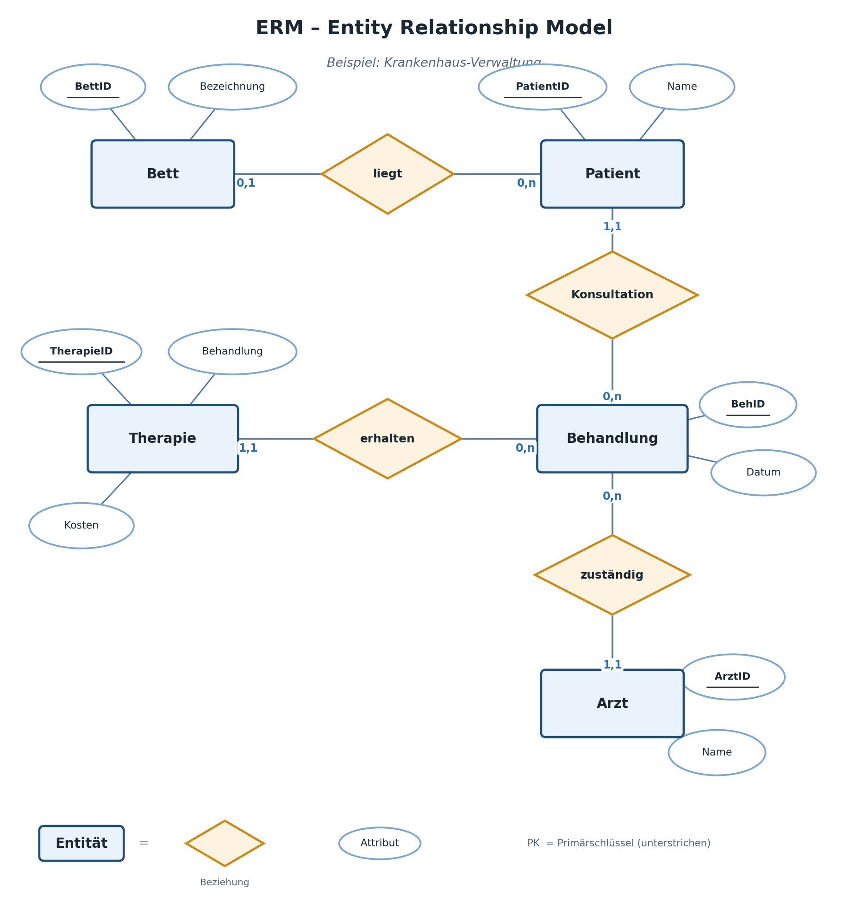
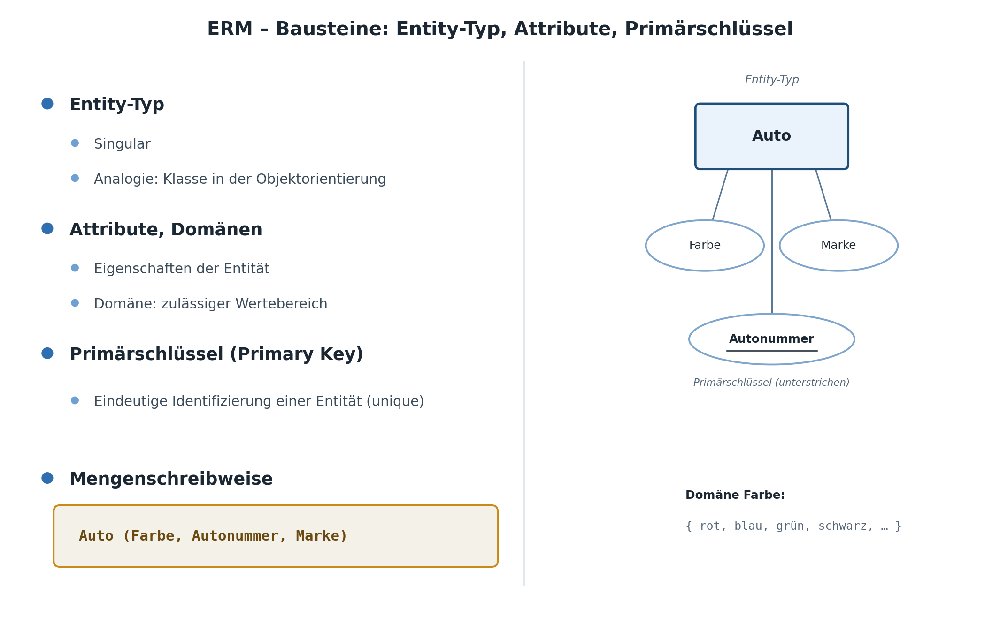
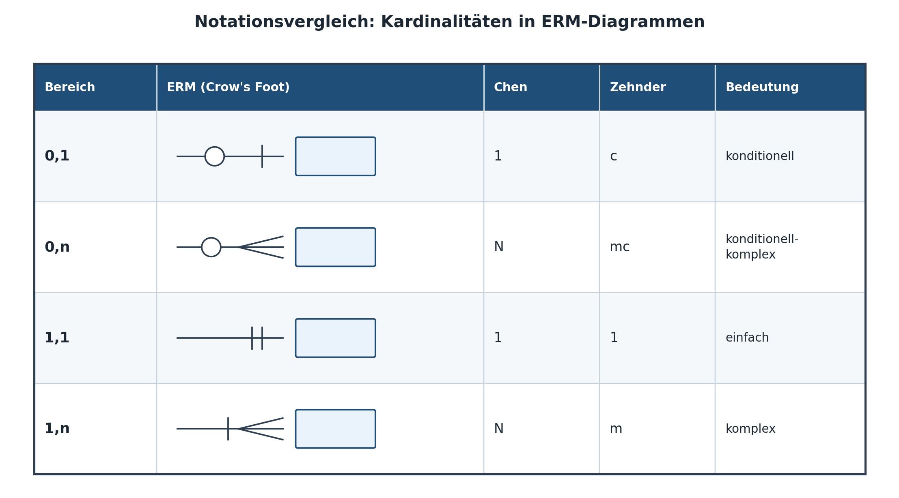
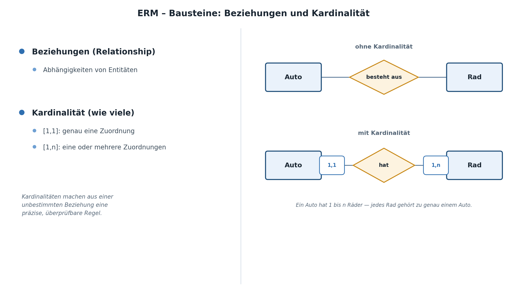
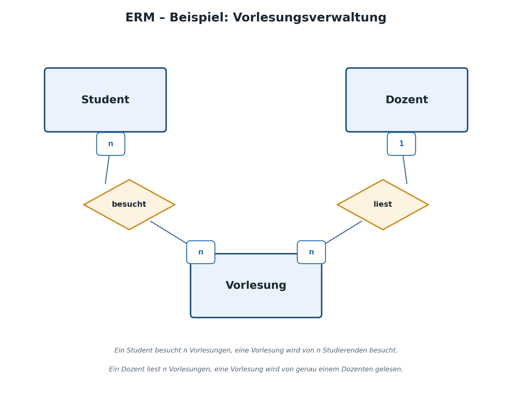
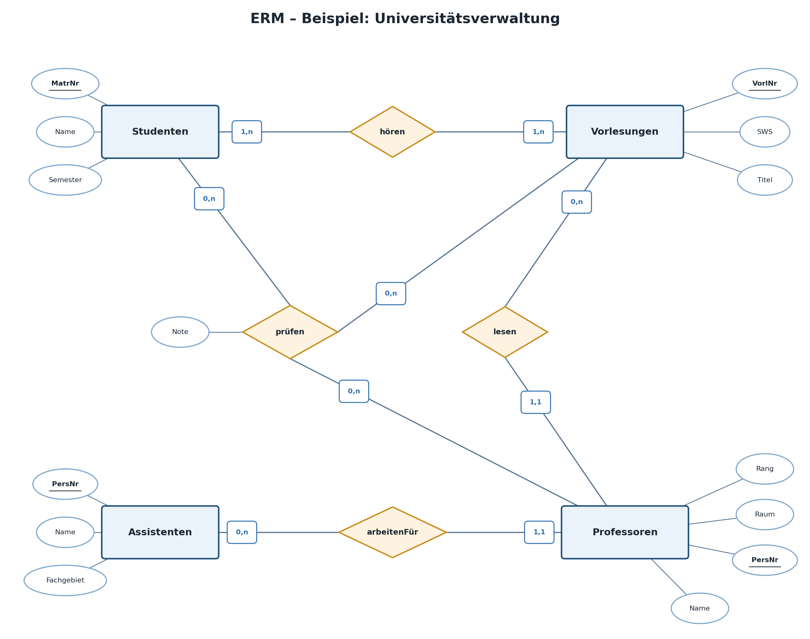
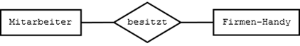

|                                             |                          |                               |
| ------------------------------------------- | ------------------------ | ----------------------------- |
| **Informatik\*in / Systemtechniker\*in HF** | **Datenbankentwicklung** |  |

- [1. ERM – Entity Relationship Modell](#1-erm--entity-relationship-modell)
  - [1.1. Lernziele](#11-lernziele)
  - [1.2. Das Entity Relationship Modell](#12-das-entity-relationship-modell)
  - [1.3. Notationselemente](#13-notationselemente)
  - [1.4. Beziehungen und Kardinalität](#14-beziehungen-und-kardinalität)
    - [1.4.1. Die (min,max)-Notation](#141-die-minmax-notation)
    - [1.4.2. Beziehungen modellieren](#142-beziehungen-modellieren)
    - [1.4.3. Assoziation](#143-assoziation)
    - [1.4.4. Die drei Grundtypen von Beziehungen](#144-die-drei-grundtypen-von-beziehungen)
    - [1.4.5. Typische Fehler bei der Kardinalitätsbestimmung](#145-typische-fehler-bei-der-kardinalitätsbestimmung)
    - [1.4.6. Vollständiges Beispiel-ERM](#146-vollständiges-beispiel-erm)
  - [1.5. Schritt-für-Schritt-Vorgehen zur Erstellung eines ERM](#15-schritt-für-schritt-vorgehen-zur-erstellung-eines-erm)
  - [1.6. Rekursive Beziehungen (Ausblick)](#16-rekursive-beziehungen-ausblick)
  - [1.7. ERM - Beispiel UNI](#17-erm---beispiel-uni)
- [2. Aufgaben](#2-aufgaben)
  - [2.1. Beziehungen ermitteln und modellieren](#21-beziehungen-ermitteln-und-modellieren)
  - [2.2. ERM erstellen (Produktherstellung)](#22-erm-erstellen-produktherstellung)
  - [2.3. Kardinalitäten bestimmen](#23-kardinalitäten-bestimmen)

---

</br>

# 1. ERM – Entity Relationship Modell

## 1.1. Lernziele

Nach diesem Kapitel können Sie:

- [ ] **Entitätsmengen**, **Attribute** und **Beziehungen** in einem **ERM** grafisch darstellen
- [ ] **Kardinalitäten (min/max-Notation)** korrekt bestimmen und einzeichnen
- [ ] **1:1-, 1:n- und m:n-Beziehungen** unterscheiden und Beispiele aus der Praxis zuordnen
- [ ] ein vollständiges **ERM** zu einer gegebenen Anforderungsbeschreibung selbständig erstellen
- [ ] **rekursive Beziehungen** erkennen und grob einordnen

---

## 1.2. Das Entity Relationship Modell



Das **Entity-Relationship-Modell** (ERM) ist die grafische Notation, mit der man das Ergebnis der konzeptionellen Datenmodellierung (siehe Kapitel 2) darstellt. Es zeigt auf einen Blick:

- welche Entitätsmengen existieren
- welche Attribute zu ihnen gehören
- wie die Entitätsmengen über Beziehungen miteinander verknüpft sind
- **wie viele** Entitäten jeweils an einer Beziehung teilnehmen (Kardinalität)

Das ERM ist bewusst **technologieunabhängig** – es sagt nichts über SQL, Tabellen oder ein konkretes DBMS aus. Es ist reine Fachmodellierung und damit auch für Nicht-Informatiker verständlich, was es zu einem hervorragenden Kommunikationsmittel zwischen Fachabteilung und Entwicklung macht.

Das ERM wurde 1976 von Peter Chen als Notation vorgeschlagen und hat sich seither – trotz zahlreicher Varianten und konkurrierender Notationen (z.B. Krähenfuss-Notation, UML-Klassendiagramme) – als Standardwerkzeug der konzeptionellen Datenmodellierung etabliert. Der grosse Vorteil gegenüber einer direkten Diskussion in SQL-Tabellenform: Ein ERM lässt sich mit Fachpersonen besprechen, die keine SQL-Kenntnisse besitzen, aber die fachlichen Zusammenhänge am besten kennen.

Das Erstellen eines Datenmodells ist kein fest vorgegebener, streng mathematischer Ablauf sein. Es ist vielmehr ein **kreativer Prozess**, in welchem die Abstraktion eine wichtige Rolle spielt, in welchem immer und immer wieder die Vor– und Nachteile unterschiedlicher Lösungsansätze verglichen werden. Der Datenmodellierer muss daher über **Kreativität**, **Abstraktionsvermögen**, **Ausdauer** und **Erfahrung** verfügen.

> **Aus den vorhergehenden Erläuterungen geht auch hervor, dass es kein Standardmodell geben kann, welches die Bedürfnisse einer bestimmten Branche unternehmensspezifisch abdeckt.**

Entity-Relationship-Model (dt. Entitäten-Beziehungs-Modell)

- Das ERM ist speziell gut geeignet um Sachverhalte für Datenbankanwendungen zu modellieren.
- Das ERM gehört zum **konzeptionellen Schema**.
- Der Begriff ERD wird auch häufig verwendet. D steht für Diagramm. Gemeint ist dasselbe wie ERM.
- Das ERM wird oft auch als **semantischen Modell** bezeichnet.

**Das ERM besteht auf folgenden Komponenten:**

- **Entität** mit Attributen
- **Entitätsmenge**
- **Beziehung** (Relationship)

**Charakteristiken von Modellen:**

- Ein Modell ist eine zweckorientierte, vereinfachte und strukturgleiche Abbildung der Wirklichkeit.
- Die Beziehung zwischen Modell und Wirklichkeit ist die Analogie.
- Ein Modell konzentriert sich auf das Wesentliche und reduziert so die Komplexität der Wirklichkeit.
- Ein Modell grenzt Unwesentliches aus -> Informationsverlust
- Ein Modell hat eine Systemgrenze. Da diese praktische nie gegeben ist, muss sie festgelegt werden. Wie die Systemgrenze gesetzt wird, ist eine Frage der Zweckmässigkeit.

---

## 1.3. Notationselemente

| **Element**              | **Symbol**                                  | **Bedeutung**                        |
| ------------------------ | ------------------------------------------- | ------------------------------------ |
| Entitätsmenge            | Rechteck                                    | z.B. `Maschine`                      |
| Attribut                 | Oval oder Liste im Rechteck                 | z.B. `Maschinennummer`               |
| Primärschlüssel-Attribut | unterstrichen                               | eindeutig identifizierendes Attribut |
| Beziehung (Relationship) | Raute / Linie mit Namen                     | z.B. `wartet`, `betrifft`            |
| Kardinalität             | Zahl oder (min,max) an der Verbindungslinie | Anzahl teilnehmender Entitäten       |

In diesem Kurs verwenden wir die **(min,max)-Notation**, da sie präzise ist und in der Praxis (u.a. bei UML-Klassendiagrammen) breit verbreitet ist. Zur einfacheren Darstellung in Markdown zeichnen wir die Diagramme als ASCII-Grafiken.



---

## 1.4. Beziehungen und Kardinalität

Eine Beziehung (Relationship) verbindet zwei (selten mehr) Entitätsmengen. Die **Kardinalität** gibt an, wie viele Entitäten der einen Seite mit wie vielen Entitäten der anderen Seite in Beziehung stehen können.

Eine gut gewählte Beziehungsbezeichnung liest sich als vollständiger Satz in Kombination mit den beteiligten Entitätsmengen: „Techniker **führt durch** Wartung", „Wartung **betrifft** Maschine". Beziehungen sollten möglichst aus der Sicht **beider** Richtungen sinnvoll lesbar sein – oft lohnt sich sogar, für beide Leserichtungen einen eigenen Namen zu vergeben (z.B. „Techniker führt Wartung durch" / „Wartung wird durchgeführt von Techniker"), auch wenn im Diagramm meist nur eine Bezeichnung notiert wird. Unklare oder generische Beziehungsnamen wie „hat" oder „bezieht sich auf" sollten wenn möglich vermieden werden, da sie bei der späteren Kommunikation mit Fachpersonen wenig Aussagekraft besitzen.

### 1.4.1. Die (min,max)-Notation

An jedem Ende einer Beziehungslinie steht ein Zahlenpaar `(min,max)`:

- **min** = minimale Anzahl von Beziehungen, an denen eine Entität teilnehmen *muss* (0 = optional, 1 = Pflicht)
- **max** = maximale Anzahl von Beziehungen, an denen eine Entität teilnehmen *kann* (1 = genau eine, n = beliebig viele)



Die Kardinalität wird für **jede Seite separat** bestimmt, und zwar immer aus der Perspektive der **gegenüberliegenden** Entitätsmenge. Eine hilfreiche Merkregel: Stellen Sie sich vor, Sie stehen bei einer konkreten Entität (z.B. einem bestimmten Techniker) und fragen sich: „Mit wie vielen Entitäten der anderen Seite (Wartungen) kann/muss ich mindestens/höchstens in Beziehung stehen?" Die Antwort wird direkt bei der Linie **neben der anderen Entitätsmenge** eingetragen.



### 1.4.2. Beziehungen modellieren

**Beziehung (Raute)**: Als Beziehungstyp zwischen Entitätstypen wird einen kurzen Text, meist ein **Verb** verwendet.
**Definition:** Eine Beziehung (engl. relationship) **assoziiert** wechselseitig mindestens **zwei Entitäten**.

**Merke:**

> - Eine Beziehung wird durch eine Linie dargestellt.
> - Auf der Linie ist die Bezeichnung der Beziehung enthalten. Auf diese Benennung der Beziehung kann verzichtet werden, falls sie aus dem Zusammenhang eindeutig ersichtlich ist, muss aber immer dann erfolgen, wenn diese nicht a priori klar ist.

### 1.4.3. Assoziation

Assoziation bedeutet, dass eine Entität eine andere Entität kennt und mit ihr in Wechselwirkung steht.
Für jede Beziehung wird angegeben, in welchem Mengenverhältnis die Entitätsmengen zueinander stehen.

### 1.4.4. Die drei Grundtypen von Beziehungen

**1:1-Beziehung** – eine Entität der einen Seite steht mit *höchstens einer* Entität der anderen Seite in Beziehung.

```bash
┌───────────┐  (1,1)      (0,1)  ┌──────────────────┐
│  Maschine │──────── hat ───────│ Steuerungsmodul  │
└───────────┘                    └──────────────────┘
```

*Lesart:* Jede Maschine hat genau ein Steuerungsmodul (1,1); ein Steuerungsmodul gehört zu keiner oder höchstens einer Maschine (0,1) – z.B. weil es sich noch im Lager befindet.

1:1-Beziehungen sind in der Praxis vergleichsweise selten – oft ein Hinweis darauf, dass zwei Entitätsmengen eigentlich auch zu **einer** zusammengefasst werden könnten. Sie sind aber gerechtfertigt, wenn z.B. ein Teil der Attribute nur optional vorhanden ist, unterschiedliche Zugriffsrechte auf die beiden Attributgruppen bestehen sollen, oder wenn – wie im Beispiel – zwei fachlich unabhängige Objekte (die Maschine als Ganzes, das austauschbare Steuerungsmodul) modelliert werden sollen.

**1:n-Beziehung** – eine Entität der einen Seite kann mit *mehreren* Entitäten der anderen Seite in Beziehung stehen, umgekehrt aber nur mit einer.

```bash
┌───────────┐  (1,1)      (0,n)  ┌──────────────────┐
│ Techniker │──── führt durch ───│    Wartung       │
└───────────┘                    └──────────────────┘
```

*Lesart:* Ein Techniker führt 0 bis n Wartungen durch; eine Wartung wird von genau einem Techniker durchgeführt.

Die 1:n-Beziehung ist der mit Abstand häufigste Beziehungstyp in praktischen Datenmodellen. Sie beschreibt klassische „gehört zu"-Beziehungen: eine Wartung gehört zu genau einer Maschine, eine Bestellung gehört zu genau einem Kunden, ein Wartungsauftrag gehört zu genau einem Techniker.

**m:n-Beziehung** – Entitäten auf beiden Seiten können mit beliebig vielen Entitäten der anderen Seite in Beziehung stehen.

```bash
┌───────────┐  (0,n)      (1,n)  ┌──────────────────┐
│  Wartung  │──── benötigt ──────│   Ersatzteil     │
└───────────┘                    └──────────────────┘
```

*Lesart:* Eine Wartung benötigt 1 bis n Ersatzteile; ein Ersatzteil kann in 0 bis n Wartungen verwendet werden.

> **Wichtig:** Wie gezeigt wird, lassen sich 1:1- und 1:n-Beziehungen direkt über Fremdschlüssel abbilden. m:n-Beziehungen hingegen benötigen zwingend eine **Zwischentabelle (Verbindungstabelle)** – dies ist einer der wichtigsten Übergänge zwischen ERM und Relationenmodell.

**Beispiel:**



- Ein **Student** besucht mehrere **Vorlesungen** (natürlich nicht gleichzeitig).
- Ein **Dozent** liest mehrere **Vorlesungen**.
- Eine **Vorlesung** wird von genau einem **Dozenten** gehalten, aber von mehreren **Studenten** besucht.

### 1.4.5. Typische Fehler bei der Kardinalitätsbestimmung

In der Praxis (und in Prüfungen) sind folgende zwei Fehler besonders häufig:

1. **Verwechslung der Seiten:** Die Kardinalität wird auf der „falschen" Seite der Linie eingetragen. Merkhilfe: Die Zahl neben einer Entitätsmenge beschreibt immer, wie oft **diese** Entitätsmenge an der Beziehung teilnimmt – nicht die gegenüberliegende.
2. **min und max vertauscht/verwechselt:** Insbesondere der Unterschied zwischen „muss" (min=1) und „kann" (min=0) wird oft übersehen. Eine gute Prüffrage: „Kann diese Entität existieren, **ohne** an dieser Beziehung teilzunehmen?" – wenn ja, ist min=0.

### 1.4.6. Vollständiges Beispiel-ERM

> „Techniker führen Wartungen an Maschinen durch. Bei jeder Wartung werden ein oder mehrere Ersatzteile verbaut, und dasselbe Ersatzteil kann bei verschiedenen Wartungen zum Einsatz kommen."

```bash
┌────────────┐  (1,1)        (0,n)  ┌────────────┐  (0,n)         (1,1)  ┌────────────┐
│ Techniker  │───── führt durch ────│  Wartung   │──── betrifft ─────────│  Maschine  │
└────────────┘                      └─────┬──────┘                       └────────────┘
                                          │
                                    (0,n) │ benötigt
                                          │ (1,n)
                                    ┌─────┴──────┐
                                    │ Ersatzteil │
                                    └────────────┘
```

Attribute (Auszug):

- `Techniker`: Personalnummer (PK), Name, Telefonnummer, Fachgebiet
- `Wartung`: Wartungsnummer (PK), Datum, Beschreibung
- `Maschine`: Maschinennummer (PK), Bezeichnung, Standort, Baujahr
- `Ersatzteil`: Ersatzteilnummer (PK), Bezeichnung, Preis, Lagerbestand

---

## 1.5. Schritt-für-Schritt-Vorgehen zur Erstellung eines ERM

Für die praktische Erarbeitung eines eigenen ERM empfiehlt sich folgendes Vorgehen, das auch in den Übungen dieses Kapitels angewendet wird:

1. **Substantiv-Analyse** durchführen (siehe Kapitel 2.4) und Entitätsmengen-Kandidaten bestimmen
2. Für jede Entitätsmenge die relevanten **Attribute** sammeln und den **Primärschlüssel** festlegen
3. Zwischen je zwei Entitätsmengen prüfen, ob eine **Beziehung** besteht, und diese sinnvoll benennen
4. Für jede Beziehung die **Kardinalität** auf beiden Seiten bestimmen (min und max separat)
5. Das entstandene Modell **gegen die Anforderungsbeschreibung prüfen**: Lassen sich alle im Text formulierten Fragestellungen mit dem Modell beantworten?

Dieser letzte Prüfschritt wird in der Praxis häufig vergessen, ist aber entscheidend: Ein ERM, das zwar „schön" aussieht, aber die eigentliche fachliche Fragestellung nicht abbilden kann (z.B. weil eine wichtige Kardinalität falsch gewählt wurde), verursacht in einer späteren Phase erheblichen Korrekturaufwand.

---

## 1.6. Rekursive Beziehungen (Ausblick)

Eine Beziehung kann auch eine Entitätsmenge mit sich selbst verbinden – man spricht von einer **rekursiven** oder **unären** Beziehung.

*Beispiel:* Ein Techniker kann einem anderen Techniker als Mentor zugeteilt sein.

```bash
┌────────────┐
│ Techniker  │◄────┐
└─────┬──────┘     │
      │ (0,1)      │ (0,n)
      └── betreut ─┘
```

Bei rekursiven Beziehungen ist es hilfreich, den beiden „Rollen", die dieselbe Entitätsmenge in der Beziehung einnimmt, eigene Namen zu geben (hier z.B. „Mentor" und „Betreuter"), um Missverständnisse zu vermeiden. Weitere typische Beispiele für rekursive Beziehungen: eine Stückliste (ein Bauteil besteht aus weiteren Bauteilen), eine Organisationsstruktur (ein Mitarbeitender hat einen Vorgesetzten, der selbst wieder Mitarbeitender ist), oder eine Ersatzteil-Kompatibilitätsliste (ein Ersatzteil kann durch ein anderes Ersatzteil ersetzt werden).

Rekursive Beziehungen sind fortgeschrittener Stoff und werden in diesem Kurs nur als Ausblick erwähnt (vertiefte Behandlung typischerweise in einem Aufbaukurs Datenbanken 2).

---

## 1.7. ERM - Beispiel UNI



---

</br>

# 2. Aufgaben

## 2.1. Beziehungen ermitteln und modellieren

| **Vorgabe**             | **Beschreibung**                                                              |
| :---------------------- | :---------------------------------------------------------------------------- |
| **Lernziele**           | Können sinnvolle Beziehungen zwischen zwei Entitäten erkennen und modellieren |
|                         | Können die Kardinalität von Beziehungen mit min,max Notation festlegen        |
| **Sozialform**          | Einzelarbeit                                                                  |
| **Auftrag**             | siehe unten                                                                   |
| **Hilfsmittel**         |                                                                               |
| **Erwartete Resultate** |                                                                               |
| **Zeitbedarf**          | 15 min                                                                        |
| **Lösungselemente**     | Vollständige Lösung mit Kardinalität auf Papier oder als DIA Datei            |

- Füge sinnvolle Beziehungen zwischen den folgenden Entitäten ein.
- Verwenden Sie dabei die Min, Max Notation ([1,1], [1,n] etc.)

- 
  - Jede Mutter hat mindestens ein oder mehrere Kinder geboren. Jedes Kind wurde von genau einer Mutter geboren
- 
  - In einer Firma kann jeder Mitarbeiter ein Firmen-Handy haben, muss es aber nicht. Jedes Firmen-Handy ist entweder einem oder keinem Mitarbeiter zugeordnet. Handys ohne Zuordnung können z.B. bei Bedarf verliehen werden
- 
  - Jeder Mentor unterstützt einen oder mehrere Künstler. Jeder Künstler kann einen oder keinen Mentor haben
- 
  - In jeden See können kein oder ein Fluss oder mehrere Flüsse münden. Jeder Fluss kann in genau einen See münden, muss es aber nicht
- 
  - Jeder Student nimmt an mindestens einer Vorlesung oder aber mehreren Vorlesungen teil. An jeder Vorlesung nimmt mindestens ein Student oder nehmen mehrere Studenten teil
- 
  - Jeder Artikel kann in keinen, einer oder mehreren Bestellungen vorkommen. Jede Bestellung beinhaltet einen oder mehrere Artikel.
- 
  - Ein Artikel kann in keinem oder einem Lager oder mehreren Lagern gelagert sein. In jedem Lager können kein, ein oder mehrere Artikel lagern. Es wird berücksichtigt, dass Artikel ausverkauft sein können und dass Lagergebäude saniert werden müssen.
  
---

## 2.2. ERM erstellen (Produktherstellung)

| **Vorgabe**             | **Beschreibung**                                              |
| :---------------------- | :------------------------------------------------------------ |
| **Lernziele**           | Können ein ERM mit korrekten Konstruktionselementen erstellen |
|                         | Können im ERM Entitäten und Beziehungen modellieren           |
| **Sozialform**          | Einzelarbeit                                                  |
| **Auftrag**             | siehe unten                                                   |
| **Hilfsmittel**         |                                                               |
| **Erwartete Resultate** |                                                               |
| **Zeitbedarf**          | 30 min                                                        |
| **Lösungselemente**     | ERM Modell auf Papier oder Draw.io                            |

Ein **ERM** und relationales Datenmodell aus vorgegebenen Regeln ableiten und vollständig mit korrekten Konstruktionselementen (Entität, Beziehung, Attribut) modellieren.

**Die Regeln:**

1. Ein Mitarbeiter hat einen Namen
2. Ein Mitarbeiter hat einen Wohnort
3. Ein Mitarbeiter arbeitet in einer Abteilung
4. Ein Mitarbeiter ist an der Herstellung mehrerer Produkte beteiligt
5. Die Herstellung erfordert pro Mitarbeiter eine bestimmte Zeit
6. Eine Abteilung hat einen Namen
7. Jedes Produkt hat eine Nummer und einen Namen
8. In einer Abteilung sind mehrere Mitarbeiter angestellt
9. Die Herstellung eines Produktes erfordert mehrere Mitarbeiter

**Auftrag:**

Entity-Relationship-Modell:** Stelle den obigen Sachverhalt im Entity-Relationship-Modell (ERM) auf einem Blatt Papier oder elektronisch (dia) dar.

---

## 2.3. Kardinalitäten bestimmen

| **Vorgabe**             | **Beschreibung**                                                            |
| :---------------------- | :-------------------------------------------------------------------------- |
| **Lernziele**           | Kardinalitäten (min,max) für gegebene Sachverhalte korrekt bestimmen        |
|                         | Ein vollständiges ERM zu einer neuen Anforderung selbständig erstellen      |
| **Sozialform**          | Einzelarbeit (Hauptaufgabe), Partnerarbeit (Zusatzaufgabe)                  |
| **Auftrag**             | siehe unten                                                                 |
| **Hilfsmittel**         | Kapitel 3 des Kursskripts, Zeichenmaterial oder Diagrammtool (z.B. draw.io) |
| **Erwartete Resultate** | 4 begründete Kardinalitätsbestimmungen sowie ein vollständiges ERM-Diagramm |
| **Zeitbedarf**          | 35 min                                                                      |
| **Lösungselemente**     | Musterlösungen inkl. begründeter Kardinalitäten und ERM-Lösungsskizze       |

Bestimmen Sie für folgende Situationen jeweils die passende Kardinalität `(min,max)` auf beiden Seiten und begründen Sie Ihre Wahl in einem Satz:

1. Ein Lieferant liefert Ersatzteile; ein Ersatzteil wird immer nur von genau einem festen Lieferanten bezogen.
2. Eine Maschine gehört zu genau einer Abteilung; eine Abteilung betreibt mehrere Maschinen, kann aber theoretisch auch (noch) keine besitzen.
3. Ein Wartungsauftrag kann von mehreren Technikern gemeinsam bearbeitet werden; ein Techniker kann an mehreren Wartungsaufträgen gleichzeitig beteiligt sein.
4. Jede Maschine hat genau ein Typenschild mit einer eindeutigen Seriennummer; ein Typenschild gehört zu genau einer Maschine.

**Zusatzaufgabe:**

Zeichnen Sie (von Hand oder mit einem Tool Ihrer Wahl) das vollständige ERM für folgende Anforderung:

> „Ein Kunde gibt Reparaturaufträge auf. Jeder Reparaturauftrag bezieht sich auf genau ein Gerät des Kunden. Ein Gerät kann im Lauf der Zeit mehrere Reparaturaufträge haben. Für jeden Reparaturauftrag wird ein zuständiger Techniker sowie das Auftragsdatum und der Status festgehalten."

---

© 2026 Lukas Müller – Licensed under CC BY-NC-ND 4.0
See [LICENSE](../license.md) file for details.
