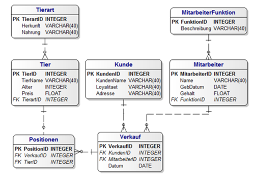
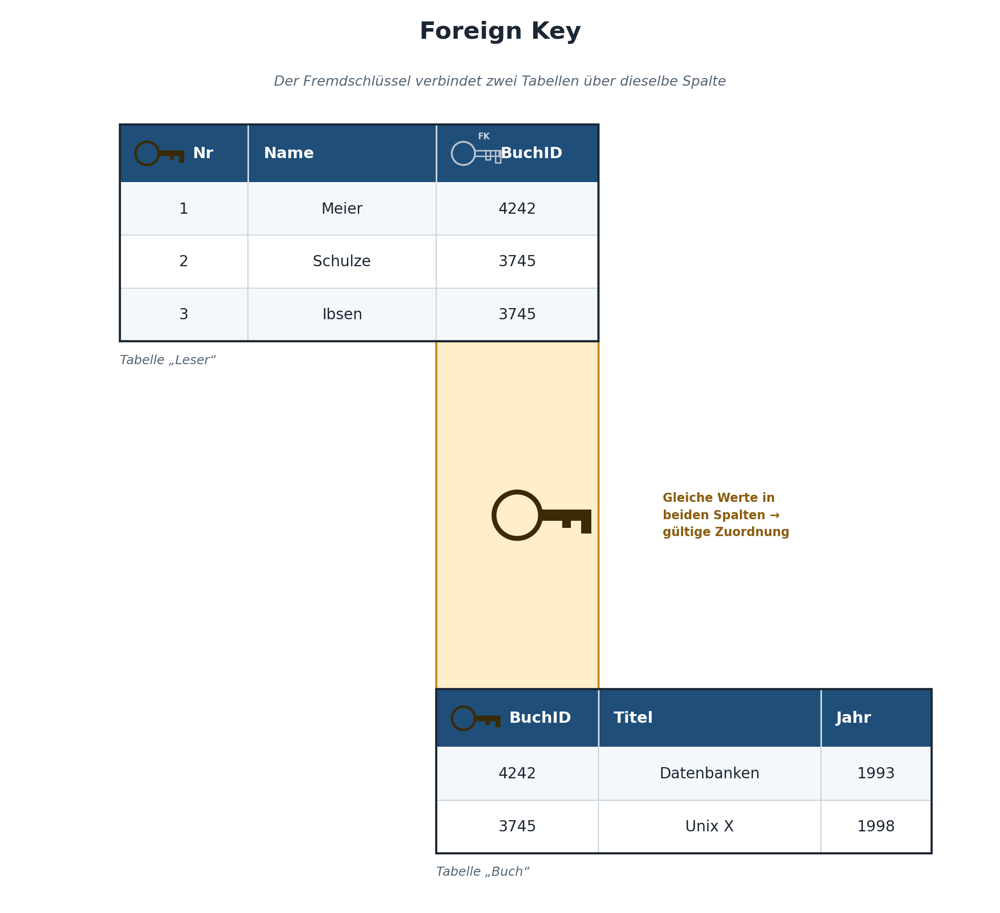
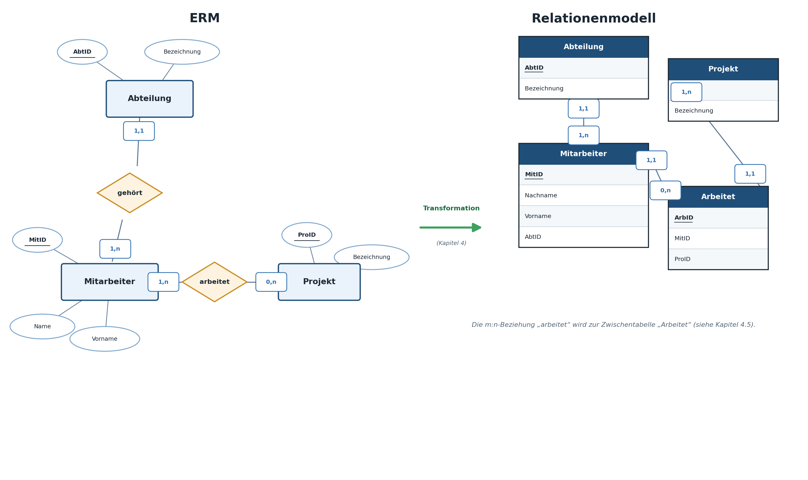
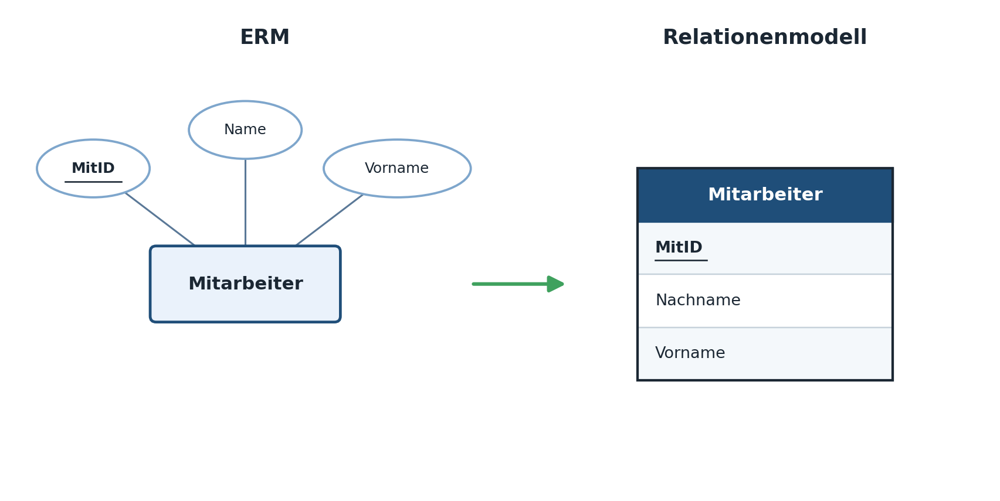
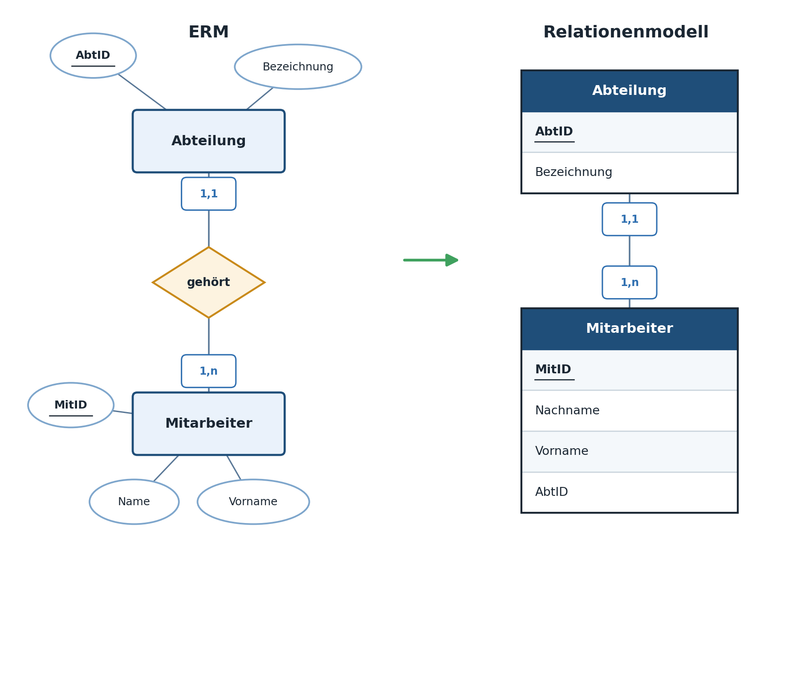
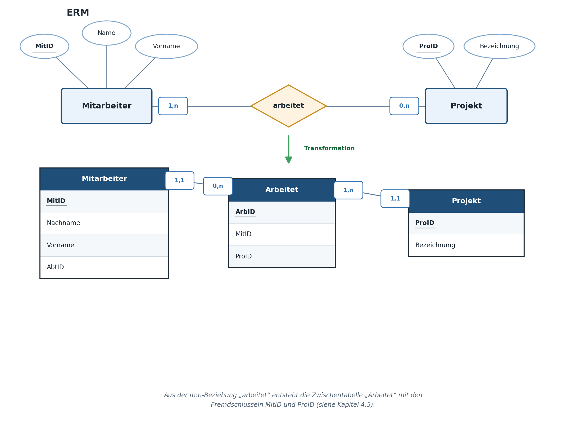
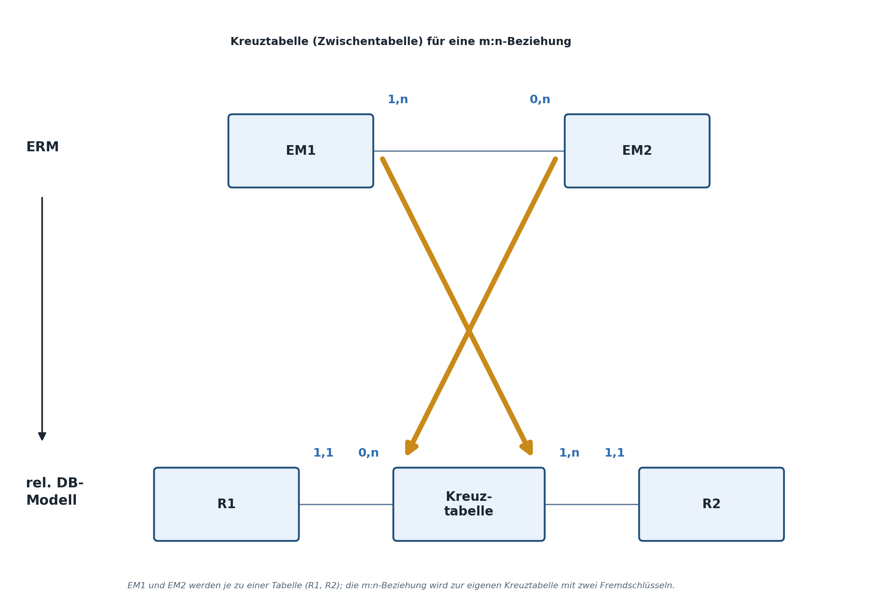

|                                             |                          |                               |
| ------------------------------------------- | ------------------------ | ----------------------------- |
| **Informatik\*in / Systemtechniker\*in HF** | **Datenbankentwicklung** |  |

- [1. Relationales Datenbank Modell](#1-relationales-datenbank-modell)
  - [1.1. Lernziele](#11-lernziele)
  - [1.2. Vom ERM zum Relationenmodell](#12-vom-erm-zum-relationenmodell)
  - [1.3. Formale Definition einer Relation](#13-formale-definition-einer-relation)
  - [1.4. Primärschlüssel (Primary Key)](#14-primärschlüssel-primary-key)
    - [1.4.1. Vor- und Nachteile im Detail](#141-vor--und-nachteile-im-detail)
  - [1.5. Fremdschlüssel (Foreign Key)](#15-fremdschlüssel-foreign-key)
  - [1.6. Referentielle Integrität](#16-referentielle-integrität)
    - [1.6.1. Regel: 1:1- und 1:n-Beziehungen abbilden](#161-regel-11--und-1n-beziehungen-abbilden)
    - [1.6.2. Merksatz zur Fremdschlüssel-Platzierung](#162-merksatz-zur-fremdschlüssel-platzierung)
  - [1.7. Regel: m:n-Beziehungen abbilden (Zwischentabelle)](#17-regel-mn-beziehungen-abbilden-zwischentabelle)
    - [1.7.1. Warum genau diese Lösung funktioniert](#171-warum-genau-diese-lösung-funktioniert)
  - [1.8. Schritt für Schritt vom ERM zum Relationen Modell](#18-schritt-für-schritt-vom-erm-zum-relationen-modell)
    - [1.8.1. Schritt 1](#181-schritt-1)
    - [1.8.2. Schritt 2](#182-schritt-2)
    - [1.8.3. Schritt 3](#183-schritt-3)
    - [1.8.4. Kreuztabellen](#184-kreuztabellen)
  - [1.9. NULL-Werte](#19-null-werte)
    - [1.9.1. Dreiwertige Logik](#191-dreiwertige-logik)
- [2. Aufgaben](#2-aufgaben)
  - [2.1. ERM/RM erstellen (Produktherstellung)](#21-ermrm-erstellen-produktherstellung)
  - [2.2. ERM in Relationenmodell überführen](#22-erm-in-relationenmodell-überführen)
  - [2.3. Datenmodelle erstellen (Aufgabensammlung)](#23-datenmodelle-erstellen-aufgabensammlung)

---

</br>

# 1. Relationales Datenbank Modell

## 1.1. Lernziele

Nach diesem Kapitel können Sie:

- [ ] die Begriffe **Relation**, **Primärschlüssel (Primary Key)** und **Fremdschlüssel (Foreign Key)** definieren
- [ ] ein ERM systematisch in ein Relationenmodell (Tabellenmodell) überführen
- [ ] 1:1-, 1:n- und m:n-Beziehungen korrekt in Tabellenstrukturen abbilden
- [ ] natürliche und künstliche Schlüssel unterscheiden und begründet auswählen
- [ ] den Umgang mit `NULL`-Werten und deren Bedeutung erklären

---

## 1.2. Vom ERM zum Relationenmodell

Während das ERM die *fachliche* Sicht auf die Daten darstellt, ist das **Relationenmodell** die *logische* Sicht: Hier werden Entitätsmengen zu **Tabellen (Relationen)**, Entitäten zu **Zeilen (Tupeln)** und Attribute zu **Spalten**.



Das Relationen Modell dient zum **Überführen** eines Entity-Relationship-Modells in eine **Datenbank**. Diese Form ist für Computer "**verständlicher**". Im Relationen Modell verwendet man **Tabellen**, statt einer grafischen Darstellung. Der Titel der Tabelle ist dabei der Name des darzustellenden Objekts (Entitys). Die Eigenschaften (Attribute) des Entitys (Objekts) sind Spalten dieser Tabelle.

**Beispiel:**

Man möchte **Personen** mit folgenden Eigenschaften darstellen: `Personalausweisnummer`, `Vorname`, `Nachname`, `Geburtsdatum` und `Adresse`. Man bezeichnet die **Personen** in diesem Beispiel auch als Entitätstypen, also Objekte (Entitys) vom **Typ Person**.

Die Tabelle heisst folglich "`Person`" und hat die **5 Spalten:** `Personalausweisnummer, Vorname, Nachname, Geburtsdatum und Adresse`.

| **ERM-Begriff** | **Relationenmodell-Begriff**                              |
| --------------- | --------------------------------------------------------- |
| Entitätsmenge   | Relation / Tabelle                                        |
| Entität         | Tupel / Zeile / Datensatz                                 |
| Attribut        | Spalte / Feld                                             |
| Beziehung       | Fremdschlüssel-Verknüpfung (oder Zwischentabelle bei m:n) |

---

## 1.3. Formale Definition einer Relation

Mathematisch betrachtet ist eine Relation eine Menge von Tupeln gleicher Struktur. Aus dieser mathematischen Herkunft (Mengenlehre) ergeben sich einige wichtige Grundregeln, die für alle relationalen Datenbanken gelten:

- **Keine doppelten Zeilen:** Eine Relation ist im mathematischen Sinn eine *Menge*, und Mengen enthalten keine doppelten Elemente. In der Praxis wird dies über den Primärschlüssel sichergestellt (siehe 4.2).
- **Keine Ordnung der Zeilen:** Die Reihenfolge der Zeilen in einer Tabelle hat keine inhaltliche Bedeutung – wird eine bestimmte Sortierung benötigt, muss sie explizit über `ORDER BY` angefordert werden (siehe Kapitel 7.3).
- **Keine Ordnung der Spalten:** Auch die Spaltenreihenfolge ist formal beliebig; in der Praxis hält man sich dennoch meist an eine sinnvolle, konsistente Reihenfolge (z.B. Primärschlüssel zuerst).
- **Atomare Werte je Zelle:** Jede Zelle (Schnittpunkt von Zeile und Spalte) enthält genau einen unteilbaren Wert – dieser Grundsatz wird in Kapitel 5.2 als 1. Normalform vertieft.

Diese Eigenschaften unterscheiden das Relationenmodell fundamental von einer gewöhnlichen Excel-Tabelle, in der z.B. mehrere Werte in einer Zelle stehen oder doppelte Zeilen ohne Weiteres möglich sind.

---

## 1.4. Primärschlüssel (Primary Key)


Der **Primärschlüssel** ist ein Attribut (oder eine Kombination von Attributen), das jede Zeile einer Tabelle **eindeutig** identifiziert.

Anforderungen an einen guten Primärschlüssel:

- **eindeutig** – kein Wert darf doppelt vorkommen
- **nicht leer** (`NOT NULL`) – jede Zeile muss einen Wert haben
- **stabil** – der Wert sollte sich über die Zeit möglichst nicht ändern
- **minimal** – enthält keine überflüssigen Bestandteile, die zur eindeutigen Identifikation nicht nötig wären

**Natürlicher vs. künstlicher Schlüssel:**

- *Natürlicher Schlüssel:* ein bereits vorhandenes, fachlich bedeutungsvolles Attribut, z.B. eine Seriennummer
- *Künstlicher Schlüssel (Surrogatschlüssel):* ein technisch erzeugter, bedeutungsloser Wert, meist eine automatisch hochzählende Ganzzahl (`AUTOINCREMENT` in SQLite)

**Praxisempfehlung:** In den meisten modernen Anwendungen wird ein künstlicher Schlüssel bevorzugt, da natürliche Schlüssel sich überraschend oft doch einmal ändern (z.B. eine Seriennummer wird korrigiert) – was bei einem Primärschlüssel massive Folgeprobleme verursacht.

### 1.4.1. Vor- und Nachteile im Detail

| **Kriterium**                                   | **Natürlicher Schlüssel**                      | **Künstlicher Schlüssel**            |
| ----------------------------------------------- | ---------------------------------------------- | ------------------------------------ |
| Lesbarkeit für Menschen                         | hoch (z.B. Seriennummer direkt erkennbar)      | gering (bedeutungslose Zahl)         |
| Stabilität über Zeit                            | oft geringer als angenommen                    | sehr hoch, ändert sich praktisch nie |
| Risiko bei fachlichen Änderungen                | hoch (z.B. Umnummerierung durch Fachabteilung) | keines, da rein technisch            |
| Zusätzlicher Speicherbedarf                     | keiner                                         | minimal (zusätzliche Spalte)         |
| Eignung bei Systemintegration (mehrere Quellen) | schwierig (Kollisionen möglich)                | einfacher zu handhaben               |

In der Praxis empfiehlt sich häufig eine Kombination: ein künstlicher Schlüssel als Primärschlüssel für die technische Verknüpfung (Fremdschlüsselbeziehungen), zusätzlich ein `UNIQUE`-Constraint (siehe Kapitel 6.3) auf dem natürlichen Schlüssel, um dessen fachliche Eindeutigkeit weiterhin sicherzustellen.

---

## 1.5. Fremdschlüssel (Foreign Key)



Ein **Fremdschlüssel** ist ein Attribut in einer Tabelle, das auf den Primärschlüssel einer anderen (oder derselben) Tabelle verweist. Über Fremdschlüssel werden die im ERM modellierten Beziehungen im Relationenmodell abgebildet.

**Beispiel:**

```console
Tabelle: Techniker                    Tabelle: Wartung
┌───────────────┬──────────┐          ┌──────────────┬────────────┬─────────────────┐
│ PersonalNr(PK)│  Name    │          │ WartungsNr(PK)│  Datum    │ PersonalNr (FK) │
├───────────────┼──────────┤          ├──────────────┼────────────┼─────────────────┤
│      1        │ Meier    │          │      101      │ 2026-03-01│       1         │
│      2        │ Huber    │          │      102      │ 2026-03-02│       2         │
└───────────────┴──────────┘          │      103      │ 2026-03-03│       1         │
                                      └──────────────┴────────────┴─────────────────┘
```

Die Spalte `PersonalNr` in der Tabelle `Wartung` ist ein Fremdschlüssel – sie verweist auf den Primärschlüssel `PersonalNr` in der Tabelle `Techniker`. Der Fremdschlüssel steht **immer auf der „n"-Seite** einer 1:n-Beziehung (hier: bei `Wartung`, da eine Wartung genau einem Techniker zugeordnet ist).

---

## 1.6. Referentielle Integrität

Die zentrale Aufgabe eines Fremdschlüssels ist die Sicherstellung der **referentiellen Integrität**: Ein Fremdschlüsselwert darf nur dann in einer Tabelle stehen, wenn der referenzierte Wert in der Zieltabelle tatsächlich existiert. Ohne diese Sicherung könnten „verwaiste" Datensätze entstehen – z.B. eine Wartung, die auf eine gar nicht (mehr) existierende Technikerin verweist. Das DBMS überwacht diese Regel automatisch, sofern die Fremdschlüsselprüfung aktiviert ist (in SQLite muss dies wie in Kapitel 6.3 gezeigt explizit eingeschaltet werden). Referentielle Integrität betrifft dabei nicht nur das Einfügen neuer Zeilen, sondern auch das Löschen oder Ändern bestehender Zeilen in der referenzierten Tabelle (siehe Kapitel 10.6 zum Thema Löschen bei bestehenden Fremdschlüsselbeziehungen).

### 1.6.1. Regel: 1:1- und 1:n-Beziehungen abbilden

**1:n-Beziehung:** Der Fremdschlüssel wird auf der „n"-Seite (der Seite mit `max = n`) eingefügt.

`Techniker (1) ── führt durch ── (n) Wartung`
→ `Wartung` erhält die Spalte `PersonalNr` als Fremdschlüssel.

**1:1-Beziehung:** Der Fremdschlüssel kann grundsätzlich auf beiden Seiten platziert werden; sinnvollerweise auf der Seite mit der optionalen Teilnahme (`min = 0`).

`Maschine (1,1) ── hat ── (0,1) Steuerungsmodul`
→ `Steuerungsmodul` erhält den Fremdschlüssel `Maschinennummer`, da nicht jedes Steuerungsmodul zwingend verbaut sein muss.

### 1.6.2. Merksatz zur Fremdschlüssel-Platzierung

Eine einfache, verlässliche Merkregel: *„Der Fremdschlüssel steht immer auf der Seite, die in der Beziehung höchstens einmal (max = 1) vorkommt."* Bei einer 1:n-Beziehung ist das immer die „n"-Seite (auf der „1"-Seite käme ja sonst derselbe Fremdschlüsselwert theoretisch mehrfach vor, was der Eindeutigkeitsanforderung widerspräche). Diese Regel funktioniert auch zuverlässig bei 1:1-Beziehungen und hilft, den in der Praxis häufigen Fehler zu vermeiden, den Fremdschlüssel versehentlich auf der falschen Seite zu platzieren.

---

## 1.7. Regel: m:n-Beziehungen abbilden (Zwischentabelle)

Eine m:n-Beziehung lässt sich **nicht** direkt über einen einfachen Fremdschlüssel abbilden – dies würde entweder Redundanz oder Informationsverlust bedeuten. Stattdessen wird eine **Zwischentabelle (auch: Verbindungs- oder Assoziativtabelle)** eingeführt, die je einen Fremdschlüssel zu beiden beteiligten Tabellen enthält.

**Beispiel:** `Wartung (0,n) ── benötigt ── (1,n) Ersatzteil`

```console
Tabelle: Wartung            Tabelle: Wartung_Ersatzteil                   Tabelle: Ersatzteil
┌───────────────┐          ┌───────────────┬─────────────────┬───────┐   ┌─────────────────┐
│ WartungsNr(PK)│          │ WartungsNr(FK)│ ErsatzteilNr(FK)│ Menge │   │ ErsatzteilNr(PK)│
├───────────────┤          ├───────────────┼─────────────────┼───────┤   ├─────────────────┤
│     101       │          │     101       │      5001       │   2   │   │       5001      │
│     102       │          │     101       │      5003       │   1   │   │       5002      │
└───────────────┘          │     102       │      5001       │   1   │   │       5003      │
                           └───────────────┴─────────────────┴───────┘   └─────────────────┘
```

Der Primärschlüssel der Zwischentabelle ist meist die **Kombination** beider Fremdschlüssel (zusammengesetzter Primärschlüssel: `WartungsNr` + `ErsatzteilNr`). Die Spalte `Menge` zeigt, dass eine Zwischentabelle durchaus eigene, „beziehungsbezogene" Attribute besitzen kann (hier: wie viele Stück eines Ersatzteils bei dieser Wartung verwendet wurden).

### 1.7.1. Warum genau diese Lösung funktioniert

Der entscheidende Denkschritt: Eine m:n-Beziehung lässt sich als **zwei aufeinanderfolgende 1:n-Beziehungen** auffassen. `Wartung_Ersatzteil` steht in einer 1:n-Beziehung zu `Wartung` (eine Wartung kann mehrere Zwischentabellen-Einträge haben) **und** in einer 1:n-Beziehung zu `Ersatzteil` (ein Ersatzteil kann in mehreren Zwischentabellen-Einträgen vorkommen). Damit wird die ursprüngliche m:n-Beziehung durch zwei ganz normale 1:n-Beziehungen ersetzt, für die bereits die Regel aus Kapitel 4.4 gilt: Der Fremdschlüssel steht jeweils auf der „n"-Seite – und das ist in beiden Fällen die Zwischentabelle.

---

## 1.8. Schritt für Schritt vom ERM zum Relationen Modell



### 1.8.1. Schritt 1



Jede Entitätsmenge muss als eigenständige Tabelle mit einem eindeutigen Primärschlüssel definiert werden.

### 1.8.2. Schritt 2



Eine einfach-komplexe Beziehungsmenge kann ohne eigenständige Tabelle ausgedrückt werden.

### 1.8.3. Schritt 3



Jede komplex-komplexe (viele zu viele) Beziehungsmenge muss als eigenständige Tabelle definiert werden.

### 1.8.4. Kreuztabellen



---

## 1.9. NULL-Werte

`NULL` bedeutet **„kein Wert vorhanden"** – es ist explizit **nicht** dasselbe wie `0`, eine leere Zeichenkette `''` oder „unbekannt". `NULL` steht für die Abwesenheit eines Wertes.

Konsequenzen:

- Ein Primärschlüssel darf **nie** `NULL` sein (sonst wäre die Eindeutigkeit nicht mehr garantiert)
- Ein Fremdschlüssel darf `NULL` sein, wenn die Beziehung optional ist (`min = 0` im ERM)
- Vergleiche mit `NULL` verhalten sich speziell: `spalte = NULL` liefert nie `TRUE`, man muss `spalte IS NULL` verwenden (wird in Kapitel 7 vertieft)

### 1.9.1. Dreiwertige Logik

Ein Grund, weshalb der Umgang mit `NULL` anfangs gewöhnungsbedürftig ist: SQL verwendet keine klassische zweiwertige (wahr/falsch), sondern eine **dreiwertige Logik**: `TRUE`, `FALSE` und `UNKNOWN`. Jeder Vergleich, an dem ein `NULL`-Wert beteiligt ist, ergibt `UNKNOWN` – und Zeilen, deren `WHERE`-Bedingung zu `UNKNOWN` ausgewertet wird, werden im Ergebnis **nicht** angezeigt (genau wie bei `FALSE`). Dieses Verhalten ist konsistent, aber eben nicht immer intuitiv, und ein häufiger Grund für scheinbar „verschwindende" Zeilen in Abfrageergebnissen.

---

</br>

# 2. Aufgaben

## 2.1. ERM/RM erstellen (Produktherstellung)

| **Vorgabe**             | **Beschreibung**                                              |
| :---------------------- | :------------------------------------------------------------ |
| **Lernziele**           | Können ein ERM mit korrekten Konstruktionselementen erstellen |
|                         | Können im ERM Entitäten und Beziehungen modellieren           |
| **Sozialform**          | Einzelarbeit                                                  |
| **Auftrag**             | siehe unten                                                   |
| **Hilfsmittel**         |                                                               |
| **Erwartete Resultate** |                                                               |
| **Zeitbedarf**          | 30 min                                                        |
| **Lösungselemente**     | ERM und Relationen Modell auf Papier oder Draw.io             |

Ein relationales Datenmodell aus vorgegebenen Regeln ableiten und vollständig mit korrekten Konstruktionselementen (Entität, Beziehung, Attribut) modellieren.

**Die Regeln:**

1. Ein Mitarbeiter hat einen Namen
2. Ein Mitarbeiter hat einen Wohnort
3. Ein Mitarbeiter arbeitet in einer Abteilung
4. Ein Mitarbeiter ist an der Herstellung mehrerer Produkte beteiligt
5. Die Herstellung erfordert pro Mitarbeiter eine bestimmte Zeit
6. Eine Abteilung hat einen Namen
7. Jedes Produkt hat eine Nummer und einen Namen
8. In einer Abteilung sind mehrere Mitarbeiter angestellt
9. Die Herstellung eines Produktes erfordert mehrere Mitarbeiter

**Auftrag:**

Relationen Modell erstellen:** Überführen Sie das obige ERM in ein Relationen Modell.

---

## 2.2. ERM in Relationenmodell überführen

| **Vorgabe**             | **Beschreibung**                                                                |
| :---------------------- | :------------------------------------------------------------------------------ |
| **Lernziele**           | Ein gegebenes ERM systematisch in ein vollständiges Relationenmodell überführen |
|                         | Primär- und Fremdschlüssel korrekt platzieren                                   |
|                         | Notwendigkeit einer Zwischentabelle bei m:n-Beziehungen begründen               |
| **Sozialform**          | Einzelarbeit                                                                    |
| **Auftrag**             | siehe unten                                                                     |
| **Hilfsmittel**         | ERM Kapitel                                                                     |
| **Erwartete Resultate** | Vollständiges Tabellenschema mit allen PK/FK-Angaben                            |
| **Zeitbedarf**          | 35 min                                                                          |
| **Lösungselemente**     | Musterlösung mit vollständigem Tabellenschema und Begründungen                  |

Gegeben ist folgendes ERM (aus dem ERM Kapitel):

```console
Techniker (0,n) ──führt durch── (1,1) Wartung (1,1) ──betrifft── (0,n) Maschine
                                        │(1,n)
                                        │
                                        │benötigt
                                        │
                                        │(0,n)
                                    Ersatzteil
```

1. Leiten Sie daraus das vollständige Relationenmodell ab. Zeichnen Sie alle Tabellen mit ihren Spalten, markieren Sie Primärschlüssel (PK) und Fremdschlüssel (FK).
2. Wie viele Tabellen ergeben sich insgesamt? Begründen Sie, weshalb eine zusätzliche Tabelle nötig ist, die im ursprünglichen ERM nicht als eigene Entitätsmenge sichtbar war.
3. Definieren Sie für jede Tabelle mindestens 3 sinnvolle Attribute (inkl. Primärschlüssel), die nicht bereits im ERM in Kapitel 3 vorgegeben waren.
4. Nehmen Sie an, eine Wartung könnte künftig auch **kein** Ersatzteil benötigen (z.B. eine reine Sichtprüfung). Welche Kardinalität und welche Konsequenz für das Relationenmodell ergibt sich daraus?

---

## 2.3. Datenmodelle erstellen (Aufgabensammlung)

| **Vorgabe**             | **Beschreibung**                                              |
| :---------------------- | :------------------------------------------------------------ |
| **Lernziele**           | Können ein ERM mit korrekten Konstruktionselementen erstellen |
|                         | Können im ERM Entitäten und Beziehungen modellieren           |
| **Sozialform**          | Einzelarbeit                                                  |
| **Auftrag**             | siehe unten                                                   |
| **Hilfsmittel**         |                                                               |
| **Erwartete Resultate** |                                                               |
| **Zeitbedarf**          | 50 min                                                        |
| **Lösungselemente**     | ERM und Relationen Modell auf Papier oder Draw.io             |

Erstelle zu den nachfolgenden Aufgaben ein ERM und relationales Datenmodell.

**Aufgabe 1:**

- In einem Ort befinden sich mehrere Strassen.
- Eine Strasse befindet sich genau in einem Ort.
- An einer Strasse befinden sich mehrere Häuser.
- Ein Haus befindet sich genau an einer Strasse.

**Aufgabe 2:**

- In jeder Filiale der Pizza-Kette XY arbeiten mehrere Mitarbeiter
- Jeder Mitarbeiter gehört zu genau einer Filiale.
- Jede Filiale verfügt über mehrere Auslieferfahrzeuge.
- Jedes Fahrzeug gehört zu genau einer Filiale

**Aufgabe 3:**

- In einem Museum A gibt es verschiedene Räume, in denen wiederum verschiedene Gegenstände ausgestellt werden.
- Jeder Gegenstand gehört zu genau einer Kategorie (z.B. Bild, Holzgegenstand, Metallgegenstand usw.).
- Für jeden Raum ist genau ein Mitarbeiter zuständig.
- Auch für jede Kategorie ist genau in Mitarbeiter zuständig.

---

© 2026 Lukas Müller – Licensed under CC BY-NC-ND 4.0
See [LICENSE](..\license.md) file for details.
