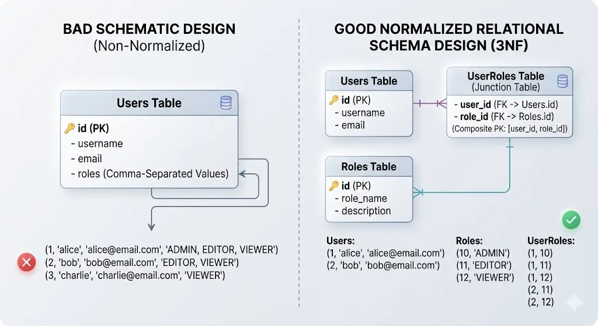
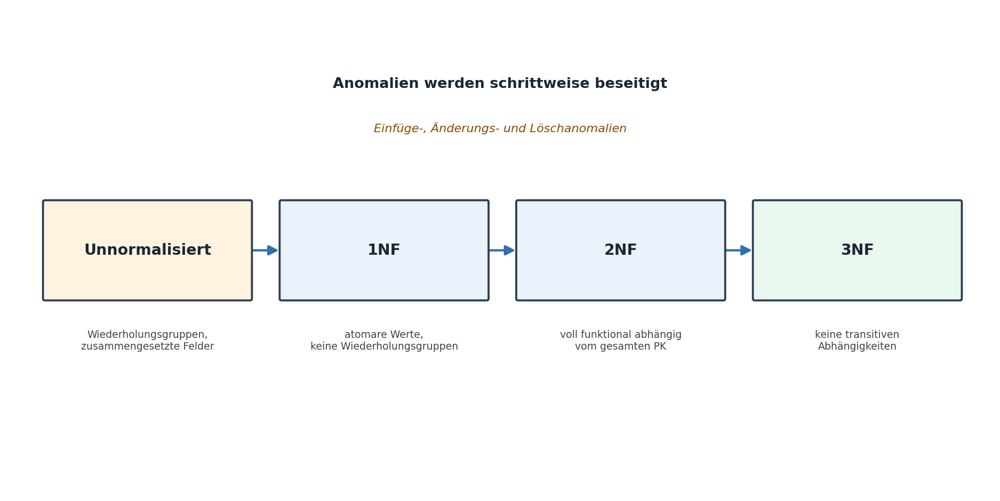
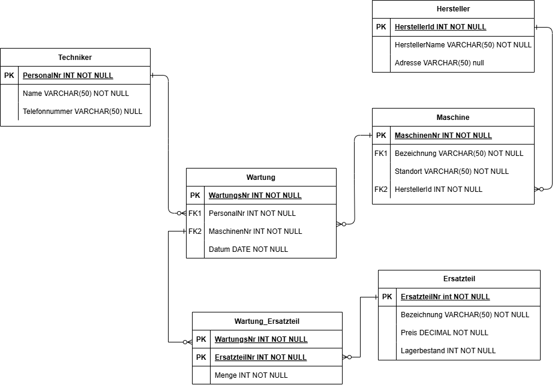
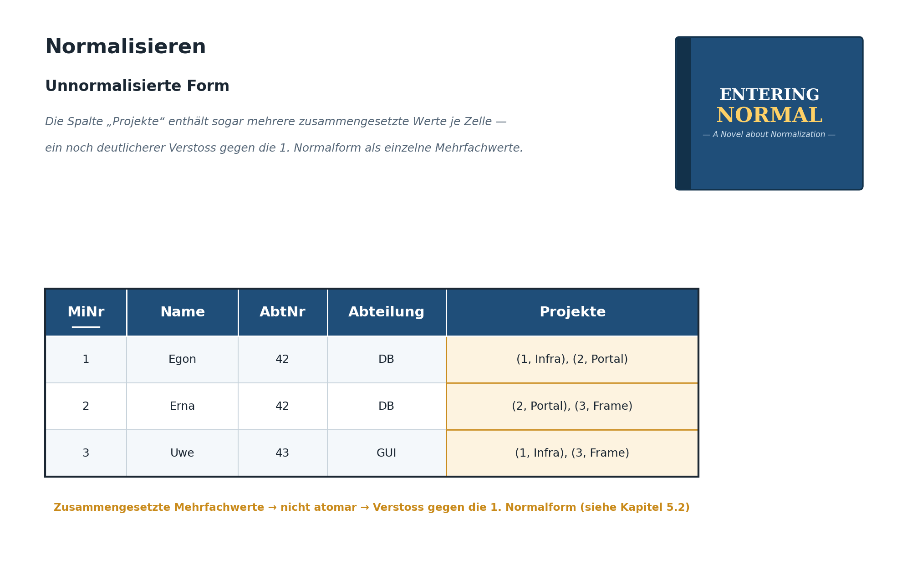
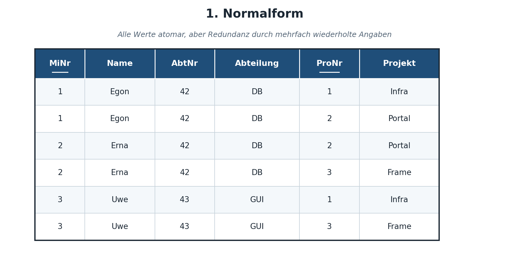
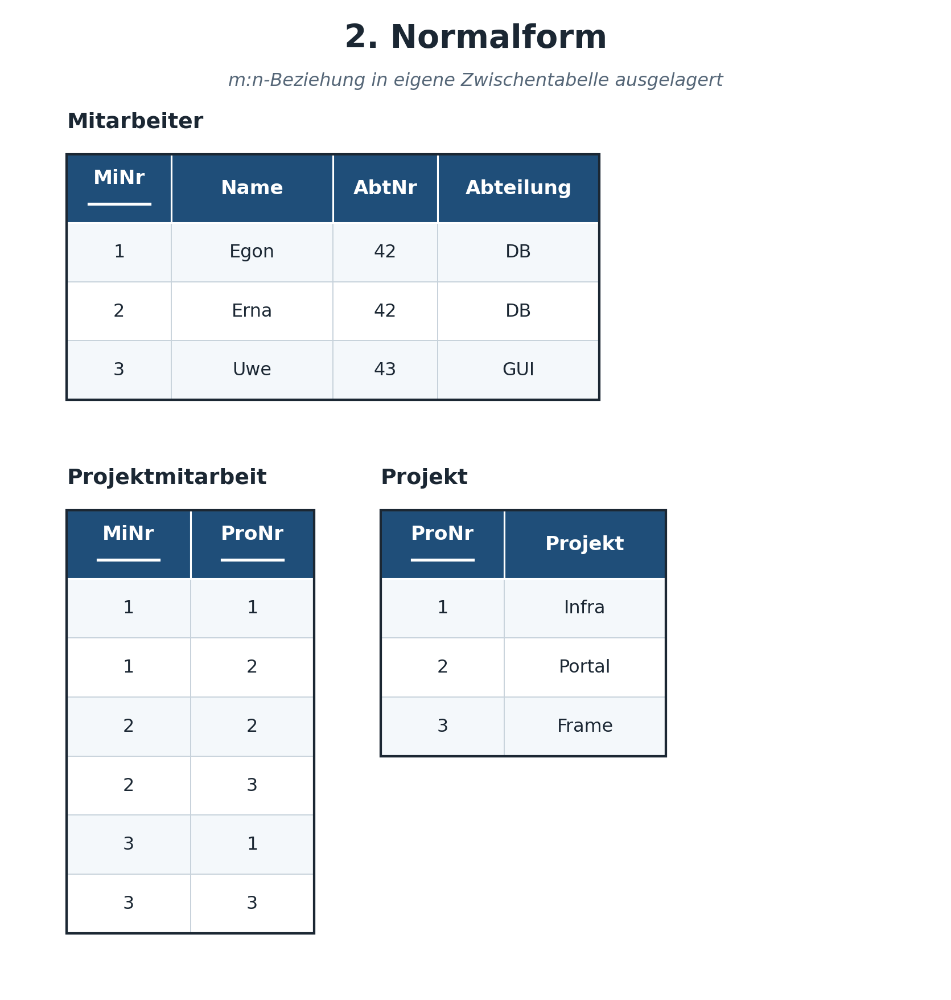
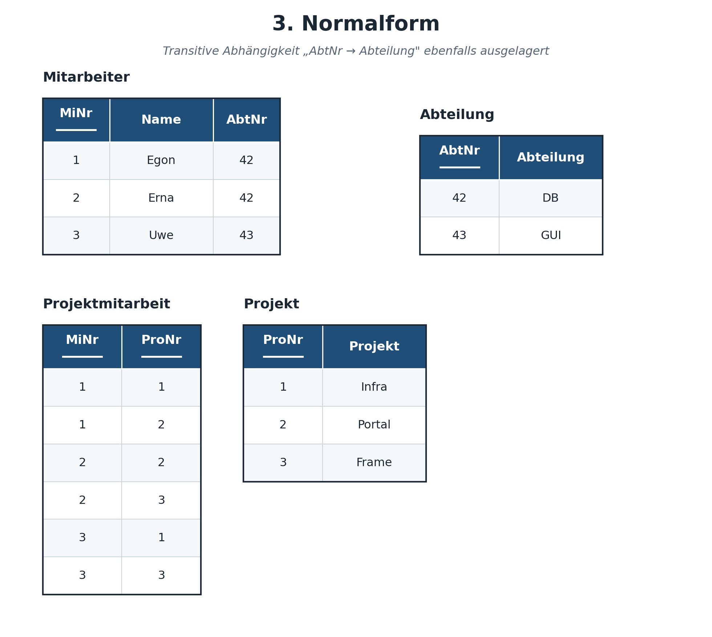

|                                             |                          |                               |
| ------------------------------------------- | ------------------------ | ----------------------------- |
| **Informatik\*in / Systemtechniker\*in HF** | **Datenbankentwicklung** |  |

- [1. Datennormalisierung](#1-datennormalisierung)
  - [1.1. Lernziele](#11-lernziele)
  - [1.2. Warum normalisieren?](#12-warum-normalisieren)
  - [1.3. Wissenswertes](#13-wissenswertes)
  - [1.4. Die drei klassischen Anomalien](#14-die-drei-klassischen-anomalien)
  - [1.5. Funktionale Abhängigkeit als theoretisches Fundament](#15-funktionale-abhängigkeit-als-theoretisches-fundament)
  - [1.6. Unnormalisierte Relation](#16-unnormalisierte-relation)
  - [1.7. Erste Normalform (1NF)](#17-erste-normalform-1nf)
  - [1.8. Zweite Normalform (2NF)](#18-zweite-normalform-2nf)
  - [1.9. Dritte Normalform (3NF)](#19-dritte-normalform-3nf)
  - [1.10. Gesamtübersicht: Alle Tabellen der Wartungsdatenbank in 3NF](#110-gesamtübersicht-alle-tabellen-der-wartungsdatenbank-in-3nf)
  - [1.11. Weiterführende Normalformen (Ausblick)](#111-weiterführende-normalformen-ausblick)
  - [1.12. Zusammenfassung: Vorgehen in der Praxis](#112-zusammenfassung-vorgehen-in-der-praxis)
    - [1.12.1. Wann denormalisiert man bewusst?](#1121-wann-denormalisiert-man-bewusst)
  - [1.13. Beispiel Mitarbeiter-Abteilung-Projekt](#113-beispiel-mitarbeiter-abteilung-projekt)
    - [1.13.1. Unnormalisierte Form](#1131-unnormalisierte-form)
    - [1.13.2. 1.NF](#1132-1nf)
    - [1.13.3. 2.NF](#1133-2nf)
    - [1.13.4. 3.NF](#1134-3nf)
- [2. Aufgaben](#2-aufgaben)
  - [2.1. Anomalien erkennen und normalisieren](#21-anomalien-erkennen-und-normalisieren)
  - [2.2. Schulverwaltung (Normalisierung)](#22-schulverwaltung-normalisierung)

---

# 1. Datennormalisierung

## 1.1. Lernziele

Nach diesem Kapitel können Sie:

- [ ] erklären, welche Anomalien (Einfüge-, Änderungs-, Löschanomalie) durch schlechtes Design entstehen
- [ ] ein Relationenmodell schrittweise in die 1., 2. und 3. Normalform überführen
- [ ] funktionale Abhängigkeiten (voll, partiell, transitiv) erkennen und benennen
- [ ] beurteilen, wann eine bewusste Denormalisierung sinnvoll sein kann

---

## 1.2. Warum normalisieren?

Normalisierung ist ein systematisches Verfahren, um Tabellen so zu strukturieren, dass **Redundanzen minimiert** und **Datenanomalien vermieden** werden.

- **Redundanzfreiheit, "One Fact one Place» Prinzip"**
- **keine Inkonsistenzen bei Einfüge-, Veränderungs- und Löschoperationen**



---

## 1.3. Wissenswertes

- Beim **Normalisieren** steigt gleichzeitig die Verständlichkeit der Datenstruktur.
- Die **Normalisierung** findet auf der konzeptionellen Ebene statt.
- In der **Normalisierung** sind mehrere Normalformen bekannt. Jede Normalform stellt sicher, dass die Daten bestimmte Bedingungen einhalten. **Am bekanntesten sind die 1. 2. und 3. Normalform (NF)**.
- In der Regel treten beim Erstellen des konzeptionellen Modells durch einen erfahrenen Modellierer gar keine **Redundanzen** auf.
- Verletzungen der Normalformen treten nur auf, falls inhaltlich unabhängige Entitäten in eine gemeinsame Entitätsmenge gepackt werden.

Betrachten wir eine bewusst schlecht entworfene Tabelle:

```bash
Tabelle: Wartung_unnormalisiert
┌───────────┬────────────┬───────────────┬───────────────┬─────────────────┬────────────────┐
│ WartungsNr│ Datum      │ Techniker     │ Telefonnummer │ Maschine        │ Standort       │
├───────────┼────────────┼───────────────┼───────────────┼─────────────────┼────────────────┤
│    101    │ 2026-03-01 │ Peter Meier   │ 031 555 12 34 │ Fräse FM-2031   │ Halle 1        │
│    102    │ 2026-03-02 │ Peter Meier   │ 031 555 12 34 │ Presse PR-118   │ Halle 2        │
│    103    │ 2026-03-03 │ Peter Meier   │ 031 555 12 34 │ Fräse FM-2031   │ Halle 1        │
└───────────┴────────────┴───────────────┴───────────────┴─────────────────┴────────────────┘
```

---

## 1.4. Die drei klassischen Anomalien

1. **Einfügeanomalie:** Ein neuer Techniker kann nicht erfasst werden, bevor er nicht mindestens eine Wartung durchgeführt hat – seine Telefonnummer „hängt" an einer Wartung.
2. **Änderungsanomalie:** Ändert sich Peter Meiers Telefonnummer, muss sie in **allen** Zeilen angepasst werden, in denen er vorkommt – vergisst man eine Zeile, entstehen widersprüchliche Daten.
3. **Löschanomalie:** Wird die letzte Wartung von Peter Meier gelöscht, verschwinden damit auch alle Informationen über ihn (Name, Telefonnummer) aus der Datenbank – obwohl er als Techniker weiterhin existiert.

Die Normalisierung löst diese Probleme, indem Daten in mehrere, sauber getrennte Tabellen aufgeteilt werden.

---

## 1.5. Funktionale Abhängigkeit als theoretisches Fundament

Alle Normalformen basieren auf dem Konzept der **funktionalen Abhängigkeit**: Ein Attribut B ist funktional abhängig von einem Attribut A (geschrieben A → B), wenn zu jedem Wert von A immer genau ein Wert von B gehört. In unserem Beispiel gilt: `Techniker → Telefonnummer` (zu einem bestimmten Techniker-Namen gehört immer dieselbe Telefonnummer). Die Normalisierungsregeln (2NF, 3NF) lassen sich letztlich alle auf die Frage zurückführen: *„Hängt dieses Attribut wirklich vollständig und ausschliesslich vom Primärschlüssel ab – oder eigentlich von etwas anderem?"* Wer diese Grundfrage verinnerlicht, kann Normalisierungsprobleme oft schon intuitiv erkennen, noch bevor die formalen Regeln angewendet werden.



---

## 1.6. Unnormalisierte Relation

- Eine Relation ist dann **unnormalisiert**, wenn am Kreuzungspunkt einer Spalte und einer Zeile **kein einzelner Wert** steht, sondern eine Gruppe oder Liste mehrerer Werte.
- Diese Form ist schlecht zu handhaben und in den meisten DBS gar nicht verarbeitbar. Da solch eine Relation Redundanz enthält, ist sie auch anfällig auf Anomalien beim Verändern von Datensätzen.

**Beispiel:**
Eine **unnormalisierte Form** ist nicht a priori schlecht, sie ist einfach in relationalen DBS nicht verarbeitbar. Aber der Mensch kann sie in geeigneter Darstellung recht gut lesen, das beste Beispiel dafür ist das Telefonbuch.

---

## 1.7. Erste Normalform (1NF)

**Regel:** Jedes Attribut enthält nur **atomare** (unteilbare) Werte, und es gibt keine Wiederholungsgruppen (keine mehrfach vorkommenden Spalten gleicher Bedeutung).

**Verletzung 1NF – Beispiel:**

```bash
┌───────────┬────────────────────────────────┐
│ WartungsNr│ VerwendeteErsatzteile          │
├───────────┼────────────────────────────────┤
│    101    │ Lager 5001, Dichtung 5003      │
└───────────┴────────────────────────────────┘
```

Die Spalte `VerwendeteErsatzteile` enthält mehrere Werte in einem Feld – ein klarer Verstoss gegen die 1NF. Auswertungen wie „wie oft wurde Ersatzteil 5001 verwendet?" wären ohne aufwändige Textverarbeitung nicht möglich.

Eine ebenso häufige, aber weniger offensichtliche Verletzung der 1NF sind **Wiederholungsgruppen als separate Spalten**, z.B. `Ersatzteil1`, `Ersatzteil2`, `Ersatzteil3` in derselben Tabelle. Auch wenn hier jede einzelne Zelle einen atomaren Wert enthält, verstösst diese Struktur gegen den Geist der 1NF: Sie limitiert künstlich die Anzahl möglicher Ersatzteile pro Wartung, erschwert Abfragen erheblich (man müsste in drei Spalten gleichzeitig suchen) und verschwendet Speicherplatz bei Wartungen mit weniger Ersatzteilen.

**Lösung:** Aufteilen in eine eigene Tabelle (wie in Kapitel RM bereits mit der Zwischentabelle `Wartung_Ersatzteil` gezeigt) – jede Zeile enthält genau einen Ersatzteil-Bezug.

---

## 1.8. Zweite Normalform (2NF)

**Regel:** Die Tabelle erfüllt die 1NF, **und** jedes Nicht-Schlüssel-Attribut ist von der **gesamten** Kombination des (zusammengesetzten) Primärschlüssels abhängig – nicht nur von einem Teil davon.

Die 2NF ist nur relevant, wenn der Primärschlüssel aus **mehreren** Spalten besteht.

**Verletzung 2NF – Beispiel:**

```bash
Tabelle: Wartung_Ersatzteil (PK: WartungsNr, ErsatzteilNr)
┌───────────┬──────────────┬───────┬──────────────────────┐
│ WartungsNr│ ErsatzteilNr │ Menge │ ErsatzteilBezeichnung│
├───────────┼──────────────┼───────┼──────────────────────┤
│    101    │     5001     │   2   │  Kugellager 6204     │
│    102    │     5001     │   1   │  Kugellager 6204     │
└───────────┴──────────────┴───────┴──────────────────────┘
```

`ErsatzteilBezeichnung` hängt nur von `ErsatzteilNr` ab, nicht vom vollständigen Schlüssel `(WartungsNr, ErsatzteilNr)` – das ist ein Verstoss gegen die 2NF (sogenannte **partielle Abhängigkeit**). Bei jeder Verwendung des Ersatzteils wird die Bezeichnung redundant wiederholt.

**Lösung:** `ErsatzteilBezeichnung` gehört in die Tabelle `Ersatzteil`, nicht in die Zwischentabelle:

```bash
Ersatzteil(ErsatzteilNr PK, Bezeichnung, Preis, Lagerbestand)
Wartung_Ersatzteil(WartungsNr FK, ErsatzteilNr FK, Menge)
```

Die Spalte `Menge` hingegen ist zu Recht in der Zwischentabelle verblieben, da sie sich weder aus `WartungsNr` allein noch aus `ErsatzteilNr` allein ableiten lässt – sie hängt tatsächlich von der **Kombination** beider ab (dieselbe Wartung könnte theoretisch dasselbe Ersatzteil in unterschiedlicher Menge benötigen, je nach konkretem Auftrag). Genau das ist die korrekte Interpretation von „volle funktionale Abhängigkeit vom gesamten Schlüssel".

---

## 1.9. Dritte Normalform (3NF)

**Regel:** Die Tabelle erfüllt die 2NF, **und** kein Nicht-Schlüssel-Attribut hängt von einem *anderen* Nicht-Schlüssel-Attribut ab (keine sogenannte **transitive Abhängigkeit**).

**Verletzung 3NF – Beispiel:**

```bash
Tabelle: Maschine
┌────────────┬─────────────┬─────────────┬───────────────────┐
│ MaschinenNr│ Bezeichnung │ HerstellerId│ HerstellerName    │
├────────────┼─────────────┼─────────────┼───────────────────┤
│   FM-2031  │ Fräse       │     12      │  Muster AG        │
│   FM-2044  │ Fräse       │     12      │  Muster AG        │
└────────────┴─────────────┴─────────────┴───────────────────┘
```

`HerstellerName` hängt nicht direkt vom Primärschlüssel `MaschinenNr` ab, sondern von `HerstellerId` – einem anderen Nicht-Schlüssel-Attribut. Das ist eine transitive Abhängigkeit: `MaschinenNr → HerstellerId → HerstellerName`.

**Lösung:** Auslagern in eine eigene Tabelle `Hersteller`:

```bash
Hersteller(HerstellerId PK, HerstellerName, Adresse)
Maschine(MaschinenNr PK, Bezeichnung, HerstellerId FK → Hersteller)
```

---

## 1.10. Gesamtübersicht: Alle Tabellen der Wartungsdatenbank in 3NF

Die Abschnitte 5.2–5.4 haben die Normalisierung jeweils an einem einzelnen Tabellenausschnitt demonstriert. Führt man dieselben Schritte konsequent an der ursprünglichen, unnormalisierten Tabelle `Wartung_unnormalisiert` aus Kapitel 5.1 durch – ergänzt um die in den Beispielen von 5.2 (Ersatzteile) und 5.4 (Hersteller) eingeführten Zusatzinformationen –, ergibt sich am Schluss folgendes vollständige, durchgängig in 3NF stehende Tabellenschema:

```bash
Techniker(PersonalNr PK, Name, Telefonnummer)
Hersteller(HerstellerId PK, HerstellerName, Adresse)
Maschine(MaschinenNr PK, Bezeichnung, Standort, HerstellerId FK → Hersteller)
Ersatzteil(ErsatzteilNr PK, Bezeichnung, Preis, Lagerbestand)
Wartung(WartungsNr PK, Datum, PersonalNr FK → Techniker, MaschinenNr FK → Maschine)
Wartung_Ersatzteil(WartungsNr FK → Wartung, ErsatzteilNr FK → Ersatzteil, Menge, PRIMARY KEY (WartungsNr, ErsatzteilNr))
```



Sechs Tabellen also – jede einzelne Aufteilung lässt sich auf eine konkrete Normalform-Regel zurückführen:

| **Ursprung (unnormalisiert)**                                                         | **Verstoss gegen**                                  | **Ergebnis**                                                   |
| ------------------------------------------------------------------------------------- | --------------------------------------------------- | -------------------------------------------------------------- |
| `Techniker` + `Telefonnummer` wiederholen sich bei jeder Wartung desselben Technikers | Anomalien, transitive Abhängigkeit von `WartungsNr` | eigene Tabelle `Techniker` (künstlicher Schlüssel `PersonalNr` |
| `VerwendeteErsatzteile` enthält mehrere Werte in einem Feld                           | 1NF (Atomarität)                                    | Zwischentabelle `Wartung_Ersatzteil`                           |
| `ErsatzteilBezeichnung` in `Wartung_Ersatzteil` hängt nur von `ErsatzteilNr` ab       | 2NF (partielle Abhängigkeit)                        | eigene Tabelle `Ersatzteil`                                    |
| `HerstellerName` in `Maschine` hängt nur von `HerstellerId` ab                        | 3NF (transitive Abhängigkeit)                       | eigene Tabelle `Hersteller`                                    |

Da für `Techniker` in der ursprünglichen Tabelle kein eindeutiger natürlicher Schlüssel vorhanden war (der Name allein eignet nicht als Primärschlüssel), wird hier – wie im gesamten Kurs üblich – ein künstlicher Schlüssel `PersonalNr` eingeführt.

---

## 1.11. Weiterführende Normalformen (Ausblick)

Über die 3NF hinaus existieren weitere, in der Praxis seltener direkt angewendete Normalformen, die hier nur kurz erwähnt seien:

- **Boyce-Codd-Normalform (BCNF):** eine strengere Variante der 3NF, relevant bei Tabellen mit mehreren sich überlappenden Schlüsselkandidaten
- **4. Normalform (4NF):** behandelt sogenannte mehrwertige Abhängigkeiten (unabhängige mehrwertige Attribute, die fälschlicherweise in derselben Tabelle kombiniert wurden)

Für die praktische Datenbankentwicklung – auch im beruflichen Alltag – genügt in den allermeisten Fällen eine saubere 3NF. Die weiterführenden Normalformen werden in einem vertiefenden Kurs (Datenbanken 2) behandelt.

---

## 1.12. Zusammenfassung: Vorgehen in der Praxis

| **Normalform** | **Kernfrage**                                                                           |
| -------------- | --------------------------------------------------------------------------------------- |
| 1NF            | Enthält jedes Feld nur einen einzigen, atomaren Wert?                                   |
| 2NF            | Hängt jedes Attribut vom **gesamten** Primärschlüssel ab?                               |
| 3NF            | Hängt jedes Attribut **nur** vom Primärschlüssel ab (nicht von einem anderen Attribut)? |

In der Praxis wird meist direkt auf **3NF** modelliert, indem man von Anfang an sauber nach Kapitel 2–4 vorgeht (Substantiv-Analyse → ERM → Relationenmodell). Die Normalisierung dient dann primär als **Kontrollwerkzeug**, um ein bestehendes oder gegebenes Tabellendesign auf Schwachstellen zu prüfen.

### 1.12.1. Wann denormalisiert man bewusst?

Vollständig normalisierte Datenbanken erfordern bei Abfragen oft viele Joins (Kapitel 9), was bei sehr grossen Datenmengen die Performance beeinträchtigen kann. In der Praxis wird gelegentlich bewusst **denormalisiert** – z.B. wird ein berechneter oder redundanter Wert zusätzlich gespeichert, um teure Berechnungen bei häufigen Leseabfragen zu vermeiden. Dies ist eine bewusste Kompromissentscheidung zwischen Datenintegrität und Performance und sollte nie das Resultat von Unwissen sein, sondern einer expliziten Abwägung.

Typische Praxisbeispiele für bewusste Denormalisierung:

- Ein zusätzliches Feld `AnzahlWartungen` direkt in der Tabelle `Maschine`, das periodisch aktualisiert wird, um bei häufigen Übersichtsabfragen einen teuren `JOIN`/`COUNT` zu vermeiden
- Historische Auswertungstabellen (Reporting-Tabellen), die bewusst redundante, bereits aggregierte Daten enthalten und regelmässig neu berechnet werden
- Sogenannte „Caching"-Spalten für häufig benötigte, aber selten geänderte Fremddaten

Entscheidend ist in solchen Fällen, dass die Anwendung (oder ein Datenbank-Trigger) dafür sorgt, dass die redundanten Werte konsistent bleiben – die Verantwortung für Konsistenz, die bei normalisierten Daten das DBMS automatisch übernimmt, muss bei bewusster Denormalisierung explizit selbst übernommen werden.

---

## 1.13. Beispiel Mitarbeiter-Abteilung-Projekt

### 1.13.1. Unnormalisierte Form



### 1.13.2. 1.NF



### 1.13.3. 2.NF



### 1.13.4. 3.NF



---

</br>

# 2. Aufgaben

## 2.1. Anomalien erkennen und normalisieren

| **Vorgabe**             | **Beschreibung**                                                      |
| :---------------------- | :-------------------------------------------------------------------- |
| **Lernziele**           | Eine Datenbasis in Excel-ähnlicher Tabellenform darstellen            |
|                         | Probleme (Anomalien) bei Datenmutationen erkennen                     |
|                         | Eine Tabelle systematisch bis zur 3. Normalform überführen            |
| **Sozialform**          | Gruppenarbeit (2–3 Personen)                                          |
| **Auftrag**             | siehe unten                                                           |
| **Hilfsmittel**         | Kapitel 5 des Kursskripts, Papier/Whiteboard oder Tabellenkalkulation |
| **Erwartete Resultate** | Vollständig normalisiertes Tabellenschema (3NF) mit PK/FK-Angaben     |
| **Zeitbedarf**          | 45 min                                                                |
| **Lösungselemente**     | Musterlösung inkl. aller Zwischenschritte 1NF → 2NF → 3NF             |

Gegeben ist folgende unnormalisierte Tabelle eines Werkzeuglagers:

```bash
Tabelle: Ausleihe
┌───────────┬──────────────┬────────────────┬─────────────────┬──────────────┬─────────────┐
│ AusleiheId│ MitarbeiterId│ MitarbeiterName│ WerkzeugId      │ WerkzeugName │ Ausleihdatum│
├───────────┼──────────────┼────────────────┼─────────────────┼──────────────┼─────────────┤
│    1      │      7       │  Anna Suter    │      301        │ Akkuschrauber│ 2026-04-01  │
│    2      │      7       │  Anna Suter    │      305        │ Bohrhammer   │ 2026-04-02  │
│    3      │      9       │  Beat Rohr     │      301        │ Akkuschrauber│ 2026-04-02  │
└───────────┴──────────────┴────────────────┴─────────────────┴──────────────┴─────────────┘
```

1. Nennen Sie ein konkretes Beispiel für eine Änderungsanomalie in dieser Tabelle.
2. Nennen Sie ein konkretes Beispiel für eine Einfügeanomalie in dieser Tabelle.
3. Prüfen Sie die Tabelle auf 1NF – ist sie erfüllt? Begründen Sie.
4. Überführen Sie die Tabelle schrittweise in die 3NF. Zeigen Sie alle entstehenden Tabellen mit PK/FK.
5. Wie viele Tabellen benötigen Sie am Schluss, und welche Normalform-Regel hat zu welcher Aufteilung geführt?

---

## 2.2. Schulverwaltung (Normalisierung)

| **Vorgabe**             | **Beschreibung**                                                                          |
| :---------------------- | :---------------------------------------------------------------------------------------- |
| **Lernziele**           | Die Teilnehmer können unnormalisierte Daten in eine normalisierte Struktur transformieren |
| **Sozialform**          | Einzelarbeit                                                                              |
| **Auftrag**             | siehe unten                                                                               |
| **Hilfsmittel**         |                                                                                           |
| **Erwartete Resultate** |                                                                                           |
| **Zeitbedarf**          | 60 min                                                                                    |
| **Lösungselemente**     | Excel                                                                                     |

**Ausgangssituation:**

- In Datenbanken gilt das **«on fact one place»** Prinzip.
- Folglich müssen sämtliche redundante Information beseitigt werden sodass sämtliche Widersprüche und Anomalien beseitigt sind.

**Auftrag:**

- Sie erhalten sie unten abgebildete Tabelle.
- Diese sollen nun in eine stark strukturierte Form (normalisierte Struktur) übertragen werden

| **StudentNr** | **Name** | **Vorname** | **Geburtsdatum** | **Fachrichtung** | **AnzahlSemester** | **KursNr** | **Bezeichnung** |
| ------------- | -------- | ----------- | ---------------- | ---------------- | ------------------ | ---------- | --------------- |
| 1             | Müller   | Hans        | 01.03.1990       | BWL              | 6                  | 1, 2, 3    | VWL, Mathe, EDV |
| 2             | Maier    | Lieschen    | 24.02.1991       | Maschinenbau     | 7                  | 2          | Mathe           |
| 3             | Schulz   | Klaus       | 11.03.1989       | BWL              | 6                  | 2, 3       | Mathe, EDV      |
| 4             | Bayer    | Ina         | 08.08.1988       | Maschinenbau     | 7                  | 2          | Mathe           |
| 5             | Schmidt  | Egon        | 12.02.1984       | Biologie         | 8                  | 4          | Vererbungslehre |

- Modellieren Sie diesen Sachverhalt mit einem geeigneten Relationen Modell (mit Attributen, Beziehungen und Kardinalitäten dar).
- Erfassen Sie die normalisierten Daten in Excel.
- Kennzeichnen Sie Primary Key und Foreign Key.


---

© 2026 Lukas Müller – Licensed under CC BY-NC-ND 4.0
See [LICENSE](../license.md) file for details.
