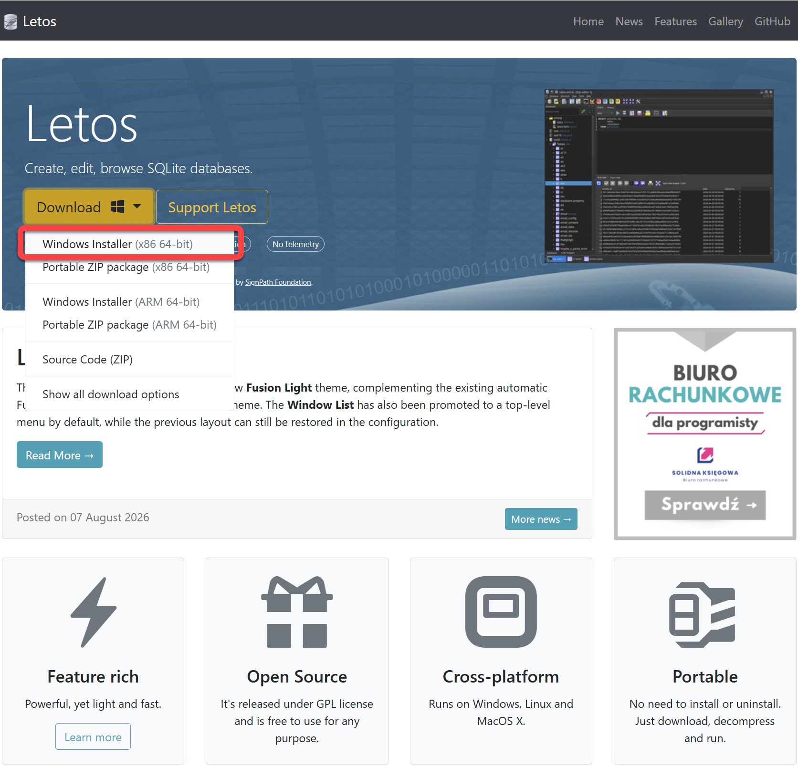
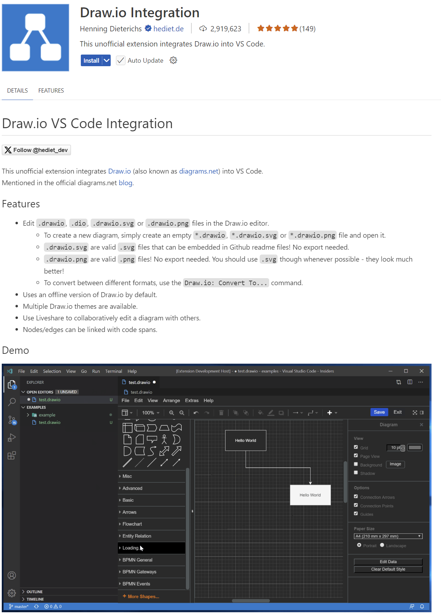
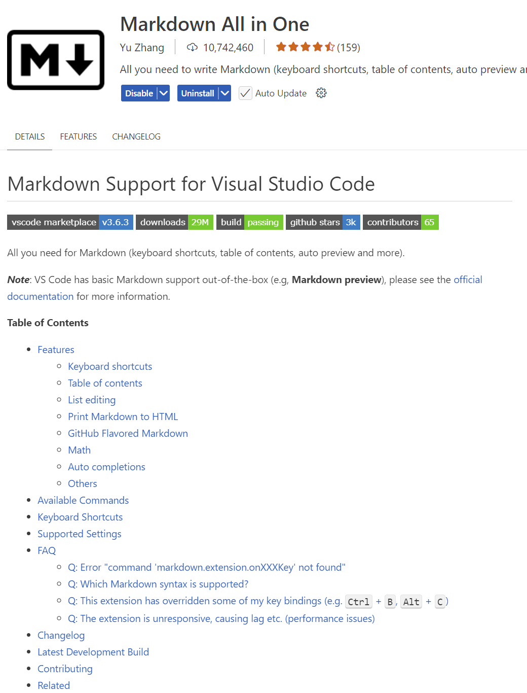

|                                             |                          |                               |
| ------------------------------------------- | ------------------------ | ----------------------------- |
| **Informatik\*in / Systemtechniker\*in HF** | **Datenbankentwicklung** |  |

- [1. Voraussetzungen / Softwareinstallationen](#1-voraussetzungen--softwareinstallationen)
  - [1.1. Letos / SQLite Studio](#11-letos--sqlite-studio)
  - [1.2. Visual Studio Code](#12-visual-studio-code)
  - [1.3. Extension Draw.io Integration](#13-extension-drawio-integration)
    - [1.3.1. Extension Material Icon Theme](#131-extension-material-icon-theme)
    - [1.3.2. Extension Markdown All in One](#132-extension-markdown-all-in-one)
- [2. Aufgaben](#2-aufgaben)
  - [2.1. Installation u. Softwarevoraussetzungen / Tools](#21-installation-u-softwarevoraussetzungen--tools)

---

 

# 1. Voraussetzungen / Softwareinstallationen

## 1.1. Letos / SQLite Studio

- [How to Download & Install Letos](https://letos.org/)
  - 

---

## 1.2. Visual Studio Code

**VS Code** ist ein leichtgewichtiger Editor, der auf Windows, macOS und Linux läuft.

[Download Visual Studio Code](https://code.visualstudio.com/)

---

## 1.3. Extension Draw.io Integration

Diese Erweiterung integriert die **draw.io** Anwendung in Visual Studio Code.

Alternativ stehen auch folgende Möglichkeiten zur Verfügung:

- [Web-App](https://app.diagrams.net/)
- [Lokale Installation](https://www.drawio.com/)

---

### 1.3.1. Extension Material Icon Theme

---

### 1.3.2. Extension Markdown All in One

[Markdown Getting-Started](https://www.markdownguide.org/getting-started/)

---

 

# 2. Aufgaben

## 2.1. Installation u. Softwarevoraussetzungen / Tools

| **Vorgabe**             | **Beschreibung**                     |
| :---------------------- | :----------------------------------- |
| **Lernziele**           | Softwarevoraussetzungen sind erfüllt |
| **Sozialform**          | Einzelarbeit                         |
| **Auftrag**             | Softwareinstallationen auf Laptop    |
| **Hilfsmittel**         | siehe Download links                 |
| **Erwartete Resultate** |                                      |
| **Zeitbedarf**          | 40 min                               |
| **Lösungselemente**     | Ausführbare SW Anwendungen           |

Installiere alle erforderlichen Softwarekomponenten auf Deinem Rechner.
Teste soweit möglich, dass alle Komponenten ohne Fehler ausgeführt werden und funktionstauglich sind.

---

© 2026 Lukas Müller – Licensed under CC BY-NC-ND 4.0
See [LICENSE](../license.md) file for details.
