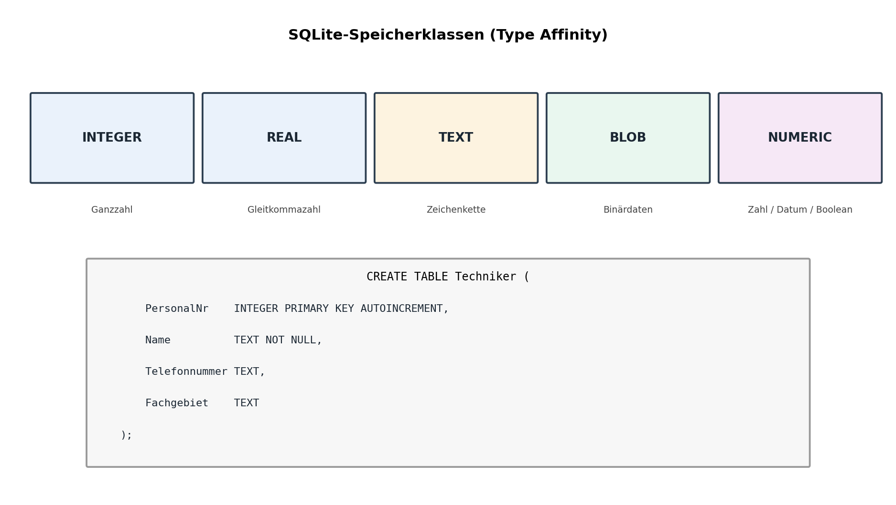
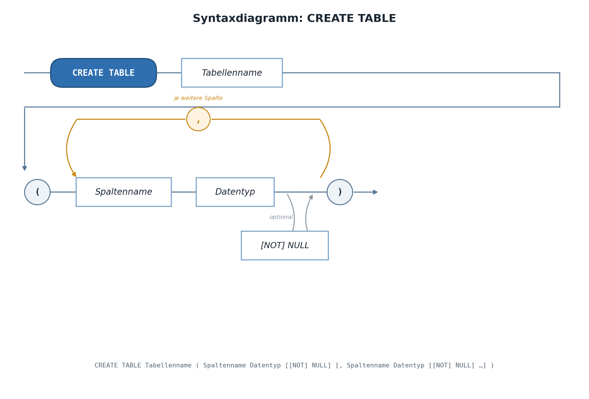
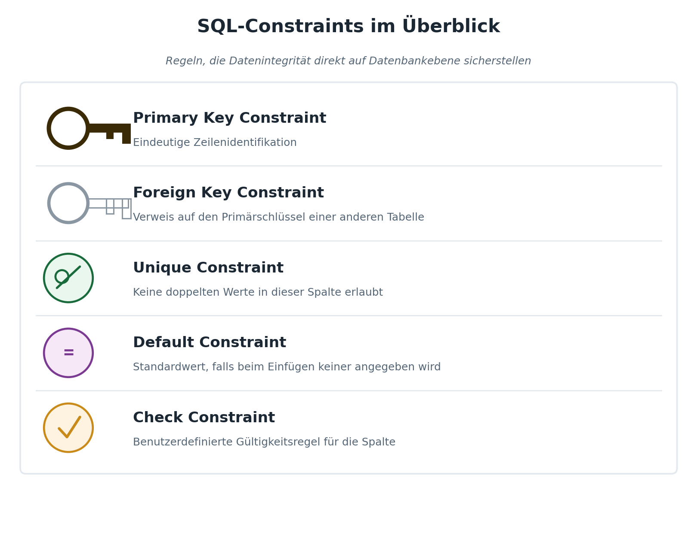
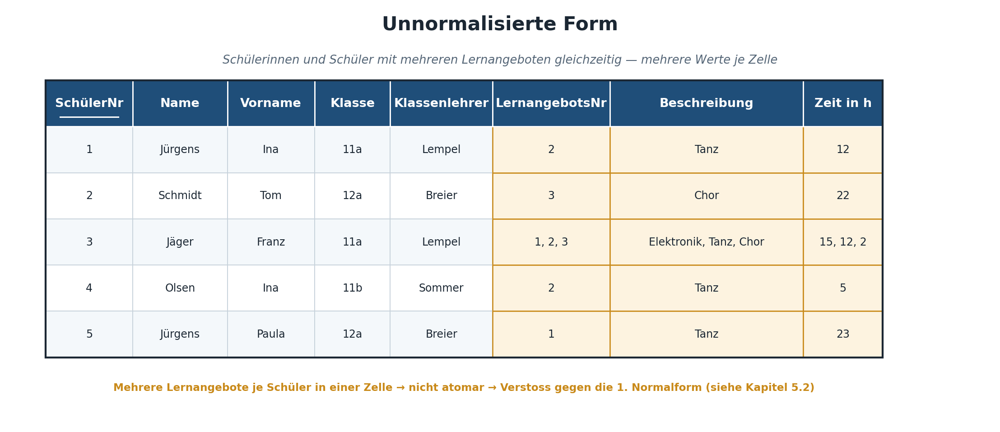

|                                             |                          |                               |
| ------------------------------------------- | ------------------------ | ----------------------------- |
| **Informatik\*in / Systemtechniker\*in HF** | **Datenbankentwicklung** |  |

- [1. Schema implementieren (Data Definition Language DDL)](#1-schema-implementieren-data-definition-language-ddl)
  - [1.1. Lernziele](#11-lernziele)
  - [1.2. Was ist SQL?](#12-was-ist-sql)
  - [1.3. Datentypen in SQLite: Type Affinity](#13-datentypen-in-sqlite-type-affinity)
    - [1.3.1. Wie Type Affinity konkret funktioniert](#131-wie-type-affinity-konkret-funktioniert)
    - [1.3.2. Warum wurde dieses Konzept gewählt?](#132-warum-wurde-dieses-konzept-gewählt)
    - [1.3.3. Empfohlene Datentypen für SQLite](#133-empfohlene-datentypen-für-sqlite)
    - [1.3.4. Datumstypen – die wichtigste SQLite-Besonderheit](#134-datumstypen--die-wichtigste-sqlite-besonderheit)
  - [1.4. CREATE TABLE – Tabellen erstellen](#14-create-table--tabellen-erstellen)
    - [1.4.1. Grundsyntax](#141-grundsyntax)
    - [1.4.2. IF NOT EXISTS – Sicheres Erstellen](#142-if-not-exists--sicheres-erstellen)
    - [1.4.3. Constraints im Überblick](#143-constraints-im-überblick)
      - [1.4.3.1. NOT NULL - Constraint](#1431-not-null---constraint)
      - [1.4.3.2. PRIMARY KEY - Constraint](#1432-primary-key---constraint)
      - [1.4.3.3. Zusammengesetzter Primärschlüssel (Zwischentabelle)](#1433-zusammengesetzter-primärschlüssel-zwischentabelle)
      - [1.4.3.4. Foreign Key - Constraint](#1434-foreign-key---constraint)
      - [1.4.3.5. UNIQUE - Constraint](#1435-unique---constraint)
      - [1.4.3.6. CHECK](#1436-check)
      - [1.4.3.7. DEFAULT - Constraint](#1437-default---constraint)
    - [1.4.4. Constraints auf Tabellenebene – Übersicht](#144-constraints-auf-tabellenebene--übersicht)
    - [1.4.5. ON DELETE und ON UPDATE – Referentielle Aktionen](#145-on-delete-und-on-update--referentielle-aktionen)
  - [1.5. DROP TABLE – Tabellen löschen](#15-drop-table--tabellen-löschen)
  - [1.6. ALTER TABLE – Tabellen anpassen](#16-alter-table--tabellen-anpassen)
    - [1.6.1. Was geht in SQLite](#161-was-geht-in-sqlite)
    - [1.6.2. Was geht NICHT – und der Workaround](#162-was-geht-nicht--und-der-workaround)
  - [1.7. Weitere nützliche Schema-Befehle](#17-weitere-nützliche-schema-befehle)
    - [1.7.1. Schema inspizieren](#171-schema-inspizieren)
    - [1.7.2. Indizes](#172-indizes)
    - [1.7.3. Views – Virtuelle Tabellen](#173-views--virtuelle-tabellen)
- [2. Übungsaufgaben](#2-übungsaufgaben)
  - [2.1. Produktherstellung (Implementierung)](#21-produktherstellung-implementierung)
  - [2.2. Schulverwaltung (Implementierung)](#22-schulverwaltung-implementierung)
  - [2.3. Lernangebot (Normalisierung u. Implementierung)](#23-lernangebot-normalisierung-u-implementierung)

---

</br>

# 1. Schema implementieren (Data Definition Language DDL)

[SQLite Tutorial](https://www.sqlitetutorial.net/)

## 1.1. Lernziele

Nach dieser Lektion könnt ihr:

- Tabellen in SQLite mit `CREATE TABLE` erstellen und mit `DROP TABLE` löschen
- Sinnvolle Datentypen für Spalten wählen und die Besonderheiten von SQLite dabei kennen
- Primärschlüssel (`PRIMARY KEY`) und Fremdschlüssel (`FOREIGN KEY`) korrekt definieren
- Constraints (`NOT NULL`, `UNIQUE`, `CHECK`, `DEFAULT`) gezielt einsetzen
- Bestehende Tabellen mit `ALTER TABLE` anpassen
- Ein vollständiges Datenbankschema von Grund auf implementieren

---

## 1.2. Was ist SQL?

**SQL (Structured Query Language)** ist die Standardsprache zur Definition, Manipulation und Abfrage relationaler Datenbanken. Sie gliedert sich – wie in Kapitel 1 eingeführt – in drei Teilsprachen:

| **Teilsprache** | **Zweck**                     | **Wichtigste Befehle**                 | **Kapitel**        |
| --------------- | ----------------------------- | -------------------------------------- | ------------------ |
| DDL             | Struktur definieren           | `CREATE`, `ALTER`, `DROP`              | **dieses Kapitel** |
| DML             | Daten manipulieren/abfragen   | `SELECT`, `INSERT`, `UPDATE`, `DELETE` | Kapitel 7–9        |
| DCL             | Zugriff/Transaktionen steuern | `GRANT`, `COMMIT`, `ROLLBACK`          | punktuell          |

SQL ist eine **mengenorientierte** Sprache: Ein einzelner Befehl kann mehrere Datensätze gleichzeitig betreffen, im Gegensatz zu einer prozeduralen Sprache wie C oder PowerShell, wo man typischerweise Zeile für Zeile durch Daten iteriert. Dieser deklarative Charakter ist ein zentraler Unterschied zu den bereits bekannten Programmiersprachen: In SQL beschreibt man **was** man erreichen möchte („alle Maschinen, die in Halle 1 stehen"), nicht **wie** dies Schritt für Schritt zu berechnen ist. Die konkrete Ausführungsstrategie (z.B. ob ein Index verwendet wird) überlässt man dem sogenannten Query-Optimizer des DBMS.

SQL wurde in den 1970er-Jahren bei IBM entwickelt, ursprünglich unter dem Namen SEQUEL, und ist seit 1986 (ANSI) bzw. 1987 (ISO) ein internationaler Standard. Trotz dieser Standardisierung unterscheiden sich die konkreten SQL-Dialekte verschiedener Hersteller (T-SQL bei SQL Server, PL/pgSQL bei PostgreSQL, die SQLite-eigene Syntax) in Details – die in diesem Kapitel behandelten SQLite-Besonderheiten sind ein typisches Beispiel dafür.

---

## 1.3. Datentypen in SQLite: Type Affinity

Im Gegensatz zu SQL Server, wo jede Spalte einen strikt festgelegten Datentyp besitzt, verwendet SQLite ein flexibleres Konzept namens **Type Affinity** (Typ-Affinität). Jede Spalte „bevorzugt" einen bestimmten Speichertyp, erzwingt ihn aber nicht zwingend.

| **SQLite-Speicherklasse** | **Bedeutung**             | **Typische verwendete Bezeichner**      |
| ------------------------- | ------------------------- | --------------------------------------- |
| `INTEGER`                 | Ganzzahl                  | `INTEGER`, `INT`                        |
| `REAL`                    | Gleitkommazahl            | `REAL`, `FLOAT`, `DOUBLE`               |
| `TEXT`                    | Zeichenkette              | `TEXT`, `VARCHAR(n)`, `CHAR(n)`         |
| `BLOB`                    | Binärdaten                | `BLOB`                                  |
| `NUMERIC`                 | Zahl, inkl. Datum/Boolean | `NUMERIC`, `DECIMAL`, `BOOLEAN`, `DATE` |

### 1.3.1. Wie Type Affinity konkret funktioniert

SQLite bestimmt die Affinität einer Spalte anhand von Schlüsselwörtern im deklarierten Typnamen (nicht anhand einer festen Liste erlaubter Typen). Enthält der Typname z.B. die Zeichenfolge „INT", erhält die Spalte `INTEGER`-Affinität; enthält er „CHAR", „CLOB" oder „TEXT", erhält sie `TEXT`-Affinität; enthält er „REAL", „FLOA" oder „DOUB", erhält sie `REAL`-Affinität. Diese Affinität beeinflusst, wie SQLite einen eingefügten Wert **versucht** zu speichern – erzwingt dies aber, anders als bei SQL Server, nicht strikt: Wird z.B. ein Text in eine Spalte mit `INTEGER`-Affinität eingefügt, der sich nicht verlustfrei in eine Zahl umwandeln lässt, speichert SQLite ihn trotzdem als Text.



**Wichtige Praxishinweise:**

- SQLite kennt **keinen echten `DATE`- oder `BOOLEAN`-Typ**. Daten werden üblicherweise als `TEXT` im ISO-Format (`'2026-03-15'`) oder als `INTEGER` (Unix-Timestamp) gespeichert. Boolesche Werte werden als `INTEGER` (`0`/`1`) abgelegt.
- Man kann in SQLite jeden beliebigen Bezeichner als Spaltentyp schreiben (auch `VARCHAR(50)`), auch wenn SQLite die Längenangabe `(50)` **nicht** durchsetzt. Dies dient primär der Lesbarkeit und Kompatibilität mit anderen DBMS.
- Diese Flexibilität erleichtert den Einstieg, verlangt aber im Gegenzug mehr Disziplin bei der Datenpflege (z.B. sollte die Applikation sicherstellen, dass wirklich nur gültige Datumswerte in einer `TEXT`-Spalte landen).
- Für Studierende mit Vorkenntnissen aus SQL Server ist dies oft die grösste Umstellung: Ein `CHECK`-Constraint (siehe 6.3) kann teilweise verwendet werden, um die in SQL Server selbstverständliche Typsicherheit nachzubilden, falls dies für die Anwendung wichtig ist.

### 1.3.2. Warum wurde dieses Konzept gewählt?

Type Affinity ist eine bewusste Designentscheidung der SQLite-Entwickler, um die Interoperabilität mit dynamisch typisierten Programmiersprachen (z.B. Python, JavaScript) zu vereinfachen, in denen Variablen ihren Typ zur Laufzeit wechseln können. Für den professionellen Einsatz bedeutet dies: Die **Disziplin**, nur sinnvolle Werte in eine Spalte zu schreiben, verlagert sich stärker auf die Anwendungsebene (bzw. auf `CHECK`-Constraints) als bei einem streng typisierten System wie SQL Server.

### 1.3.3. Empfohlene Datentypen für SQLite

In der Praxis verwendet ihr diese Typen – SQLite mappt sie intern auf die
Storage Classes oben:

| SQLite-Typ | Affinity | Typischer Einsatz                       |
| ---------- | -------- | --------------------------------------- |
| `INTEGER`  | INTEGER  | IDs, Anzahlen, Flags (0/1)              |
| `REAL`     | REAL     | Preise, Koordinaten, Messwerte          |
| `TEXT`     | TEXT     | Namen, E-Mails, Beschreibungen          |
| `BLOB`     | BLOB     | Bilder, Dateien (selten in SQLite)      |
| `NUMERIC`  | NUMERIC  | Geldbeträge mit definierter Genauigkeit |

### 1.3.4. Datumstypen – die wichtigste SQLite-Besonderheit

SQLite hat **keinen eingebauten Datumstyp**. Datum und Zeit werden als `TEXT`,
`INTEGER` oder `REAL` gespeichert. Die empfohlene Convention:

```sql
-- Option 1: ISO 8601 Text (empfohlen für Lesbarkeit)
geburtsdatum TEXT   -- Format: 'YYYY-MM-DD'
erstellt_am  TEXT   -- Format: 'YYYY-MM-DD HH:MM:SS'

-- Option 2: Unix-Timestamp (für Berechnungen)
erstellt_am  INTEGER  -- Sekunden seit 1970-01-01

-- SQLite-Datumsfunktionen funktionieren mit beiden Varianten:
SELECT date('now');                          -- '2024-11-15'
SELECT datetime('now', 'localtime');         -- '2024-11-15 14:32:10'
SELECT strftime('%d.%m.%Y', geburtsdatum);   -- '15.11.1990'
```

> **Convention im Team festlegen:** Wählt eine Variante und haltet euch
> konsequent daran. `TEXT` mit ISO 8601 ist am lesbarsten und am einfachsten
> zu debuggen.

---

## 1.4. CREATE TABLE – Tabellen erstellen

### 1.4.1. Grundsyntax



```sql
CREATE TABLE tabellenname (
    spalte1  datentyp  [constraints],
    spalte2  datentyp  [constraints],
    ...
    [tabellen-constraints]
);
```

**Beispiel:**

```sql
CREATE TABLE Techniker (
    PersonalNr      INTEGER PRIMARY KEY AUTOINCREMENT,
    Name            TEXT NOT NULL,
    Telefonnummer   TEXT,
    Fachgebiet      TEXT
);
```

- `PRIMARY KEY` markiert die Spalte als Primärschlüssel
- `AUTOINCREMENT` sorgt für eine automatisch hochzählende, garantiert nie wiederverwendete Ganzzahl (in SQLite genügt oft bereits `INTEGER PRIMARY KEY` allein, siehe Hinweis unten)
- `NOT NULL` erzwingt, dass für diese Spalte immer ein Wert vorhanden sein muss

> **SQLite-Spezialität:** Eine Spalte vom Typ `INTEGER PRIMARY KEY` (ohne `AUTOINCREMENT`) wird automatisch zu einem Alias des internen `rowid` und zählt ebenfalls automatisch hoch. `AUTOINCREMENT` sollte nur explizit angegeben werden, wenn garantiert werden muss, dass eine einmal verwendete Nummer **nie** wiederverwendet wird (z.B. bei gelöschten Zeilen) – für die meisten Kursbeispiele genügt `INTEGER PRIMARY KEY`.

### 1.4.2. IF NOT EXISTS – Sicheres Erstellen

```sql
-- Ohne IF NOT EXISTS: Fehler, wenn Tabelle bereits existiert
CREATE TABLE Techniker ( ... );   -- Fehler bei Wiederholung

-- Mit IF NOT EXISTS: Kein Fehler, Tabelle bleibt unverändert
CREATE TABLE IF NOT EXISTS Techniker ( ... );
```

> **Best Practice:** In Setup-Skripten immer `IF NOT EXISTS` verwenden –
> so kann das Skript mehrfach ausgeführt werden, ohne Fehler zu werfen.

### 1.4.3. Constraints im Überblick



| **Constraint** | **Zweck**                                               | **Beispiel**                     |
| -------------- | ------------------------------------------------------- | -------------------------------- |
| `PRIMARY KEY`  | eindeutige Zeilenidentifikation                         | `PersonalNr INTEGER PRIMARY KEY` |
| `NOT NULL`     | Pflichtfeld                                             | `Name TEXT NOT NULL`             |
| `UNIQUE`       | keine doppelten Werte erlaubt                           | `Email TEXT UNIQUE`              |
| `DEFAULT`      | Standardwert, falls keiner angegeben                    | `Status TEXT DEFAULT 'offen'`    |
| `CHECK`        | benutzerdefinierte Gültigkeitsregel                     | `CHECK (Preis >= 0)`             |
| `FOREIGN KEY`  | Verweis auf einen Primärschlüssel einer anderen Tabelle | siehe unten                      |

Constraints sind ein zentrales Werkzeug, um Datenintegrität **direkt auf Datenbankebene** sicherzustellen, statt sich ausschliesslich auf die Applikationslogik zu verlassen. Der grosse Vorteil: Ein Constraint gilt für **jeden** Zugriffsweg auf die Datenbank – egal ob über die geplante Applikation, ein Wartungsskript oder eine manuelle Korrektur direkt in SQLiteStudio. Fehlerhafte Daten werden so bereits an der Quelle verhindert, statt erst nachträglich (und oft zu spät) entdeckt zu werden.

#### 1.4.3.1. NOT NULL - Constraint

Verhindert leere Werte. Felder ohne `NOT NULL` akzeptieren automatisch `NULL`.

```sql
-- Spalte mit NOT NULL
name TEXT NOT NULL

-- Spalte ohne NOT NULL (NULL erlaubt)
beschreibung TEXT        -- entspricht: beschreibung TEXT NULL
```

**Wann `NOT NULL` verwenden?**

- Pflichtfelder, die für die Identität des Datensatzes wesentlich sind
- Fremdschlüssel, wenn die Beziehung obligatorisch ist
- Felder, die in Berechnungen oder Joins vorkommen (NULL in Berechnungen
  ergibt immer NULL)

```sql
-- Typischer Fehler:
INSERT INTO mitglieder (vorname, email, eintrittsdatum)
VALUES ('Anna', 'anna@example.com', '2024-01-15');
-- Fehler: NOT NULL constraint failed: mitglieder.nachname
```

#### 1.4.3.2. PRIMARY KEY - Constraint

Kombination aus `NOT NULL` und `UNIQUE`. Jede Tabelle sollte einen
Primärschlüssel haben.

```sql
-- Einfacher PK (häufigster Fall)
id INTEGER PRIMARY KEY AUTOINCREMENT

-- Zusammengesetzter PK (auf Tabellenebene)
CREATE TABLE mitglied_event (
    mitglied_id INTEGER NOT NULL,
    event_id    INTEGER NOT NULL,
    anmeldedatum TEXT,
    PRIMARY KEY (mitglied_id, event_id)
);
```

> **AUTOINCREMENT – wann nötig?**
> Ohne `AUTOINCREMENT`: SQLite wählt `MAX(id) + 1`. Gelöschte IDs können
> wiederverwendet werden.
> Mit `AUTOINCREMENT`: IDs steigen immer strikt an, gelöschte IDs werden nie
> wiederverwendet. Braucht etwas mehr Overhead – für die meisten Anwendungen
> empfehlenswert, wenn IDs auch als Referenz nach aussen dienen.

#### 1.4.3.3. Zusammengesetzter Primärschlüssel (Zwischentabelle)

```sql
CREATE TABLE Wartung_Ersatzteil (
    WartungsNr    INTEGER NOT NULL,
    ErsatzteilNr  INTEGER NOT NULL,
    Menge         INTEGER NOT NULL DEFAULT 1,
    PRIMARY KEY (WartungsNr, ErsatzteilNr),
    FOREIGN KEY (WartungsNr)   REFERENCES Wartung(WartungsNr),
    FOREIGN KEY (ErsatzteilNr) REFERENCES Ersatzteil(ErsatzteilNr)
);
```

#### 1.4.3.4. Foreign Key - Constraint

```sql
CREATE TABLE Wartung (
    WartungsNr    INTEGER PRIMARY KEY AUTOINCREMENT,
    Datum         TEXT NOT NULL,
    Beschreibung  TEXT,
    PersonalNr    INTEGER NOT NULL,
    MaschinenNr   INTEGER NOT NULL,
    FOREIGN KEY (PersonalNr)  REFERENCES Techniker(PersonalNr),
    FOREIGN KEY (MaschinenNr) REFERENCES Maschine(MaschinenNr)
);
```

> **Wichtige SQLite-Besonderheit:** Fremdschlüssel-Prüfungen sind in SQLite **standardmässig deaktiviert**! Ohne folgende Zeile zu Beginn jeder Sitzung werden Verstösse gegen `FOREIGN KEY`-Constraints **nicht** verhindert:
>
> ```sql
> PRAGMA foreign_keys = ON;
> -- Prüfen ob aktiv:
> PRAGMA foreign_keys;   -- 1 = aktiv, 0 = inaktiv
> ```

Dieses Verhalten überrascht Studierende mit SQL-Server-Erfahrung meist am meisten, da dort Fremdschlüsselprüfungen von Anfang an aktiv sind. Der historische Grund: SQLite wurde ursprünglich primär für sehr kleine, eingebettete Anwendungen konzipiert, bei denen maximale Kompatibilität mit älteren SQL-Dialekten wichtiger war als eine standardmässig strikte referentielle Integrität. Aus heutiger Sicht ist es Best Practice, `PRAGMA foreign_keys = ON` konsequent zu setzen.

#### 1.4.3.5. UNIQUE - Constraint

Garantiert, dass kein Wert in dieser Spalte doppelt vorkommt.
`NULL`-Werte sind von `UNIQUE` ausgenommen – mehrere `NULL`-Werte sind erlaubt.

```sql
-- Einfach-UNIQUE auf Spaltenebene
email TEXT NOT NULL UNIQUE

-- Zusammengesetztes UNIQUE auf Tabellenebene
-- (Kombination muss eindeutig sein, nicht jede Spalte einzeln)
CREATE TABLE mitglied_event (
    mitglied_id INTEGER NOT NULL,
    event_id    INTEGER NOT NULL,
    anmeldedatum TEXT,
    UNIQUE (mitglied_id, event_id)   -- ein Mitglied kann sich nur einmal anmelden
);
```

#### 1.4.3.6. CHECK

Prüft einen beliebigen booleschen Ausdruck. `INSERT` und `UPDATE` schlagen
fehl, wenn die Bedingung `FALSE` ergibt. `NULL` besteht den CHECK
(da `NULL` in SQLite als "unbekannt" gilt, nicht als falsch).

```sql
-- Einfache CHECK-Constraints
ALTER TABLE mitglieder ADD COLUMN jahrgang INTEGER
    CHECK (jahrgang >= 1900 AND jahrgang <= 2020);

-- Typische CHECKs in der Praxis
preis       REAL    NOT NULL CHECK (preis >= 0),
prioritaet  INTEGER NOT NULL CHECK (prioritaet IN (1, 2, 3)),
status      TEXT    NOT NULL CHECK (status IN ('aktiv', 'inaktiv', 'gesperrt')),
bis_datum   TEXT             CHECK (bis_datum >= von_datum),  -- spaltenübergreifend

-- Events-Tabelle mit mehreren Checks
CREATE TABLE IF NOT EXISTS events (
    id              INTEGER PRIMARY KEY AUTOINCREMENT,
    titel           TEXT    NOT NULL,
    von_datum       TEXT    NOT NULL,
    bis_datum       TEXT    NOT NULL,
    max_teilnehmer  INTEGER CHECK (max_teilnehmer > 0),
    kosten          REAL    NOT NULL DEFAULT 0.0
                    CHECK (kosten >= 0),
    status          TEXT    NOT NULL DEFAULT 'geplant'
                    CHECK (status IN ('geplant', 'aktiv', 'abgesagt', 'abgeschlossen')),
    verantwortlich_id INTEGER REFERENCES mitglieder(id),
    CONSTRAINT valid_zeitraum CHECK (bis_datum >= von_datum)
);
```

> **Benannte Constraints:** Mit `CONSTRAINT name` können Constraints
> benannt werden. Das ergibt bessere Fehlermeldungen und erleichtert das
> spätere Löschen (bei ALTER TABLE).

#### 1.4.3.7. DEFAULT - Constraint

Definiert einen Standardwert, der verwendet wird, wenn beim `INSERT` kein
Wert angegeben wird.

```sql
-- Statischer Standardwert
status  TEXT    NOT NULL DEFAULT 'aktiv'
aktiv   INTEGER NOT NULL DEFAULT 1
land    TEXT             DEFAULT 'Schweiz'

-- Dynamischer Standardwert (Funktion)
erstellt_am TEXT NOT NULL DEFAULT (datetime('now'))
token       TEXT NOT NULL DEFAULT (hex(randomblob(16)))

-- Verwendung:
INSERT INTO mitglieder (vorname, nachname, email, eintrittsdatum)
VALUES ('Beat', 'Müller', 'beat@example.com', '2024-03-01');
-- aktiv wird automatisch auf 1 gesetzt
-- eintrittsdatum DEFAULT greift NICHT, weil wir einen Wert angegeben haben
```

### 1.4.4. Constraints auf Tabellenebene – Übersicht

Constraints können an der Spalte (Spaltenebene) oder am Ende der
Tabellendefinition (Tabellenebene) stehen. Tabellenebene ist zwingend
für zusammengesetzte Constraints:

```sql
CREATE TABLE beispiel (
    col_a INTEGER,
    col_b INTEGER,
    col_c TEXT,

    -- Tabellenebene: zusammengesetzte Constraints
    PRIMARY KEY (col_a, col_b),
    UNIQUE (col_b, col_c),
    CHECK (col_a > 0 AND col_b > col_a),
    CONSTRAINT fk_beispiel FOREIGN KEY (col_a) REFERENCES andere_tabelle(id)
);
```

### 1.4.5. ON DELETE und ON UPDATE – Referentielle Aktionen

Was passiert, wenn ein referenzierter Datensatz gelöscht oder geändert wird?

| **Aktion**    | **Verhalten**                                                     |
| ------------- | ----------------------------------------------------------------- |
| `RESTRICT`    | Löschen/Ändern verboten, solange Referenzen existieren (Standard) |
| `NO ACTION`   | Wie RESTRICT, aber Prüfung erfolgt erst am Ende der Transaktion   |
| `CASCADE`     | Abhängige Datensätze werden automatisch mitgelöscht/-geändert     |
| `SET NULL`    | Fremdschlüssel-Spalte wird auf `NULL` gesetzt                     |
| `SET DEFAULT` | Fremdschlüssel-Spalte wird auf den DEFAULT-Wert gesetzt           |

```sql
CREATE TABLE IF NOT EXISTS mitglieder (
    id           INTEGER PRIMARY KEY AUTOINCREMENT,
    vorname      TEXT    NOT NULL,
    nachname     TEXT    NOT NULL,
    email        TEXT    NOT NULL UNIQUE,
    telefon      TEXT,
    geburtsdatum TEXT,
    eintrittsdatum TEXT  NOT NULL DEFAULT (date('now')),
    aktiv        INTEGER NOT NULL DEFAULT 1,

    -- Abteilung: optional. Wird Abteilung gelöscht → NULL setzen
    abteilung_id INTEGER
        REFERENCES abteilungen(id)
        ON DELETE SET NULL
        ON UPDATE CASCADE
);
```

**Praxisbeispiele für die Aktionswahl:**

```sql
-- Bestellpositionen: Wenn Bestellung gelöscht → Positionen mitlöschen
bestellung_id INTEGER NOT NULL
    REFERENCES bestellungen(id)
    ON DELETE CASCADE

-- Mitglied: Wenn Abteilung gelöscht → Mitglied bleibt, Zuweisung wird NULL
abteilung_id INTEGER
    REFERENCES abteilungen(id)
    ON DELETE SET NULL

-- Kritische Referenz: Löschen verhindern (z.B. Rechnungen)
kunden_id INTEGER NOT NULL
    REFERENCES kunden(id)
    ON DELETE RESTRICT
```

---

## 1.5. DROP TABLE – Tabellen löschen

```sql
-- Tabelle löschen (Fehler, wenn nicht vorhanden)
DROP TABLE mitglieder;

-- Sicheres Löschen (kein Fehler, wenn nicht vorhanden)
DROP TABLE IF EXISTS mitglieder;
```

> **`DROP TABLE` löscht alle Daten unwiderruflich!** In SQLite gibt es
> kein automatisches Backup. Immer zuerst mit `SELECT` prüfen, ob das die
> richtige Tabelle ist.

**Reihenfolge beim Löschen mit Fremdschlüsseln:**

Child-Tabellen (die FKs enthalten) müssen **vor** Parent-Tabellen gelöscht
werden – sonst verletzt ihr die referentielle Integrität:

```sql
PRAGMA foreign_keys = ON;

-- Reihenfolge: erst Child, dann Parent
DROP TABLE IF EXISTS mitglied_event;  -- referenziert mitglieder + events
DROP TABLE IF EXISTS events;          -- referenziert mitglieder
DROP TABLE IF EXISTS mitglieder;      -- referenziert abteilungen
DROP TABLE IF EXISTS abteilungen;     -- keine FK nach aussen
```

---

## 1.6. ALTER TABLE – Tabellen anpassen

SQLite unterstützt nur einen eingeschränkten Satz von `ALTER TABLE`-Befehlen
im Vergleich zu anderen Datenbanken.

### 1.6.1. Was geht in SQLite

```sql
-- Tabelle umbenennen
ALTER TABLE mitglieder RENAME TO vereinsmitglieder;

-- Spalte umbenennen (ab SQLite 3.25.0)
ALTER TABLE mitglieder RENAME COLUMN telefon TO mobile;

-- Spalte hinzufügen (nur am Ende, keine Constraints ausser DEFAULT und NOT NULL
-- wenn DEFAULT angegeben oder NOT NULL mit DEFAULT)
ALTER TABLE mitglieder ADD COLUMN notizen TEXT;
ALTER TABLE mitglieder ADD COLUMN newsletter INTEGER NOT NULL DEFAULT 0;

-- Spalte löschen (ab SQLite 3.35.0)
ALTER TABLE mitglieder DROP COLUMN notizen;
```

### 1.6.2. Was geht NICHT – und der Workaround

SQLite erlaubt kein nachträgliches Hinzufügen von Constraints (z.B. `UNIQUE`,
`CHECK`, `FOREIGN KEY`) zu bestehenden Spalten. Dafür gibt es den
**Table-Rebuild-Workaround**:

```sql
-- Schritt 1: Neue Tabelle mit gewünschtem Schema erstellen
CREATE TABLE mitglieder_neu (
    id           INTEGER PRIMARY KEY AUTOINCREMENT,
    vorname      TEXT    NOT NULL,
    nachname     TEXT    NOT NULL,
    email        TEXT    NOT NULL UNIQUE,  -- neu: UNIQUE
    telefon      TEXT,
    geburtsdatum TEXT    CHECK (geburtsdatum GLOB '????-??-??'),  -- neu: CHECK
    eintrittsdatum TEXT  NOT NULL DEFAULT (date('now')),
    aktiv        INTEGER NOT NULL DEFAULT 1,
    abteilung_id INTEGER REFERENCES abteilungen(id) ON DELETE SET NULL
);

-- Schritt 2: Daten übertragen
INSERT INTO mitglieder_neu
SELECT id, vorname, nachname, email, telefon, geburtsdatum,
       eintrittsdatum, aktiv, abteilung_id
FROM mitglieder;

-- Schritt 3: Alte Tabelle löschen
DROP TABLE mitglieder;

-- Schritt 4: Neue Tabelle umbenennen
ALTER TABLE mitglieder_neu RENAME TO mitglieder;
```

> **Tipp:** In der Entwicklung (vor Produktivdaten) ist es einfacher,
> das Schema zu löschen und neu aufzubauen. Für produktive Datenbanken:
> SQLite-Migrations-Bibliotheken (z.B. FluentMigrator, EF Core Migrations)
> übernehmen diesen Prozess automatisch.

---

## 1.7. Weitere nützliche Schema-Befehle

### 1.7.1. Schema inspizieren

```sql
-- Alle Tabellen anzeigen
SELECT name FROM sqlite_master WHERE type = 'table' ORDER BY name;

-- CREATE-Statement einer Tabelle anzeigen
SELECT sql FROM sqlite_master WHERE name = 'mitglieder';

-- Spalten einer Tabelle anzeigen
PRAGMA table_info(mitglieder);
-- Gibt zurück: cid, name, type, notnull, dflt_value, pk

-- Fremdschlüssel einer Tabelle
PRAGMA foreign_key_list(mitglieder);

-- Alle Indizes
PRAGMA index_list(mitglieder);
```

### 1.7.2. Indizes

Indizes beschleunigen Abfragen auf Kosten von Speicher und Schreibperformance.
Primary Keys und UNIQUE-Constraints erstellen automatisch einen Index.

```sql
-- Einfacher Index (beschleunigt WHERE nachname = '...')
CREATE INDEX IF NOT EXISTS idx_mitglieder_nachname
    ON mitglieder (nachname);

-- Zusammengesetzter Index (beschleunigt WHERE nachname = '...' AND vorname = '...')
CREATE INDEX IF NOT EXISTS idx_mitglieder_name
    ON mitglieder (nachname, vorname);

-- Partieller Index (nur aktive Mitglieder indizieren)
CREATE INDEX IF NOT EXISTS idx_mitglieder_aktiv_email
    ON mitglieder (email)
    WHERE aktiv = 1;

-- Index löschen
DROP INDEX IF EXISTS idx_mitglieder_nachname;
```

### 1.7.3. Views – Virtuelle Tabellen

Views sind gespeicherte SELECT-Abfragen, die wie Tabellen abgefragt werden
können. Sie speichern keine Daten, sondern nur die Abfrage.

```sql
-- View: Aktive Mitglieder mit Abteilungsname
CREATE VIEW IF NOT EXISTS v_aktive_mitglieder AS
SELECT
    m.id,
    m.vorname || ' ' || m.nachname AS vollname,
    m.email,
    m.eintrittsdatum,
    COALESCE(a.name, 'Keine Abteilung') AS abteilung
FROM mitglieder m
LEFT JOIN abteilungen a ON m.abteilung_id = a.id
WHERE m.aktiv = 1;

-- Verwendung wie eine normale Tabelle:
SELECT * FROM v_aktive_mitglieder WHERE abteilung = 'Vorstand';

-- View löschen
DROP VIEW IF EXISTS v_aktive_mitglieder;
```

---

</br>

# 2. Übungsaufgaben

## 2.1. Produktherstellung (Implementierung)

| **Vorgabe**             | **Beschreibung**                                              |
| :---------------------- | :------------------------------------------------------------ |
| **Lernziele**           | Kann ein relationales Datenbankmodell mit SQL implementieren. |
| **Sozialform**          | Einzelarbeit                                                  |
| **Auftrag**             | siehe unten                                                   |
| **Hilfsmittel**         |                                                               |
| **Erwartete Resultate** |                                                               |
| **Zeitbedarf**          | 30 min                                                        |
| **Lösungselemente**     | Fehlerfreie SQL-Skriptdateien                                 |
|                         | `herstellung_create_schema.sql`                               |

**Ausgangssituation:**

- Sie verwenden das Datenbank Modell vorangegangener Aufgabe.
- Implementieren Sie dieses Modell und fügen Sie die aufgelisteten Daten ein.

**Aufgabe:**

- Schreiben Sie die SQL-Befehle (create table …) um alle Tabellen in Ihrer Produktherstellung anzulegen.
- Verwenden Sie hierzu das "SQLite Studio" oder "DB Browser".

Beispiel:

```sql
CREATE TABLE Ort (
    OrtID INTEGER,
    PLZ INTEGER,
    Ortschaft TEXT NOT NULL,
    constraint PK_Ort PRIMARY KEY (OrtID)
);
```

---

## 2.2. Schulverwaltung (Implementierung)

| **Vorgabe**             | **Beschreibung**                                              |
| :---------------------- | :------------------------------------------------------------ |
| **Lernziele**           | Kann ein relationales Datenbankmodell mit SQL implementieren. |
| **Sozialform**          | Einzelarbeit                                                  |
| **Auftrag**             | siehe unten                                                   |
| **Hilfsmittel**         |                                                               |
| **Erwartete Resultate** |                                                               |
| **Zeitbedarf**          | 50 min                                                        |
| **Lösungselemente**     | Fehlerfreie SQL-Skriptdateien                                 |
|                         | `create_schema.sql`                                           |

**Ausgangssituation:**

- Sie verwenden das Datenbank Modell vorangegangener Aufgabe.
- Implementieren Sie dieses Modell und fügen Sie die aufgelisteten Daten ein.

**Aufgabe:**

- Schreiben Sie die SQL-Befehle (create table …) um alle Tabellen in Ihrer Schulverwaltungsdatenbank anzulegen.
- Verwenden Sie hierzu das "SQLite Studio" oder "DB Browser".

Beispiel:

```sql
CREATE TABLE MITGLIED (
    ID            INTEGER        NOT NULL,
    VORNAME       VARCHAR(40)    NULL,
    CONSTRAINT [PK_MITGLIED] PRIMARY KEY (ID)
```

---

## 2.3. Lernangebot (Normalisierung u. Implementierung)

| **Vorgabe**             | **Beschreibung**                                                          |
| :---------------------- | :------------------------------------------------------------------------ |
| **Lernziele**           | Kann unnormalisierte Daten in eine normalisierte Struktur transformieren. |
| **Sozialform**          | Einzelarbeit                                                              |
| **Auftrag**             | siehe unten                                                               |
| **Hilfsmittel**         |                                                                           |
| **Erwartete Resultate** |                                                                           |
| **Zeitbedarf**          | 60 min                                                                    |
| **Lösungselemente**     | Excel-Datei mit normalisierten Daten                                      |

**Aufgabenstellung:**

- Sie erhalten sie unten abgebildete Tabelle. Diese sollen nun in eine stark strukturierte Form (normalisierte Struktur) übertragen werden
- Aktuell wird das Lernangebot einer Bildungseinrichtung in einer Excel Datei mit nachfolgender Struktur geführt.
- Überlegen Sie, wie redundante Daten ohne Informationsverlust eliminiert werden kann.



---

© 2026 Lukas Müller – Licensed under CC BY-NC-ND 4.0
See [LICENSE](..\license.md) file for details.
