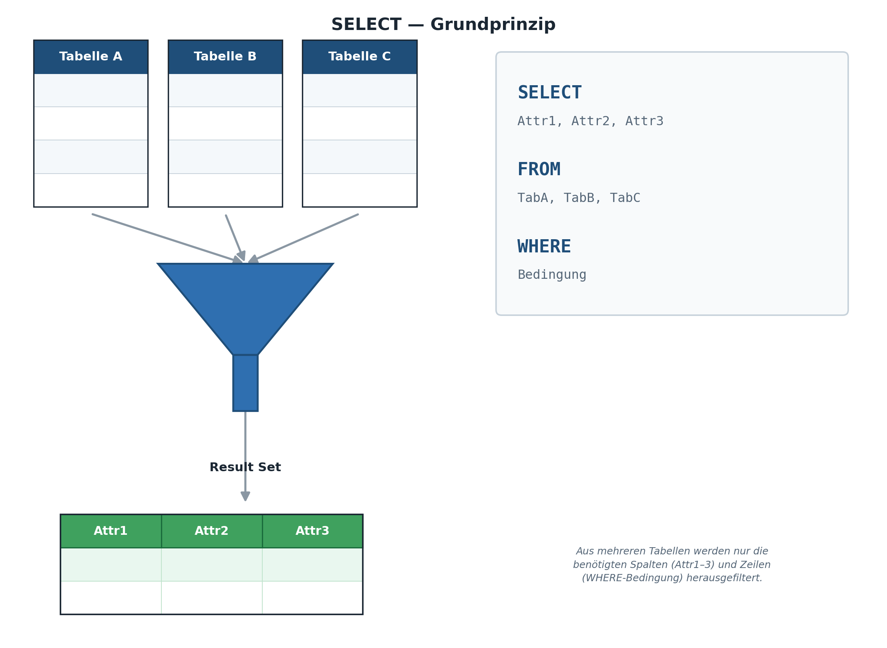
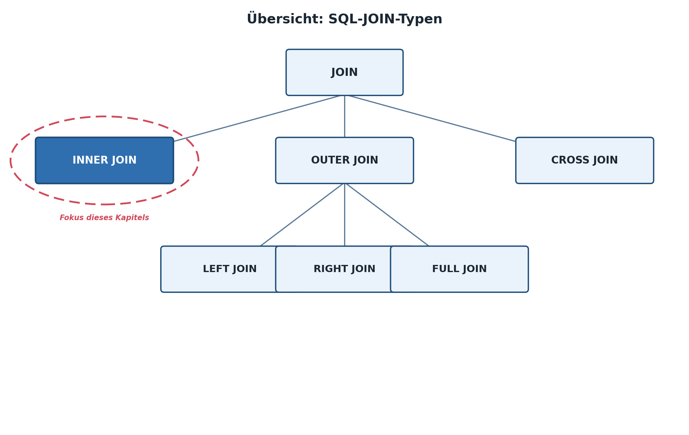
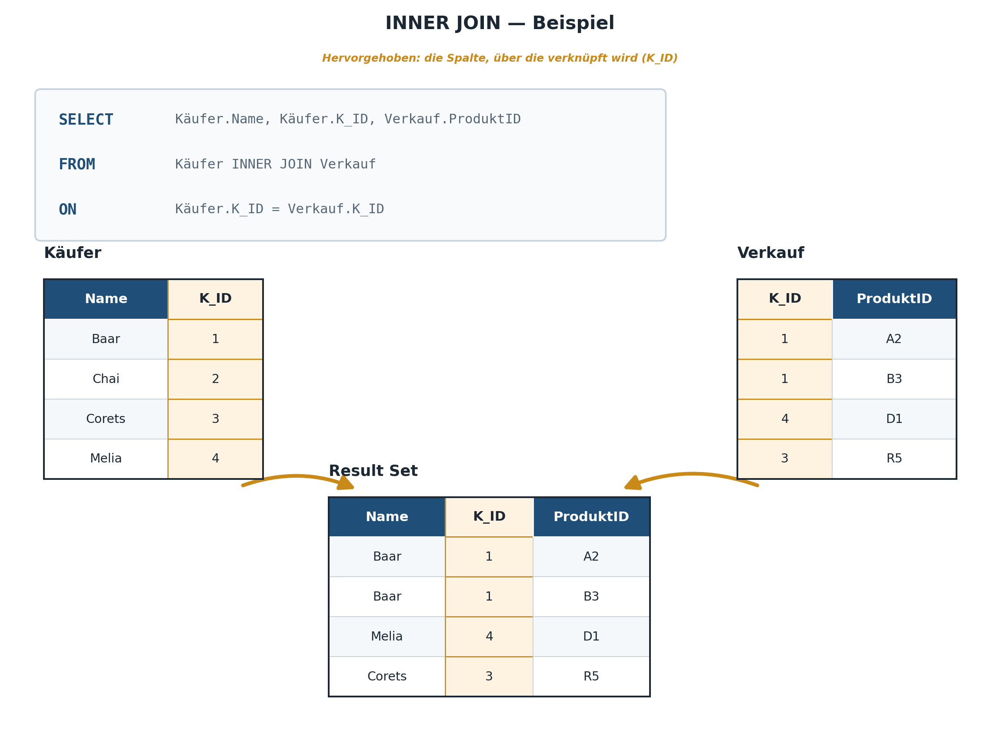
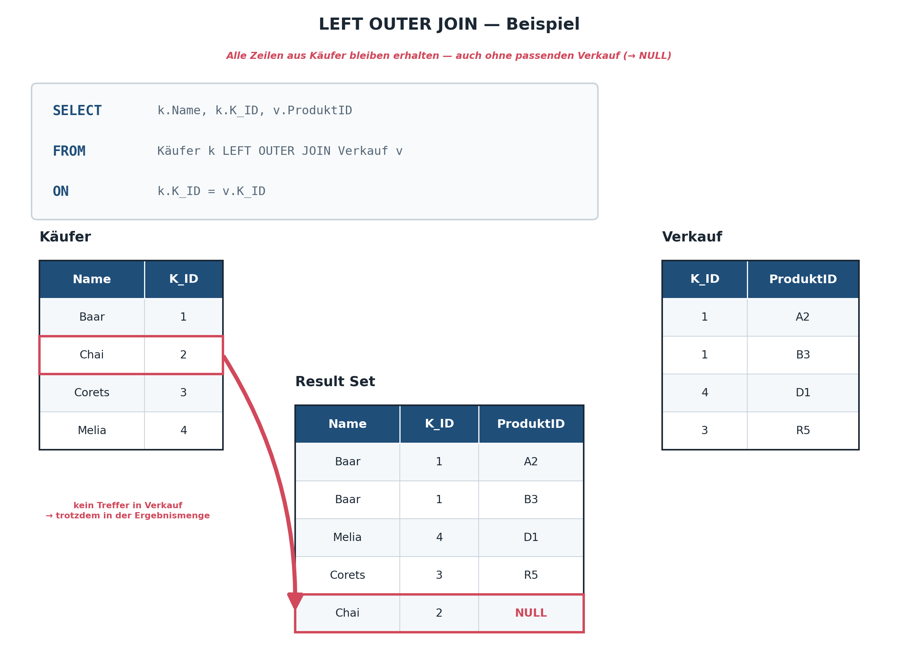

|                                             |                          |                               |
| ------------------------------------------- | ------------------------ | ----------------------------- |
| **Informatik\*in / Systemtechniker\*in HF** | **Datenbankentwicklung** |  |

- [1. Tabellen verknüpfen mit JOINs](#1-tabellen-verknüpfen-mit-joins)
  - [1.1. Lernziele](#11-lernziele)
  - [1.2. Wozu Joins?](#12-wozu-joins)
  - [1.3. INNER JOIN (nur übereinstimmende Zeilen)](#13-inner-join-nur-übereinstimmende-zeilen)
    - [1.3.1. Tabellen-Alias](#131-tabellen-alias)
    - [1.3.2. Alte Syntax vs. moderne Syntax](#132-alte-syntax-vs-moderne-syntax)
  - [1.4. LEFT JOIN (alle linken Zeilen)](#14-left-join-alle-linken-zeilen)
  - [1.5. CROSS JOIN](#15-cross-join)
  - [1.6. Self-Join](#16-self-join)
  - [1.7. Übersicht der JOIN-Typen](#17-übersicht-der-join-typen)
  - [1.8. Mehrere Joins kombinieren (m:n über Zwischentabelle)](#18-mehrere-joins-kombinieren-mn-über-zwischentabelle)
  - [1.9. JOIN mit Aggregation kombinieren](#19-join-mit-aggregation-kombinieren)
  - [1.10. Unterabfragen (Subqueries)](#110-unterabfragen-subqueries)
    - [1.10.1. Subquery in WHERE](#1101-subquery-in-where)
    - [1.10.2. Subquery in FROM (Derived Table)](#1102-subquery-in-from-derived-table)
    - [1.10.3. EXISTS – Existenzprüfung](#1103-exists--existenzprüfung)
  - [1.11. Weiterführende Ressourcen](#111-weiterführende-ressourcen)
- [2. Aufgaben](#2-aufgaben)
  - [2.1. Abfragen Bibliothek Datenbank (JOIN)](#21-abfragen-bibliothek-datenbank-join)
  - [2.2. Praxisprojekt: Bibliotheksauswertung](#22-praxisprojekt-bibliotheksauswertung)
  - [2.3. Abfragen Schulverwaltungsdatenbank](#23-abfragen-schulverwaltungsdatenbank)

---

</br>

# 1. Tabellen verknüpfen mit JOINs

## 1.1. Lernziele

Nach diesem Kapitel können Sie:

- [ ] erklären, weshalb Joins in einer normalisierten Datenbank zwingend nötig sind
- [ ] `INNER JOIN`, `LEFT JOIN` und `CROSS JOIN` korrekt einsetzen und den Unterschied erklären
- [ ] mehrere Tabellen (auch über eine Zwischentabelle) in einer Abfrage verknüpfen
- [ ] einen Self-Join für rekursive Beziehungen korrekt formulieren
- [ ] Subqueries (Unterabfragen) als Alternative bzw. Ergänzung zu Joins anwenden

---

## 1.2. Wozu Joins?

In vorherigen Kapiteln wurde die Bibliotheksdatenbank-Datenbank bewusst normalisiert und in mehrere Tabellen aufgeteilt: `kunde`, `ausleihe`, `buch` usw. Der Preis dieser sauberen Struktur: Um eine aussagekräftige Frage wie „Welcher Kunde hat welches Buch ausgeliehen?" zu beantworten, müssen Daten aus **mehreren Tabellen gleichzeitig** gelesen werden. Genau das leistet ein **JOIN**.



Joins sind damit gewissermassen der „Preis", den man für die Vorteile der Normalisierung (keine Redundanz, keine Anomalien) bezahlt – ein Preis, der sich in aller Regel klar lohnt, da moderne DBMS Joins hocheffizient ausführen können, insbesondere wenn auf den beteiligten Fremdschlüssel-Spalten Indizes vorhanden sind.



---

## 1.3. INNER JOIN (nur übereinstimmende Zeilen)

Der `INNER JOIN` liefert nur jene Zeilen, für die in **beiden** Tabellen ein passender Eintrag existiert (Verknüpfung über die Fremdschlüssel-Beziehung).



```sql
-- Bücher mit Autorenname
SELECT
    b.titel,
    a.vorname || ' ' || a.nachname AS Autor,
    b.genre,
    b.preis
FROM buecher b
INNER JOIN autoren a ON b.autor_id = a.id
ORDER BY b.titel;
```

> **Tabellenaliase:** Bei `JOIN`s immer kurze Aliase verwenden (`b`, `a`, `k`...) und Spalten damit qualifizieren (`b.titel` statt `titel`). Das verhindert Fehler bei gleichnamigen Spalten.

```sql
-- Ausleihen mit Kunden- und Buchinformationen (3-Table-Join)
SELECT
    k.name          AS Kunde,
    b.titel         AS Buch,
    a.ausleihdatum,
    a.rueckgabe
FROM ausleihen a
INNER JOIN kunden  k ON a.kunden_id = k.id
INNER JOIN buecher b ON a.buch_id   = b.id
ORDER BY a.ausleihdatum DESC;
```

**Visualisierung:**

```bash
kunden              ausleihe            buecher
┌────┐              ┌────┐              ┌────┐
│ ●●●│  ════════►   │ ●●●│  ◄═══════    │ ●●●│
└────┘   (nur wo    └────┘  (nur wo     └────┘
         kunden_id           buch_id
         übereinstimmt)      übereinstimmt)
```

Kunden ohne jegliche Ausleihe erscheinen bei einem `INNER JOIN` **nicht** im Ergebnis – das ist bei einer Auswertung wie „wer hat was ausgeliehen" oft gewünscht, kann aber je nach Fragestellung problematisch sein (siehe `LEFT JOIN`).

### 1.3.1. Tabellen-Alias

In den obigen Beispielen wurden die Tabellen mit kurzen Alias-Namen (`w`, `t`, `m`) versehen. Dies ist bei Joins nicht nur eine Schreiberleichterung, sondern in bestimmten Fällen zwingend notwendig – etwa beim Self-Join (siehe 9.5), wo dieselbe Tabelle zweimal referenziert wird und ohne unterschiedliche Alias-Namen gar nicht mehr unterschieden werden könnte, welche Instanz gemeint ist. Alias-Namen werden direkt nach dem Tabellennamen angegeben (optional mit dem Schlüsselwort `AS`, das in SQLite bei Tabellen-Alias meist weggelassen wird) und gelten für die gesamte restliche Abfrage.

### 1.3.2. Alte Syntax vs. moderne Syntax

```sql
-- Alte, implizite Syntax (Join über WHERE) – nicht mehr empfohlen
SELECT k.name
       a.ausleihdatum,
       a.rueckgabe
FROM ausleihe a, kunden k
WHERE a.kunden_id = k.id;

-- Moderne, explizite Syntax – im Kurs verwendet
SELECT k.name
       a.ausleihdatum,
       a.rueckgabe
FROM ausleihen a
INNER JOIN kunden  k ON a.kunden_id = k.id;
```

Die explizite `JOIN ... ON`-Syntax wird empfohlen, da sie Filterbedingung (`WHERE`) und Verknüpfungsbedingung (`ON`) klar trennt und Fehler (z.B. vergessene Verknüpfung → „kartesisches Produkt", siehe 9.4) deutlich seltener macht.

---

## 1.4. LEFT JOIN (alle linken Zeilen)

`LEFT JOIN` gibt **alle** Zeilen der linken Tabelle zurück, auch wenn es keinen Treffer in der rechten gibt. Fehlende Werte werden mit `NULL` gefüllt:



```sql
-- Alle Autoren, auch jene ohne Buch in der DB
SELECT
    a.vorname || ' ' || a.nachname AS Autor,
    b.titel,
    b.genre
FROM autoren a
LEFT JOIN buecher b ON b.autor_id = a.id
ORDER BY a.nachname;

-- Anti-Join: Autoren OHNE Buch in der Datenbank
SELECT a.vorname, a.nachname
FROM autoren a
LEFT JOIN buecher b ON b.autor_id = a.id
WHERE b.id IS NULL;
```

---

## 1.5. CROSS JOIN

Der `CROSS JOIN` verknüpft **jede** Zeile der einen Tabelle mit **jeder** Zeile der anderen Tabelle (kartesisches Produkt) – ohne jegliche Verknüpfungsbedingung.

```sql
SELECT a.vorname, a.nachname, k.name
FROM autoren a
CROSS JOIN kunden k;
```

Da `autoren` 3 Zeilen und `kunden` 2 Zeilen enthält, liefert diese Abfrage 3 × 2 = 6 Ergebniszeilen – jede Kombination aus Autor und Kunde, unabhängig von jeglicher inhaltlicher Beziehung zwischen den beiden Tabellen.

Ein solches versehentliches kartesisches Produkt erkennt man in der Praxis meist daran, dass die Anzahl Ergebniszeilen unerwartet stark ansteigt (z.B. exakt das Produkt der beiden Tabellengrössen statt einer plausiblen, kleineren Zahl) – ein guter Grund, sich bei jeder Join-Abfrage kurz zu fragen, ob die Grössenordnung des Ergebnisses plausibel erscheint.

---

## 1.6. Self-Join

Ein Self-Join verknüpft eine Tabelle mit sich selbst – nützlich bei rekursiven Beziehungen.

```sql
-- Beispiel: Techniker mit ihrem jeweiligen Mentor (angenommen: Spalte MentorPersonalNr)
SELECT t1.Name AS Techniker, t2.Name AS Mentor
FROM Techniker t1
LEFT JOIN Techniker t2 ON t1.MentorPersonalNr = t2.PersonalNr;
```

Die Tabelle wird dabei zweimal mit unterschiedlichen Alias-Namen (`t1`, `t2`) referenziert. Gedanklich hilft es, sich vorzustellen, es handle sich um zwei physisch getrennte Kopien derselben Tabelle – SQLite selbst „weiss" nicht, dass beide Alias letztlich auf dieselbe Tabelle zurückgehen, und behandelt sie exakt wie zwei unabhängige Tabellen mit identischer Struktur.

---

## 1.7. Übersicht der JOIN-Typen

| **JOIN-Typ** | **Ergebnis**                              | **Typischer Einsatz**                      |
| ------------ | ----------------------------------------- | ------------------------------------------ |
| `INNER JOIN` | Nur Zeilen mit Treffer in beiden Tabellen | Normale Verknüpfungen (Bestellung + Kunde) |
| `LEFT JOIN`  | Alle linken + passende rechte Zeilen      | Optionale Beziehungen (Autor ohne Buch)    |
| `RIGHT JOIN` | Alle rechten + passende linke Zeilen      | Nicht in SQLite! → Tabellen umdrehen       |
| `CROSS JOIN` | Kartesisches Produkt (jede × jede)        | Kombinationstabellen, selten nötig         |

> **RIGHT JOIN in SQLite:** Erst ab Version 3.39.0 (2022) unterstützt.
> Besser: Tabellen in `LEFT JOIN` einfach umdrehen.
> `FROM buecher b RIGHT JOIN autoren a` → `FROM autoren a LEFT JOIN buecher b`

---

## 1.8. Mehrere Joins kombinieren (m:n über Zwischentabelle)

Dies ist das direkte praktische Gegenstück zur m:n-Modellierung: Um von kunden zu buecher zu gelangen, muss zwingend über die Zwischentabelle ausleihen verknüpft werden. Grundsätzlich lassen sich beliebig viele Tabellen über mehrere aufeinanderfolgende JOIN-Klauseln verknüpfen; in der Praxis lohnt es sich bei mehr als drei bis vier beteiligten Tabellen, die Abfrage schrittweise aufzubauen und nach jedem zusätzlichen Join das Zwischenergebnis zu kontrollieren, statt die komplette Abfrage „in einem Wurf" zu schreiben.

```sql
SELECT k.name, a.ausleihdatum, b.titel AS Buch
FROM kunden k
INNER JOIN ausleihen a ON k.id = a.kunden_id
INNER JOIN buecher b   ON a.buch_id = b.id
ORDER BY a.ausleihdatum;
```

Erweiterung auf vier Tabellen — genau der im Text angesprochene Fall („mehr als drei bis vier beteiligte Tabellen"): Soll zusätzlich der Autor jedes ausgeliehenen Buchs erscheinen, kommt eine vierte Tabelle über einen weiteren INNER JOIN hinzu:

```sql
SELECT k.name, a.ausleihdatum, b.titel AS Buch, 
       au.vorname || ' ' || au.nachname AS Autor
FROM kunden k
INNER JOIN ausleihen a ON k.id = a.kunden_id
INNER JOIN buecher b   ON a.buch_id = b.id
INNER JOIN autoren au  ON b.autor_id = au.id
ORDER BY a.ausleihdatum;
```

---

## 1.9. JOIN mit Aggregation kombinieren

```sql
-- Anzahl Bücher und Durchschnittspreis pro Autor
SELECT
    a.vorname || ' ' || a.nachname AS Autor,
    a.land,
    COUNT(b.id)                    AS Anzahl_Buecher,
    ROUND(AVG(b.preis), 2)         AS Avg_Preis
FROM autoren a
LEFT JOIN buecher b ON b.autor_id = a.id
GROUP BY a.id, a.vorname, a.nachname, a.land
ORDER BY Anzahl_Buecher DESC;

-- Häufigste Ausleiher (Top 10)
SELECT
    k.name,
    k.stadt,
    COUNT(au.id) AS Anzahl_Ausleihen
FROM kunden k
LEFT JOIN ausleihen au ON au.kunden_id = k.id
GROUP BY k.id, k.name, k.stadt
ORDER BY Anzahl_Ausleihen DESC
LIMIT 10;
```

---

## 1.10. Unterabfragen (Subqueries)

Eine Unterabfrage ist ein `SELECT`-Statement innerhalb eines anderen `SELECT`-Statements.
Manche Fragestellungen lassen sich statt mit einem Join auch mit einer **Unterabfrage** lösen:

### 1.10.1. Subquery in WHERE

```sql
-- Bücher, die teurer sind als der Durchschnitt
SELECT titel, preis
FROM buecher
WHERE preis > (SELECT AVG(preis) FROM buecher)
ORDER BY preis DESC;

-- Bücher von Autoren aus der Schweiz
SELECT titel, genre, preis
FROM buecher
WHERE autor_id IN (
    SELECT id FROM autoren WHERE land = 'Schweiz'
);

-- Kunden, die das teuerste Buch ausgeliehen haben
SELECT DISTINCT k.name
FROM kunden k
INNER JOIN ausleihen au ON au.kunden_id = k.id
WHERE au.buch_id = (
    SELECT id FROM buecher ORDER BY preis DESC LIMIT 1
);
```

Das gleiche Ergebnis liesse sich auch mit einem `INNER JOIN` + `DISTINCT` erzielen. **Faustregel:** Wenn Spalten aus **beiden** Tabellen im Ergebnis erscheinen sollen, ist ein `JOIN` nötig. Wenn nur geprüft werden muss, *ob* ein Zusammenhang existiert (aber keine Spalten der zweiten Tabelle im Ergebnis gebraucht werden), ist eine Subquery oft übersichtlicher.

Subqueries lassen sich an drei unterschiedlichen Stellen einer Abfrage einsetzen: in der `WHERE`-Klausel (wie oben gezeigt), in der `SELECT`-Liste (sogenannte „skalare" Subquery, die genau einen Wert zurückliefert) oder in der `FROM`-Klausel (als „abgeleitete Tabelle"). Ein Beispiel für eine skalare Subquery in der `SELECT`-Liste:

```sql
SELECT b.titel,
       (SELECT COUNT(*) FROM ausleihen a WHERE a.buch_id = b.id) AS AnzahlAusleihen
FROM buecher b;
```

Für jedes Buch wird über die korrelierte Unterabfrage gezählt, wie oft es in ausleihen vorkommt – auch Bücher, die noch nie ausgeliehen wurden, erscheinen mit 0.

### 1.10.2. Subquery in FROM (Derived Table)

Eine Unterabfrage kann auch als virtuelle Tabelle im `FROM` verwendet werden:

```sql
-- Genres mit überdurchschnittlicher Buchanzahl
SELECT g.genre, g.anzahl
FROM (
    SELECT genre, COUNT(*) AS anzahl
    FROM buecher
    GROUP BY genre
) AS g
WHERE g.anzahl > (
    SELECT AVG(cnt)
    FROM (SELECT COUNT(*) AS cnt FROM buecher GROUP BY genre)
)
ORDER BY g.anzahl DESC;
```

### 1.10.3. EXISTS – Existenzprüfung

`EXISTS` gibt `TRUE` zurück, wenn die Unterabfrage mindestens eine Zeile liefert:

```sql
-- Kunden, die mindestens eine Ausleihe haben
SELECT name, email
FROM kunden k
WHERE EXISTS (
    SELECT 1 FROM ausleihen au WHERE au.kunden_id = k.id
);

-- Bücher, die derzeit ausgeliehen sind (Rückgabe noch offen)
SELECT titel, genre
FROM buecher b
WHERE EXISTS (
    SELECT 1 FROM ausleihen au
    WHERE au.buch_id = b.id
    AND au.rueckgabe IS NULL
);
```

> **EXISTS vs. IN**
>
> - `EXISTS` stoppt bei erstem Treffer → oft schneller bei grossen Tabellen
> - `IN` lädt alle Werte der Unterabfrage → besser bei kleinen Listen
> - Bei `NULL`-Werten verhält sich `NOT IN` anders als `NOT EXISTS` – Vorsicht!

---

## 1.11. Weiterführende Ressourcen

- SQLite Dokumentation: <https://www.sqlite.org/lang_select.html>
- Interaktiv üben: <https://sqliteonline.com>
- DB Browser for SQLite (GUI): <https://sqlitebrowser.org>
- SQL-Übungsplattform: <https://www.sql-practice.com>

---

</br>

# 2. Aufgaben

## 2.1. Abfragen Bibliothek Datenbank (JOIN)

| **Vorgabe**             | **Beschreibung**                                                            |
| :---------------------- | :-------------------------------------------------------------------------- |
| **Lernziele**           | Einfache SQL-Abfragen mit Spalten Selektion und Sortierung ausführen        |
|                         | Einfache SQL-Abfragen mit WHERE Klause und Prädikaten                       |
|                         | Einfache SQL-Abfragen Aggregatfunktionen und Gruppierungen                  |
|                         | Komplexe SQL-Abfragen mit mehreren Tabellen (JOIN)                          |
|                         | Komplexe SQL-Abfragen mit mehreren Tabellen und Unterabfragen (Sub-Queries) |
| **Sozialform**          | Einzelarbeit                                                                |
| **Auftrag**             | siehe unten                                                                 |
| **Hilfsmittel**         |                                                                             |
| **Erwartete Resultate** |                                                                             |
| **Zeitbedarf**          | 60 min                                                                      |
| **Lösungselemente**     | SQL Abfragebefehle                                                          |

**Schreibe eine Abfrage, die folgendes ausgibt:**

1. Listet alle Bücher mit dem vollständigen Autorennamen und dem Land des Autors
2. Zeigt alle Kunden, die noch **nie** ein Buch ausgeliehen haben
3. Findet die 5 beliebtesten Bücher (meiste Ausleihen)
4. Welche Genres werden von Autoren aus der Schweiz geschrieben?

**Komplexe Abfragen mit Unterabfragen (Herausforderungsaufgaben):**

1. Welche Bücher kosten mehr als das teuerste Buch im Genre «Roman»?
2. Welche Autoren haben mehr Bücher als der Durchschnitt aller Autoren?
3. Listet alle Kunden, die noch kein Buch aus dem Genre «Krimi» ausgeliehen haben

---

## 2.2. Praxisprojekt: Bibliotheksauswertung

| **Vorgabe**             | **Beschreibung**                                    |
| :---------------------- | :-------------------------------------------------- |
| **Lernziele**           | Komplexe SQL-Abfragen für statistische Auswertungen |
| **Sozialform**          | Einzelarbeit                                        |
| **Auftrag**             | siehe unten                                         |
| **Hilfsmittel**         |                                                     |
| **Erwartete Resultate** |                                                     |
| **Zeitbedarf**          | 30 min                                              |
| **Lösungselemente**     | SQL Abfragebefehle                                  |

Setzt das gesamte Wissen ein. Erstellt einen vollständigen Bibliotheksbericht.

**Aufgabe A – Bestandsübersicht:**

- Erstellt eine vollständige Bestandsübersicht pro Genre
- Erwartete Spalten:
  - Genre, Anzahl_Titel, Verfuegbar (Summe Lagerbestand),
  - Avg_Preis, Guenstigstes, Teuerstes
- Nur Genres mit mindestens 2 Titeln
- Sortiert nach Anzahl_Titel absteigend

**Aufgabe B – Top-Ausleiher Report:**

- Erstellt einen Kunden-Report:
  - Name, Stadt, Anzahl_Ausleihen, Aktuell_Ausgeliehen (rueckgabe IS NULL)
  - Alle Kunden anzeigen (auch ohne Ausleihe)
  - Sortiert nach Anzahl_Ausleihen DESC

**Aufgabe C – Autoren-Performance:**

- Für jeden Autor:
  - Vollname, Land, Anzahl_Buecher, Gesamtausleihen (über alle Bücher),
  - Avg_Preis, Beliebtestes_Buch (Titel mit meisten Ausleihen)
  - Nur Autoren mit mindestens einem Buch

---

## 2.3. Abfragen Schulverwaltungsdatenbank

| **Vorgabe**             | **Beschreibung**                                    |
| :---------------------- | :-------------------------------------------------- |
| **Lernziele**           | Komplexe SQL-Abfragen für statistische Auswertungen |
| **Sozialform**          | Einzelarbeit                                        |
| **Auftrag**             | siehe unten                                         |
| **Hilfsmittel**         |                                                     |
| **Erwartete Resultate** |                                                     |
| **Zeitbedarf**          | 40 min                                              |
| **Lösungselemente**     | SQL Abfragebefehle                                  |

**Teil 1: Abfragen mit mehreren Tabellen (Join):**

**A1.1:**

- Liste alle Studenten mit den Fachrichtungen
- Die Liste soll die Spalten *StudentName, StudentVorname, StudentGeburtsdatum, Fachrichtung, AnzahlSemester* enthalten und nach *StudentName u. StudentVorname* aufsteigend sortiert sein.

**A1.2:**

- Liste alle Studenten, die der Fachrichtung *"Maschinenbau"* angehören
- Die Liste soll die Spalten *StudentName, StudentVorname, StudentGeburtsdatum, Fachrichtung, AnzahlSemester* enthalten und nach *StudentName u. StudentVorname* aufsteigend sortiert sein.

**A1.3:**

- Liste alle Studenten, deren Fachrichtung länger als *6 Semester* dauert und nach dem *1.1.1990* geboren sind.
- Die Liste soll die Spalten *StudentName, StudentVorname, StudentGeburtsdatum, Fachrichtung, AnzahlSemester* enthalten und nach *AnzahlSemester* absteigend sortiert sein.

**A1.4:**

- Liste alle Studenten, die den Kurs *"Mathe"* besuchen.
- Die Liste soll die Spalten *StudentName, StudentVorname, StudentGeburtsdatum* aufsteigend sortiert nach *StudentName, StudentVorname* anzeigen.

**A1.5:**

- Liste alle Studenten, die den Kurs *"Mathe" oder "VWL"* besuchen.
- Die Liste soll die Spalten *StudentName, StudentVorname, StudentGeburtsdatum, Kursbezeichnung* aufsteigend sortiert nach *StudentName, StudentVorname* anzeigen.
- **Tipp: IN-Operator verwenden!**

**A1.6:**

- Liste alle Studenten, die den Kurs *"Mathe"* besuchen.
- Die Liste soll die Spalten *StudentName, StudentVorname, StudentGeburtsdatum, FachrichtungBezeichnung* aufsteigend sortiert nach *FachrichtungBezeichnung, StudentName, StudentVorname* anzeigen.

**A1.7:**

- Erstelle eine Gesamtübersicht zu den Studenten, Kursen und den Fachrichtungen.
- Die Liste soll die Spalten *StudentNr, StudentName, StudentVorname, StudentGeburtsdatum, FachrichtungNr, FachrichtungBezeichnung, AnzahlSemester, KursNr, Kursbezeichnung* aufsteigend sortiert nach *StudentNr* anzeigen.

---

**Teil 2: Aggregatfunktionen:**

**A2.1:**

- Ermittle die Anzahl der Studenten, die der Fachrichtung "*BWL*" zugeordnet sind.
- Spaltenübersicht "*AnzahlStudenten*".

**A2.2:**

- Ermittle die Anzahl der Kurse, die von Student *Hans, Müller* belegt werden.
- Die Liste soll die Spalten *StudentName, StudentVorname* und *AnzahlKurse* enthalten.

**A2.3:**

- Ermittle die Anzahl der Studierende pro Fachrichtung.
- Die Ausgabe soll die Spalten *Fachrichtung u. AnzahlStudierende* enthalten.

**A2.4:**

- Ermittle die Anzahl der belegten Kurse pro Student.
- Die Ausgabe soll die Spalten *StudentName, StudentVorname u. AnzahlBelegteKurse* enthalten.

**A2.5:**

- Ermittle die Studenten, die mehr als einen Kurs belegen.
- Die Ausgabe soll die Spalten *StudentName, StudentVorname u. AnzahlBelegteKurse* enthalten.

---

© 2026 Lukas Müller – Licensed under CC BY-NC-ND 4.0
See [LICENSE](../license.md) file for details.
