|                                             |                          |                               |
| ------------------------------------------- | ------------------------ | ----------------------------- |
| **Informatik\*in / Systemtechniker\*in HF** | **Datenbankentwicklung** |  |

- [1. SQL - Abfragen](#1-sql---abfragen)
  - [1.1. Lernziele](#11-lernziele)
  - [1.2. Ausgangslage: Die Übungsdatenbank](#12-ausgangslage-die-übungsdatenbank)
  - [1.3. Grundstruktur des SELECT-Befehls](#13-grundstruktur-des-select-befehls)
    - [1.3.1. Alle Spalten vs. gezielte Auswahl](#131-alle-spalten-vs-gezielte-auswahl)
    - [1.3.2. Aliase (AS)](#132-aliase-as)
    - [1.3.3. Berechnungen und Ausdrücke](#133-berechnungen-und-ausdrücke)
    - [1.3.4. DISTINCT – Duplikate entfernen](#134-distinct--duplikate-entfernen)
  - [1.4. Filtern mit WHERE und Prädikaten](#14-filtern-mit-where-und-prädikaten)
    - [1.4.1. Vergleichsoperatoren](#141-vergleichsoperatoren)
    - [1.4.2. BETWEEN – Bereichsfilter](#142-between--bereichsfilter)
    - [1.4.3. IN – Werteliste](#143-in--werteliste)
    - [1.4.4. LIKE – Textmuster](#144-like--textmuster)
    - [1.4.5. IS NULL / IS NOT NULL](#145-is-null--is-not-null)
    - [1.4.6. Logische Operatoren: AND, OR, NOT](#146-logische-operatoren-and-or-not)
  - [1.5. Sortieren, Begrenzen und Aggregieren](#15-sortieren-begrenzen-und-aggregieren)
    - [1.5.1. ORDER BY – Sortierung](#151-order-by--sortierung)
    - [1.5.2. LIMIT und OFFSET – Paginierung](#152-limit-und-offset--paginierung)
  - [1.6. Berechnungen in Abfragen](#16-berechnungen-in-abfragen)
    - [1.6.1. Aggregatfunktionen](#161-aggregatfunktionen)
    - [1.6.2. GROUP BY – Gruppierung](#162-group-by--gruppierung)
    - [1.6.3. HAVING – Filter auf Gruppen](#163-having--filter-auf-gruppen)
  - [1.7. Logische Ausführungsreihenfolge](#17-logische-ausführungsreihenfolge)
  - [1.8. Zusammenfassung und Cheatsheet](#18-zusammenfassung-und-cheatsheet)
    - [1.8.1. Klausel-Reihenfolge](#181-klausel-reihenfolge)
    - [1.8.2. Prädikate Übersicht](#182-prädikate-übersicht)
    - [1.8.3. Weiterführende Ressourcen](#183-weiterführende-ressourcen)
- [2. Aufgaben](#2-aufgaben)
  - [2.1. Datenbank Bibliothek erstellen](#21-datenbank-bibliothek-erstellen)
  - [2.2. Abfragen Bibliothek Datenbank](#22-abfragen-bibliothek-datenbank)
  - [2.3. Abfragen Schulverwaltungsdatenbank](#23-abfragen-schulverwaltungsdatenbank)

---

</br>

# 1. SQL - Abfragen

## 1.1. Lernziele

- [ ] Daten mit `SELECT` gezielt abfragen und filtern (`WHERE`)
- [ ] Ergebnisse sortieren (`ORDER BY`) und Rechenoperationen in Abfragen einbauen
- [ ] Aggregatfunktionen (`COUNT`, `SUM`, `AVG`, `MIN`, `MAX`) und `GROUP BY`/`HAVING` korrekt einsetzen
- [ ] die logische Ausführungsreihenfolge einer SELECT-Abfrage nachvollziehen
- [ ] den Unterschied zwischen `WHERE` und `HAVING` an eigenen Beispielen erklären

---

## 1.2. Ausgangslage: Die Übungsdatenbank

Alle Beispiele basieren auf einer einfachen Bibliotheksdatenbank. Sie besteht aus vier Tabellen und bildet einen praxisnahen Kontext, der über die gesamte Lektion hinweg verwendet wird.

```sql
-- Tabelle: autoren
CREATE TABLE autoren (
    id          INTEGER PRIMARY KEY AUTOINCREMENT,
    vorname     TEXT NOT NULL,
    nachname    TEXT NOT NULL,
    land        TEXT,
    geburtsjahr INTEGER
);

-- Tabelle: buecher
CREATE TABLE buecher (
    id           INTEGER PRIMARY KEY AUTOINCREMENT,
    titel        TEXT NOT NULL,
    autor_id     INTEGER REFERENCES autoren(id),
    genre        TEXT,
    jahr         INTEGER,
    preis        REAL,
    lagerbestand INTEGER DEFAULT 0
);

-- Tabelle: kunden
CREATE TABLE kunden (
    id    INTEGER PRIMARY KEY AUTOINCREMENT,
    name  TEXT NOT NULL,
    email TEXT UNIQUE,
    stadt TEXT
);

-- Tabelle: ausleihen
CREATE TABLE ausleihen (
    id           INTEGER PRIMARY KEY AUTOINCREMENT,
    kunden_id    INTEGER REFERENCES kunden(id),
    buch_id      INTEGER REFERENCES buecher(id),
    ausleihdatum TEXT,
    rueckgabe    TEXT
);
```

---

## 1.3. Grundstruktur des SELECT-Befehls

`SELECT` ist der zentrale Befehl zum Lesen von Daten aus einer Datenbank. Er folgt einer fixen Klausel-Reihenfolge:

```sql
SELECT  [DISTINCT] spalte1, spalte2, ...   -- Was?
FROM    tabelle                             -- Woher?
[JOIN   ...]                               -- Verknüpfungen
[WHERE  bedingung]                         -- Filter
[GROUP BY spalte]                          -- Gruppierung
[HAVING  bedingung]                        -- Filter auf Gruppen
[ORDER BY spalte [ASC|DESC]]               -- Sortierung
[LIMIT  n OFFSET m];                       -- Mengenbegrenzung
```

### 1.3.1. Alle Spalten vs. gezielte Auswahl

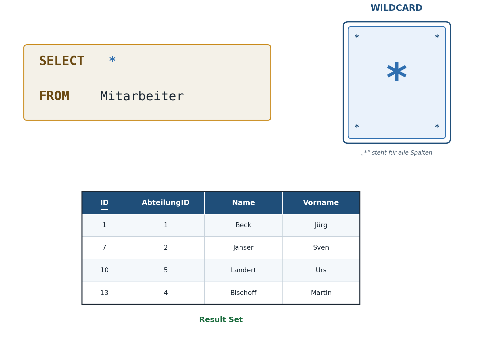

Der Stern (`*`) wählt alle Spalten – praktisch zum Erkunden, aber in Produktion vermeiden:

```sql
-- Alle Spalten (Entwicklung / Debugging)
SELECT * FROM buecher;
```

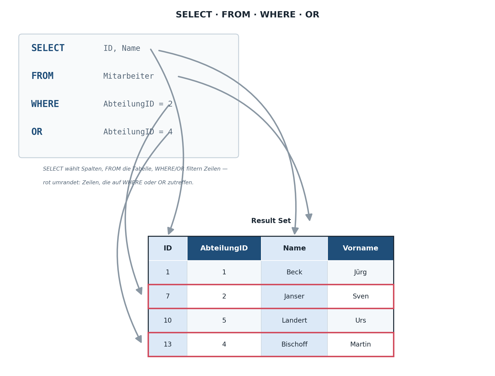

```sql
-- Nur benötigte Spalten (bevorzugt)
SELECT titel, genre, preis FROM buecher;
```

> **Best Practice: `SELECT *` vermeiden**

- Überträgt unnötige Daten (Performance)
- Bricht Code, wenn Spalten hinzugefügt/entfernt werden
- Erschwert das Lesen der Abfrageabsicht

### 1.3.2. Aliase (AS)

Spalten und Tabellen können mit `AS` umbenannt werden – besonders bei Berechnungen oder langen Namen nützlich:

```sql
SELECT
    titel              AS Buchtitel,
    preis * 1.077      AS Preis_CHF,
    lagerbestand       AS Verfuegbar
FROM buecher;
```

### 1.3.3. Berechnungen und Ausdrücke

```sql
-- Arithmetik direkt in SELECT
SELECT
    titel,
    preis,
    preis * 0.9           AS Rabattpreis,
    preis - (preis * 0.1) AS Ebenfalls_Rabatt
FROM buecher;

-- Texte verketten mit ||
SELECT vorname || ' ' || nachname AS Vollname
FROM autoren;
```

### 1.3.4. DISTINCT – Duplikate entfernen

`DISTINCT` sorgt dafür, dass jede Kombination nur einmal im Ergebnis erscheint:

```sql
-- Welche Genres gibt es? (ohne Duplikate)
SELECT DISTINCT genre FROM buecher ORDER BY genre;

-- Welche Länder haben Autoren?
SELECT DISTINCT land FROM autoren WHERE land IS NOT NULL;
```

---

## 1.4. Filtern mit WHERE und Prädikaten

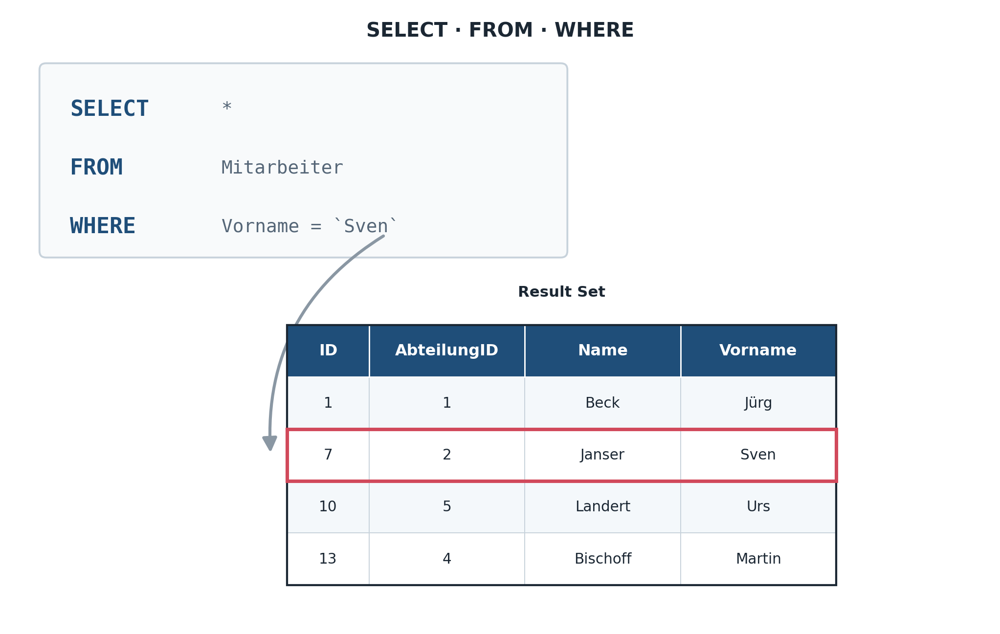

Die `WHERE`-Klausel schränkt das Ergebnis auf Zeilen ein, die eine Bedingung erfüllen. SQLite kennt verschiedene Prädikate:

### 1.4.1. Vergleichsoperatoren

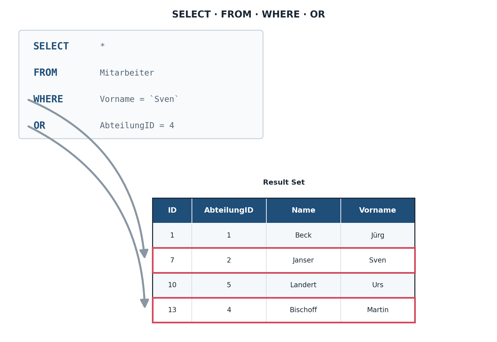

| **Operator**         | **Bedeutung**                                    |
| -------------------- | ------------------------------------------------ |
| `=`                  | gleich                                           |
| `<>` oder `!=`       | ungleich                                         |
| `<`, `>`, `<=`, `>=` | kleiner, grösser, kleiner-gleich, grösser-gleich |

```sql
-- Einfache Vergleiche: =, <>, <, >, <=, >=
SELECT titel, preis FROM buecher
WHERE preis > 25.00;

SELECT titel, jahr FROM buecher
WHERE jahr >= 2000 AND jahr <= 2020;

-- Ungleich
SELECT * FROM autoren WHERE land <> 'Deutschland';
```

### 1.4.2. BETWEEN – Bereichsfilter

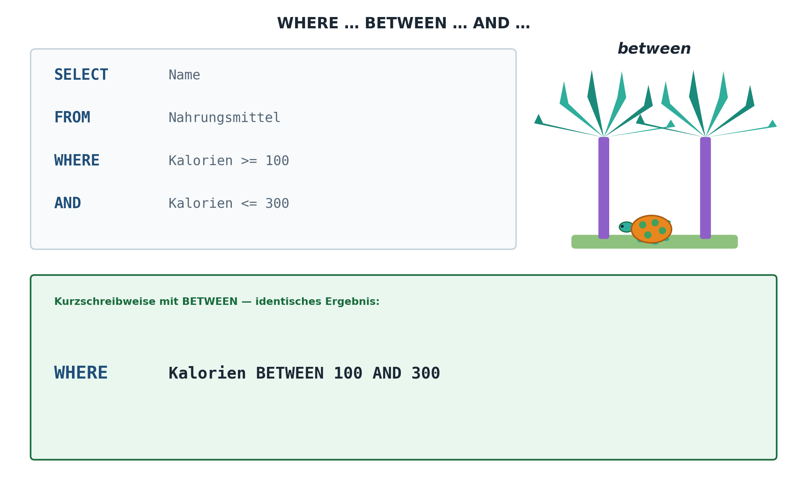

`BETWEEN` prüft, ob ein Wert in einem Bereich liegt (beide Grenzen **inklusive**):

```sql
-- Bücher zwischen 2000 und 2020
SELECT titel, jahr FROM buecher
WHERE jahr BETWEEN 2000 AND 2020;

-- Preisbereich
SELECT titel, preis FROM buecher
WHERE preis BETWEEN 10.00 AND 30.00
ORDER BY preis;
```

### 1.4.3. IN – Werteliste

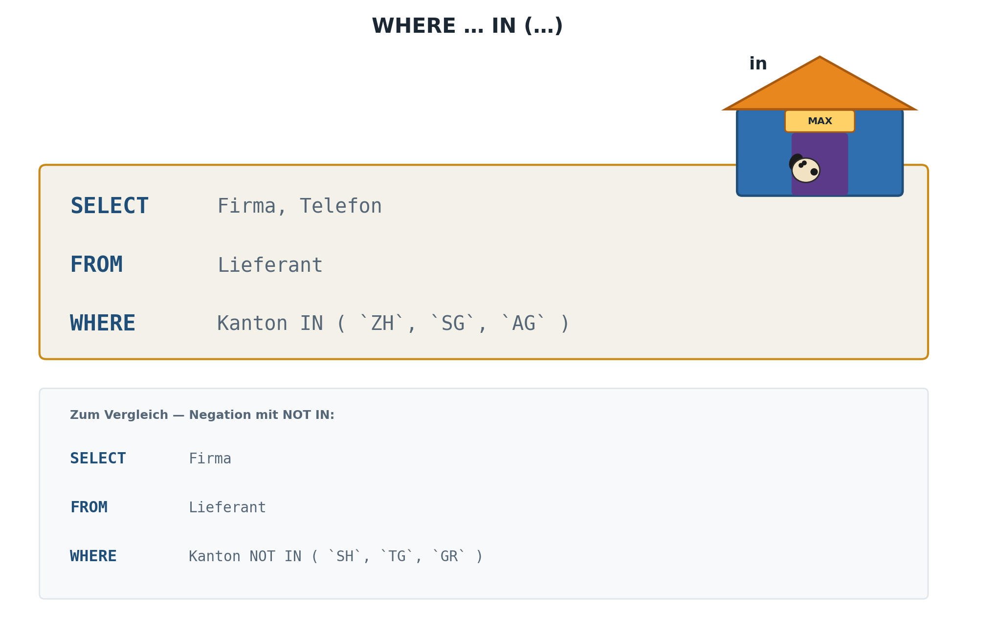

`IN` prüft, ob ein Wert in einer Menge von Werten vorkommt:

```sql
-- Mehrere Genres auf einmal
SELECT titel, genre FROM buecher
WHERE genre IN ('Roman', 'Krimi', 'Thriller');

-- NOT IN (Ausschlussliste)
SELECT titel, genre FROM buecher
WHERE genre NOT IN ('Sachbuch', 'Biografie');

-- Mit Subquery kombinieren
SELECT titel FROM buecher
WHERE autor_id IN (SELECT id FROM autoren WHERE land = 'Schweiz');
```

### 1.4.4. LIKE – Textmuster

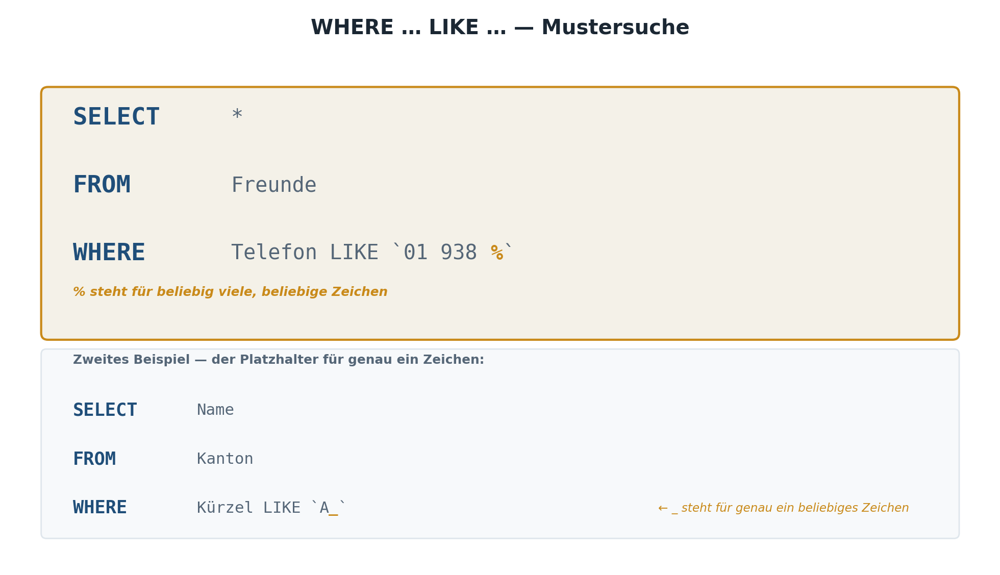

`LIKE` erlaubt die Suche nach Textmustern. Zwei Wildcards stehen zur Verfügung:

| **Wildcard** | **Bedeutung**                   | **Beispiel**              |
| ------------ | ------------------------------- | ------------------------- |
| `%`          | Beliebig viele Zeichen (auch 0) | `'Ha%'` → Harry, Hans, Ha |
| `_`          | Genau ein beliebiges Zeichen    | `'H_ns'` → Hans, Hens     |

```sql
-- Titel, die mit 'Der' beginnen
SELECT titel FROM buecher WHERE titel LIKE 'Der%';

-- Titel, die 'Krieg' enthalten
SELECT titel FROM buecher WHERE titel LIKE '%Krieg%';

-- E-Mails von Google
SELECT name, email FROM kunden WHERE email LIKE '%@gmail.com';

-- Genau 4-buchstabige Vornamen
SELECT vorname, nachname FROM autoren WHERE vorname LIKE '____';

-- Case-insensitiv: LOWER() verwenden
SELECT titel FROM buecher WHERE LOWER(titel) LIKE '%harry%';
```

### 1.4.5. IS NULL / IS NOT NULL

`NULL` bedeutet «unbekannt» oder «nicht vorhanden». Achtung: `NULL` kann **nicht** mit `=` verglichen werden!

```sql
-- FALSCH: findet nichts!
SELECT * FROM autoren WHERE land = NULL;

-- RICHTIG:
SELECT vorname, nachname FROM autoren WHERE land IS NULL;
SELECT vorname, nachname FROM autoren WHERE land IS NOT NULL;

-- COALESCE: Fallback-Wert für NULL
SELECT vorname, COALESCE(land, 'Unbekannt') AS Land
FROM autoren;
```

### 1.4.6. Logische Operatoren: AND, OR, NOT

[](./x_gitres/select-column-where-or.png)

Bedingungen können mit `AND`, `OR` und `NOT` kombiniert werden. Klammerung beachten!

```sql
-- Bücher: Roman UND Preis unter 20 CHF
SELECT titel, genre, preis FROM buecher
WHERE genre = 'Roman' AND preis < 20.00;

-- Bücher: Krimi ODER Thriller
SELECT titel, genre FROM buecher
WHERE genre = 'Krimi' OR genre = 'Thriller';

-- Klammerung ist entscheidend!
SELECT titel, genre, preis FROM buecher
WHERE (genre = 'Roman' OR genre = 'Krimi') AND preis < 25.00;
-- vs.
SELECT titel, genre, preis FROM buecher
WHERE genre = 'Roman' OR (genre = 'Krimi' AND preis < 25.00);
```

> **Operator-Priorität:** `NOT` hat höchste Priorität, dann `AND`, dann `OR`.
> Im Zweifelsfall immer Klammern setzen – das macht die Absicht klar!

---

## 1.5. Sortieren, Begrenzen und Aggregieren

### 1.5.1. ORDER BY – Sortierung

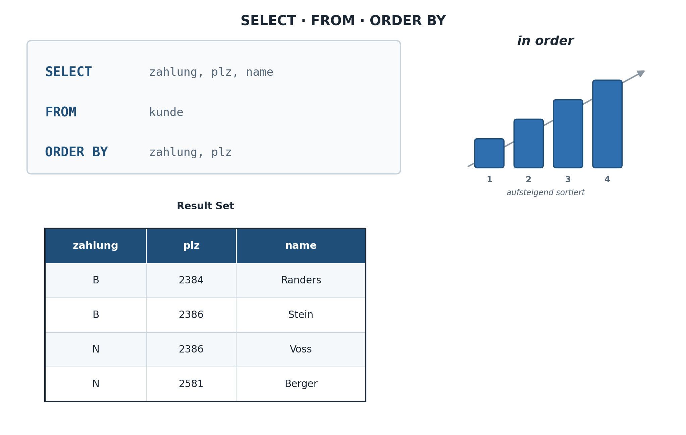

```sql
-- Aufsteigend (Standard)
SELECT titel, preis FROM buecher ORDER BY preis ASC;

-- Absteigend
SELECT titel, preis FROM buecher ORDER BY preis DESC;

-- Mehrere Spalten: zuerst nach Genre, dann nach Preis
SELECT titel, genre, preis FROM buecher
ORDER BY genre ASC, preis DESC;

-- NULL-Werte ans Ende stellen
SELECT vorname, nachname, geburtsjahr FROM autoren
ORDER BY geburtsjahr NULLS LAST;
```

Bei einer mehrstufigen Sortierung wird zunächst nach der ersten angegebenen Spalte sortiert; nur innerhalb gleicher Werte dieser ersten Spalte kommt die zweite Sortierspalte zum Tragen. Dieses Verhalten entspricht z.B. dem Sortieren einer Telefonliste zuerst nach Nachname, dann (bei gleichem Nachnamen) nach Vorname.

### 1.5.2. LIMIT und OFFSET – Paginierung

```sql
-- Die 5 teuersten Bücher
SELECT titel, preis FROM buecher
ORDER BY preis DESC
LIMIT 5;

-- Seite 2 (Datensätze 6–10)
SELECT titel, preis FROM buecher
ORDER BY preis DESC
LIMIT 5 OFFSET 5;

-- Das teuerste Buch
SELECT titel, preis FROM buecher
ORDER BY preis DESC
LIMIT 1;
```

---

## 1.6. Berechnungen in Abfragen

```sql
SELECT Bezeichnung,
       Preis,
       Preis * 1.081 AS PreisInklMwSt   -- Beispiel: 8.1% MwSt.
FROM Ersatzteil;
```

Rechenoperatoren: `+`, `-`, `*`, `/`. Achtung: SQLite führt bei zwei `INTEGER`-Operanden eine Ganzzahldivision durch (`5/2` ergibt `2`, nicht `2.5`) – für Kommazahlen mindestens einen Operanden als `REAL` erzwingen: `5.0/2`.

Diese Berechnungen finden **zur Laufzeit der Abfrage** statt und werden nirgends dauerhaft gespeichert – jedes Mal, wenn die Abfrage erneut ausgeführt wird, wird der Wert neu berechnet. Das ist im Sinne der Normalisierung (Kapitel 5) durchaus gewünscht: Ein abgeleiteter Wert wie `PreisInklMwSt` sollte grundsätzlich nicht redundant in der Tabelle gespeichert werden, sondern bei Bedarf aus den Basisdaten berechnet werden.

### 1.6.1. Aggregatfunktionen

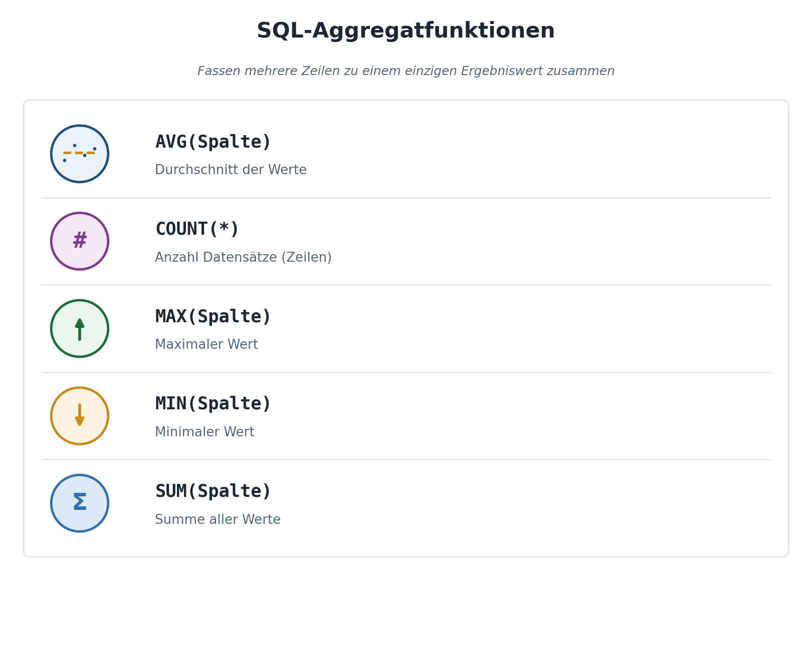

Aggregatfunktionen berechnen einen Wert über mehrere Zeilen:

| Funktion        | Beschreibung               | Beispiel               |
| --------------- | -------------------------- | ---------------------- |
| `COUNT(*)`      | Anzahl Zeilen (inkl. NULL) | `COUNT(*) → 42`        |
| `COUNT(spalte)` | Anzahl Nicht-NULL-Werte    | `COUNT(land) → 38`     |
| `SUM(spalte)`   | Summe                      | `SUM(preis) → 1250.50` |
| `AVG(spalte)`   | Durchschnitt               | `AVG(preis) → 22.30`   |
| `MIN(spalte)`   | Kleinster Wert             | `MIN(jahr) → 1950`     |
| `MAX(spalte)`   | Grösster Wert              | `MAX(preis) → 59.90`   |

```sql
-- Statistiken über den Buchbestand
SELECT
    COUNT(*)            AS Anzahl_Buecher,
    ROUND(AVG(preis),2) AS Durchschnittspreis,
    MIN(preis)          AS Guenstigstes,
    MAX(preis)          AS Teuerstes,
    SUM(lagerbestand)   AS Gesamtbestand
FROM buecher;
```

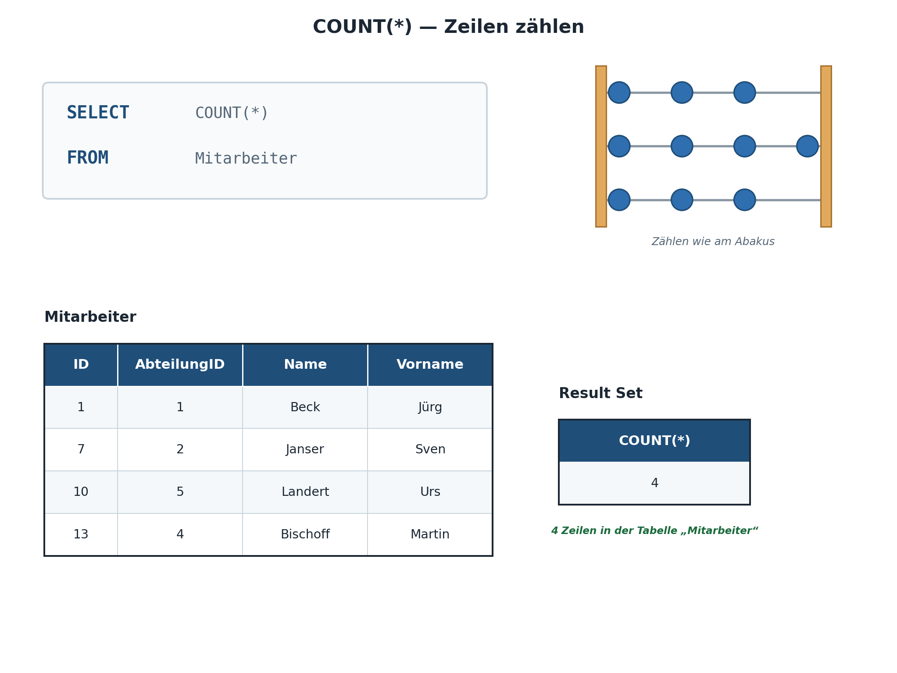

Ein wichtiger Unterschied zwischen `COUNT(*)` und `COUNT(Spalte)`: `COUNT(*)` zählt schlicht die Anzahl Ergebniszeilen, unabhängig davon, ob einzelne Spaltenwerte `NULL` sind. `COUNT(Spalte)` hingegen zählt nur jene Zeilen, in denen die angegebene Spalte tatsächlich einen Wert (also nicht `NULL`) enthält. Dieser Unterschied ist besonders nützlich, um z.B. zu ermitteln, bei wie vielen Technikern das Fachgebiet tatsächlich erfasst wurde: `SELECT COUNT(Fachgebiet) FROM Techniker;` liefert eine kleinere Zahl als `SELECT COUNT(*) FROM Techniker;`, sofern mindestens ein Fachgebiet-Wert `NULL` ist.

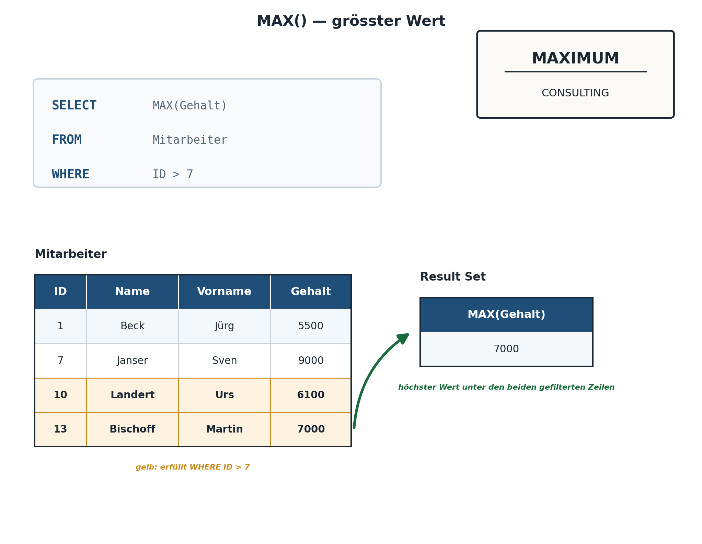

### 1.6.2. GROUP BY – Gruppierung

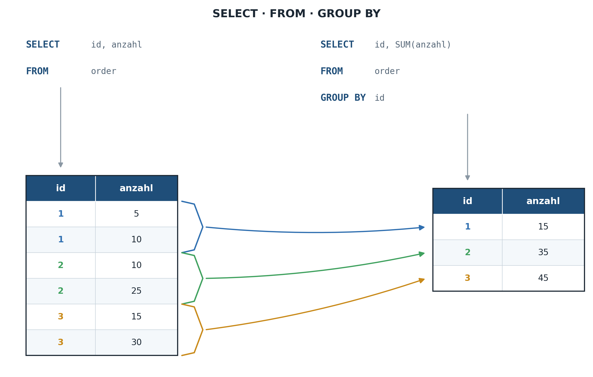

Anschaulich gesprochen bewirkt `GROUP BY` eine gedankliche Aufteilung der gesamten Ergebnismenge in mehrere „Stapel" – einen Stapel je unterschiedlichem Wert der Gruppierungsspalte(n) – auf die anschliessend die gewünschten Aggregatfunktionen **je Stapel** angewendet werden. Eine wichtige Regel: In der `SELECT`-Liste dürfen bei Verwendung von `GROUP BY` nur die Gruppierungsspalten selbst sowie Aggregatfunktionen erscheinen – jede weitere „nackte" Spalte würde zu einer mehrdeutigen Auswahl innerhalb der Gruppe führen und wird von SQLite entweder abgelehnt oder liefert einen undefinierten (nicht garantiert stabilen) Wert.

`GROUP BY` fasst Zeilen mit gleichem Wert zusammen und erlaubt Aggregationen pro Gruppe:

```sql
-- Anzahl Bücher pro Genre
SELECT genre, COUNT(*) AS Anzahl
FROM buecher
GROUP BY genre
ORDER BY Anzahl DESC;

-- Statistiken pro Genre
SELECT
    genre,
    COUNT(*)            AS Anzahl,
    ROUND(AVG(preis),2) AS Avg_Preis,
    MIN(preis)          AS Min_Preis,
    MAX(preis)          AS Max_Preis
FROM buecher
GROUP BY genre
ORDER BY Avg_Preis DESC;
```

> **Wichtige Regel:** Alle Spalten im `SELECT`, die **nicht** in einer Aggregatfunktion stehen, **müssen** in `GROUP BY` erscheinen!
>
> ```sql
> -- Falsch:
> SELECT genre, titel, COUNT(*) FROM buecher GROUP BY genre;
> -- Richtig:
> SELECT genre, COUNT(*) FROM buecher GROUP BY genre;
> ```

### 1.6.3. HAVING – Filter auf Gruppen

Während `WHERE` **vor** der Gruppierung filtert (auf einzelne Zeilen), filtert `HAVING` **nach** der Gruppierung (auf die Gruppenergebnisse).

```sql
-- Genres mit mehr als 3 Büchern
SELECT genre, COUNT(*) AS Anzahl
FROM buecher
GROUP BY genre
HAVING COUNT(*) > 3
ORDER BY Anzahl DESC;

-- WHERE vor GROUP BY, HAVING nach GROUP BY
SELECT genre, COUNT(*) AS Anzahl
FROM buecher
WHERE jahr >= 2000        -- filtert Zeilen (vor Gruppierung)
GROUP BY genre
HAVING COUNT(*) >= 2;     -- filtert Gruppen (nach Gruppierung)
```

> **Merksatz:** `WHERE` filtert Zeilen, `HAVING` filtert Gruppen. Ein Aggregatausdruck wie `COUNT(*) > 3` darf **nie** in `WHERE` stehen, nur in `HAVING`.

`WHERE` und `HAVING` lassen sich auch kombiniert einsetzen – z.B. um zunächst nur Maschinen ab Baujahr 2015 zu berücksichtigen (`WHERE`) und danach nur jene Standorte anzuzeigen, an denen mindestens 2 solcher Maschinen stehen (`HAVING`):

```sql
SELECT Standort, COUNT(*) AS AnzahlNeuereMaschinen
FROM Maschine
WHERE Baujahr >= 2015
GROUP BY Standort
HAVING COUNT(*) >= 2;
```

---

## 1.7. Logische Ausführungsreihenfolge


SQL wird zwar in der Reihenfolge `SELECT … FROM … WHERE … GROUP BY … HAVING … ORDER BY` **geschrieben**, aber in folgender Reihenfolge **ausgeführt**:

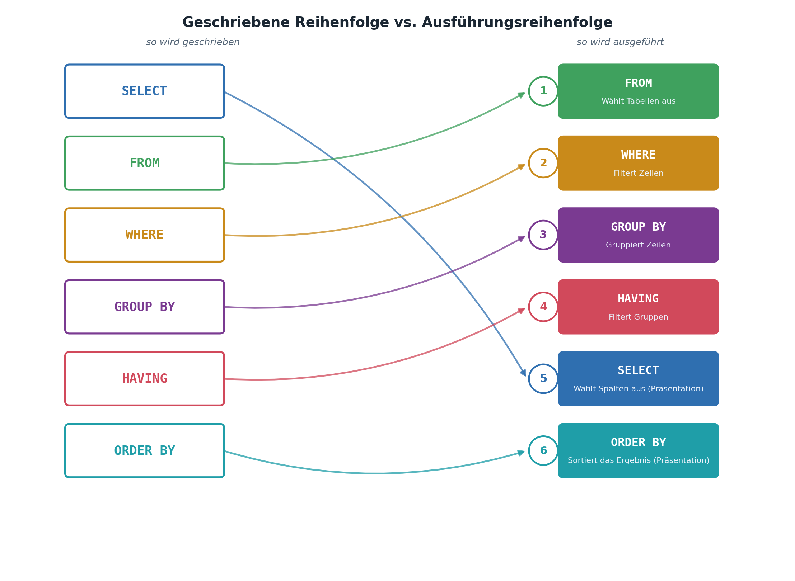

```console
1. FROM       (Datenquelle bestimmen)
2. WHERE      (einzelne Zeilen filtern)
3. GROUP BY   (gruppieren)
4. HAVING     (Gruppen filtern)
5. SELECT     (Spalten/Aliase bestimmen)
6. ORDER BY   (sortieren)
```

Dieses Verständnis erklärt z.B., weshalb ein in `SELECT` definierter Alias nicht in `WHERE` verwendet werden kann (die `WHERE`-Klausel wird ausgeführt, *bevor* der Alias existiert), in `ORDER BY` aber schon.

Dieses Auseinanderfallen von Schreib- und Ausführungsreihenfolge ist für viele Studierende zu Beginn der grösste gedankliche Stolperstein bei SQL. Es lohnt sich, diese Reihenfolge zu verinnerlichen, da sie viele scheinbar willkürliche Regeln plötzlich logisch erklärt – etwa auch, weshalb `LIMIT` (die Begrenzung der Anzahl Ergebniszeilen) faktisch als letzter Schritt nach `ORDER BY` wirkt.

---

## 1.8. Zusammenfassung und Cheatsheet

### 1.8.1. Klausel-Reihenfolge

| **Reihenfolge** | **Klausel**      | **Zweck**                          |
| --------------- | ---------------- | ---------------------------------- |
| 1               | `SELECT`         | Spalten / Ausdrücke wählen         |
| 2               | `FROM`           | Quelltabelle definieren            |
| 3               | `JOIN ... ON`    | Tabellen verknüpfen                |
| 4               | `WHERE`          | Zeilen filtern (vor Gruppierung)   |
| 5               | `GROUP BY`       | Zeilen gruppieren                  |
| 6               | `HAVING`         | Gruppen filtern (nach Gruppierung) |
| 7               | `ORDER BY`       | Ergebnis sortieren                 |
| 8               | `LIMIT / OFFSET` | Anzahl Zeilen begrenzen            |

### 1.8.2. Prädikate Übersicht

| **Prädikat** | **Syntax**                  | **Bedeutung**           |
| ------------ | --------------------------- | ----------------------- |
| Vergleich    | `=, <>, <, >, <=, >=`       | Direkter Wertvergleich  |
| `BETWEEN`    | `spalte BETWEEN x AND y`    | Wertebereich (inklusiv) |
| `IN`         | `spalte IN (a, b, c)`       | Wert in Menge           |
| `LIKE`       | `spalte LIKE 'Mu%'`         | Textmuster (`%`, `_`)   |
| `IS NULL`    | `spalte IS NULL`            | Fehlender Wert          |
| `EXISTS`     | `WHERE EXISTS (SELECT ...)` | Existenzprüfung         |
| `AND/OR/NOT` | `bed1 AND bed2`             | Logische Verknüpfung    |

---

### 1.8.3. Weiterführende Ressourcen

- SQLite Dokumentation: <https://www.sqlite.org/lang_select.html>
- Interaktiv üben: <https://sqliteonline.com>
- DB Browser for SQLite (GUI): <https://sqlitebrowser.org>
- SQL-Übungsplattform: <https://www.sql-practice.com>

---

</br>

# 2. Aufgaben

## 2.1. Datenbank Bibliothek erstellen

| **Vorgabe**             | **Beschreibung**                                    |
| :---------------------- | :-------------------------------------------------- |
| **Lernziele**           | Datenbank Schema implementieren und Datein einfügen |
| **Sozialform**          | Einzelarbeit                                        |
| **Auftrag**             | siehe unten                                         |
| **Hilfsmittel**         |                                                     |
| **Erwartete Resultate** |                                                     |
| **Zeitbedarf**          | 15 min                                              |
| **Lösungselemente**     | Beispieldatenbank `bibliothek.db`                   |

**Datenbank und Initial Daten wie folgt erstellen:**

- Erstelle mit **[SQLiteStudio](https://sqlitestudio.pl)** oder **[DB Browser for SQLite](https://sqlitebrowser.org)** eine neue Datenbank (`bibliothek.db`)
- Führe die SQL-Befehle der Datei  aus.
- Prüfe ob alle vier Tabellen angelegt und mit Daten befüllt wurden.

> **Setup**
> Erstellt die Datenbank lokal: `sqlite3 bibliothek.db < schema.sql`

---

## 2.2. Abfragen Bibliothek Datenbank

| **Vorgabe**             | **Beschreibung**                                                            |
| :---------------------- | :-------------------------------------------------------------------------- |
| **Lernziele**           | Einfache SQL-Abfragen mit Spalten Selektion und Sortierung ausführen        |
|                         | Einfache SQL-Abfragen mit WHERE Klause und Prädikaten                       |
|                         | Einfache SQL-Abfragen Aggregatfunktionen und Gruppierungen                  |
|                         | Komplexe SQL-Abfragen mit mehreren Tabellen (JOIN)                          |
|                         | Komplexe SQL-Abfragen mit mehreren Tabellen und Unterabfragen (Sub-Queries) |
| **Sozialform**          | Einzelarbeit                                                                |
| **Auftrag**             | siehe unten                                                                 |
| **Hilfsmittel**         |                                                                             |
| **Erwartete Resultate** |                                                                             |
| **Zeitbedarf**          | 60 min                                                                      |
| **Lösungselemente**     | SQL Abfragebefehle                                                          |

**Schreibe eine Abfrage, die folgendes ausgibt:**

**A1 - Einfache Abfragen mit Spaltenselektion:**

1. Vorname und Nachname aller Autoren als eine Spalte `Autor`
2. Das Erscheinungsjahr der Bücher
3. Den Preis erhöht um 10% als `Neuer_Preis`
4. Sortiert nach Erscheinungsjahr absteigend

**A2 - Abfragen mit Zeilenrestriktionen (WHERE Klausel):**

1. Alle Bücher, die zwischen 2000 und 2010 erschienen sind und mehr als 15 CHF kosten
2. Alle Kunden aus Zürich oder Bern
3. Alle Bücher, deren Titel das Wort «Welt» enthält
4. Alle Autoren, bei denen das Geburtsjahr nicht bekannt ist
5. Alle Bücher mit einem Lagerbestand von 0 (ausverkauft)

**A3 - Abfragen mit Aggregatfunktionen und Gruppierungen:**

1. Wie viele Bücher gibt es pro Erscheinungsjahr? (Sortiert nach Jahr absteigend)
2. Welche Genres haben einen Durchschnittspreis über 20 CHF?
3. Welche Stadt hat die meisten Kunden? (Top 3)
4. Wie viele Bücher wurden nach 2000 veröffentlicht und kosten unter 20 CHF?

---

## 2.3. Abfragen Schulverwaltungsdatenbank

| **Vorgabe**             | **Beschreibung**                                    |
| :---------------------- | :-------------------------------------------------- |
| **Lernziele**           | Komplexe SQL-Abfragen für statistische Auswertungen |
| **Sozialform**          | Einzelarbeit                                        |
| **Auftrag**             | siehe unten                                         |
| **Hilfsmittel**         |                                                     |
| **Erwartete Resultate** |                                                     |
| **Zeitbedarf**          | 50 min                                              |
| **Lösungselemente**     | SQL Abfragebefehle                                  |

**Teil 1: Einfache Abfragen:**

**A1.1:**

- Suche alle Studenten mit *Name, Vorname, Geburtsdatum*.
- Sortiere die Ausgabe nach *Geburtsdatum* aufsteigend.

**A1.2:**

- Suche alle Studenten mit *Name, Vorname, Geburtsdatum*, welche nach dem *01.01.1990* geboren sind.
- Sortiere die Ausgabe nach *Name, Vorname* aufsteigend.

> Hinweis: SQLite speichert Daten als Text im Format YYYY-MM-DD.

**A1.3:**

- Suche alle Studenten deren Name mit *"M"* beginnt und zeige den *Vornamen, Nachname Geburtsdatum* an.

**A1.4:**

- Suche alle Studenten deren *StudentNr* kleiner *5* ist und vor dem *01.01.1989* geboren sind.

**A1.5:**

- Suche Studenten, deren Name ein *"ll"* enthält.

**A1.6:**

- Suche alle Studenten, die zwischen *01.01.1980 und 13.12.1989* geboren sind.
- Zeige die Ausgabe sortiert nach Geburtsdatum an.

**A1.7:**

- Suche alle Studenten, deren Name ein *"a"* enthält oder der Vorname mit *"n"* endet.

---

**Teil 2: Aggregatfunktionen:**

**A2.1:**

- Ermittle die Anzahl der erfassten Studenten.
- Spaltenübersicht "*AnzahlStudenten*".

**A2.2:**

- Ermittle die durchschnittliche Semester Anzahl aller Fachrichtungen.
- Spaltenübersicht "*DurchschnittlicheSemester*".

---

© 2026 Lukas Müller – Licensed under CC BY-NC-ND 4.0
See [LICENSE](..\license.md) file for details.
